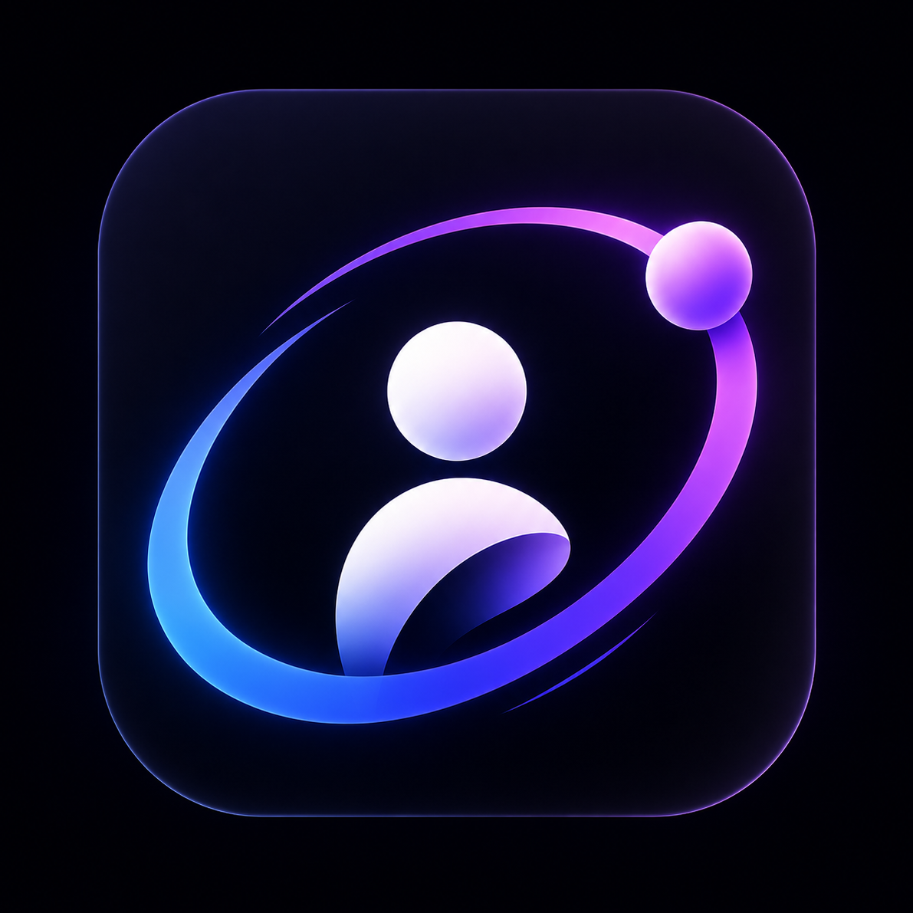
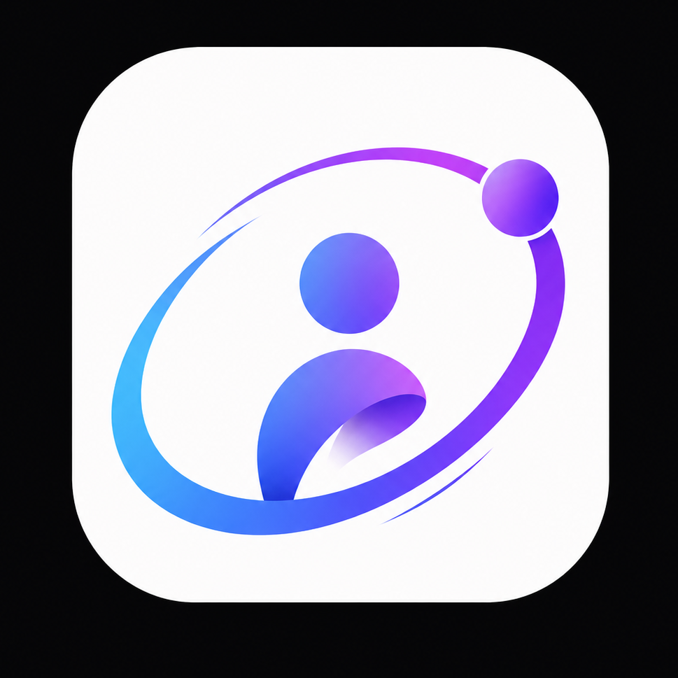

# Orbit

Orbit is an AI-powered Personal Operating System for students designed to handle the cognitive load of student life. By allowing you to braindump your day in a single reflection, Orbit's AI brain parses your text and automatically organizes your classes, tasks, decisions, learnings, and mood updates.

Built using **Flutter**, **Firebase**, and **Material 3**.

---

## 📸 Media & Screenshots

| Custom Space Splash | Dynamic Home View |
|:---:|:---:|
|  |  |

---

## ✨ Key Features

- **Smart Reflection (Speech & Text)**: Capture daily reflections either by typing or via voice recording (utilizing automated Whisper/Gemini Fallback Speech-To-Text transcription).
- **Automated AI Extraction**: The system parses reflections to extract and synchronize:
  - **Tasks**: Todo items with priorities and automatically detected due dates.
  - **Decisions**: Key conclusions and logic paths recorded for later reference.
  - **Learnings**: Captured knowledge snippets categorized by subject or theme.
  - **Events**: Time-sensitive academic or personal events.
- **Fail-safe AI Infrastructure**: A robust request manager supporting:
  - **Sequential Fallback**: Graceful failover between Google Gemini and Groq API systems.
  - **Real-time Health Monitoring**: Real-time evaluation of API latency and error rates.
  - **Local Encryption**: Secure client-side storage of user-provided API tokens.
- **Space Aesthetics**: Space-themed custom splash layouts, dynamic Material 3 custom theming (Dark & Light support), and rich animations.

---

## 🛠️ Tech Stack

- **Framework**: [Flutter](https://flutter.dev) (Dart)
- **Backend Services**: [Firebase](https://firebase.google.com) (Authentication, Cloud Firestore)
- **State Management**: [Riverpod](https://riverpod.dev) (Dependency injection and reactive state caching)
- **Model Layer**: [Freezed](https://pub.dev/packages/freezed) & [Json Serializable](https://pub.dev/packages/json_serializable) for immutable models
- **AI Models**: Google Gemini 2.5 Flash, Groq Whisper (whisper-large-v3, whisper-large-v3-turbo), Llama 3/3.3, and Qwen.

---

## 🏗️ Architecture & folder Structure

Orbit follows a **Feature-First Architecture** combined with Riverpod state management.

```text
lib/
├── app/                  # Global routing and theme notifications
├── core/                 # Shared widgets, utilities (AppLogger), and voice recording controllers
└── features/             # Isolated feature components
    ├── ai/               # AI prompts, synchronizers, and request router
    ├── auth/             # Google Sign-In and email login views
    ├── day/              # Daily summary aggregates
    ├── tasks/            # Todo lists and task tracking
    └── [other domains]   # events, learning, decision, mood, settings, home
```

For a detailed look, refer to the documentation:
- [Technical Architecture](docs/architecture.md)
- [Folder Directory Reference](docs/folder_structure.md)

---

## 🚀 Setup & Installation

### 1. Prerequisites
- [Flutter SDK](https://docs.flutter.dev/get-started/install) (Stable channel)
- A Firebase Project account
- Google Gemini and optionally Groq API tokens

### 2. Environment Configuration
Copy the environment template file:
```bash
cp .env.example .env
```
Fill in the values in your `.env`:
```env
GEMINI_API_KEY=your_gemini_api_key_here
GROQ_API_KEY=your_groq_api_key_here
```

### 3. Firebase Integration
Add your `google-services.json` (Android) and `GoogleService-Info.plist` (iOS) files to their respective platform locations.
For complete instructions, check the [Workspace Setup Guide](docs/setup.md).

### 4. Running the Application
```bash
flutter pub get
flutter run
```

### 5. Building the Release APK
To compile the production release binary:
```bash
flutter build apk --release
```

---

## 🛣️ Roadmap

- [x] Speech-to-text reflection transcription fallback pipeline.
- [x] Native response schema compliance.
- [x] Secure centralized mode-aware logging.
- [ ] Offline caching support for reflections.
- [ ] Integration of calendar services (Google Calendar).

---

## 🤝 Contributing

We welcome community contributions! Please read our [CONTRIBUTING.md](CONTRIBUTING.md) to understand branch conventions, Conventional Commits style guides, and local development configurations.

---

## 📄 License

Distributed under the MIT License. See [LICENSE](LICENSE) for more details.

---

## 👤 Credits

Created and maintained by [Shashi Singh](https://github.com/ShashiSingh8434).
