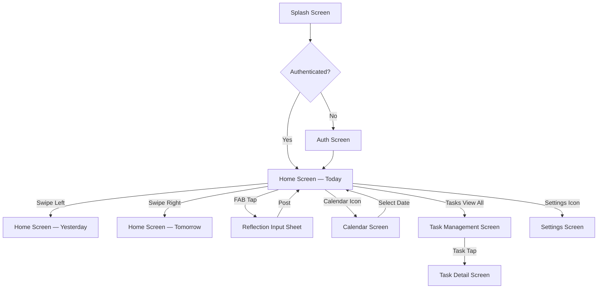
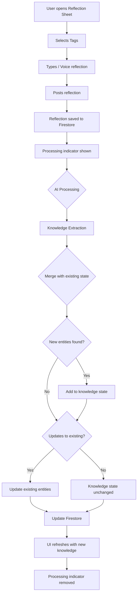
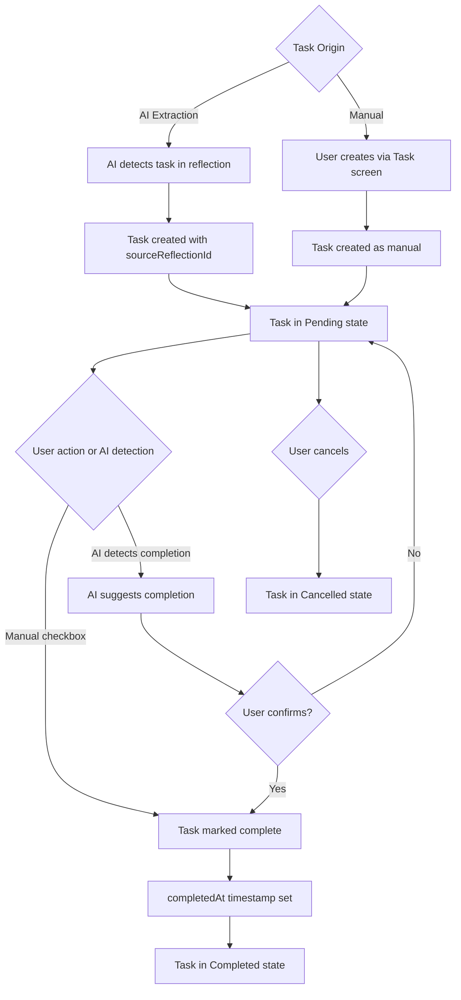
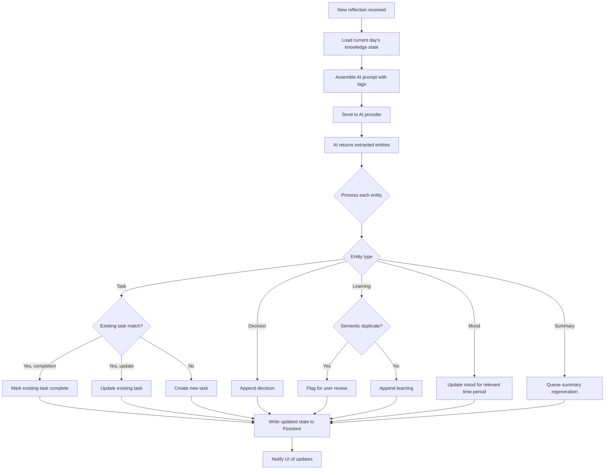
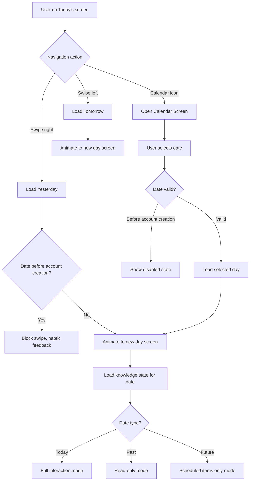

# 01 — Orbit: Vision and Product Blueprint

> **Document Version:** 1.0.0  
> **Status:** Living Document  
> **Phase:** Phase 2 — Today's Reflection  
> **Audience:** Product Team, Design Team, Engineering Team, Open-Source Contributors  
> **Last Updated:** 2025

---

## Table of Contents

1. [Executive Summary](#1-executive-summary)
2. [Product Vision](#2-product-vision)
3. [Core Philosophy](#3-core-philosophy)
4. [Target Audience and User Personas](#4-target-audience-and-user-personas)
5. [User Journey and Experience Flow](#5-user-journey-and-experience-flow)
6. [Product Principles](#6-product-principles)
7. [Feature Architecture Overview](#7-feature-architecture-overview)
8. [Screen Specifications](#8-screen-specifications)
9. [Navigation Architecture](#9-navigation-architecture)
10. [The Knowledge Model](#10-the-knowledge-model)
11. [The AI Engine — Conceptual Overview](#11-the-ai-engine--conceptual-overview)
12. [Calendar System](#12-calendar-system)
13. [Reflection System](#13-reflection-system)
14. [Summary System](#14-summary-system)
15. [Task System](#15-task-system)
16. [Timeline System](#16-timeline-system)
17. [Prompt System — Conceptual Overview](#17-prompt-system--conceptual-overview)
18. [Future Module Blueprints](#18-future-module-blueprints)
19. [Product Roadmap](#19-product-roadmap)
20. [Design Language and UX Principles](#20-design-language-and-ux-principles)
21. [Appendix: UI Flow Diagrams](#21-appendix-ui-flow-diagrams)

---

## 1. Executive Summary

Orbit is an AI-powered Personal Operating System designed primarily for students. Its core proposition is simple but radical: rather than asking users to organize their lives manually into structured formats, Orbit allows them to reflect naturally — in free-form text or voice — and then uses artificial intelligence to extract, organize, and maintain structured knowledge from those reflections.

The dominant assumption in productivity software today is that the user must do the work of organization. The user must open a task manager, type a task, assign a due date, choose a priority, and file it into a project. The user must open a calendar, create an event, fill in metadata. The user must open a notes app and deliberately capture a learning. Orbit challenges this assumption fundamentally.

**The insight driving Orbit:** Humans naturally reflect. Students especially think aloud, in journals, in voice notes, in messages to themselves. The problem is that this reflection is unstructured. It lives in notes apps, WhatsApp saved messages, and voice recordings that are never revisited. Orbit intercepts this natural reflective behavior and transforms it into structured, queryable, actionable knowledge — without forcing the user to change how they think.

This document defines:

- The product vision and philosophy
- The complete user journey
- Screen-by-screen specifications
- The knowledge model
- The navigation architecture
- Feature specifications for the current phase and future modules
- The product roadmap

This document does **not** cover technical implementation (see `02_ORBIT_TECHNICAL_ARCHITECTURE.md`) or development phasing in granular detail (see `03_ORBIT_DEVELOPMENT_ROADMAP.md`).

---

## 2. Product Vision

### 2.1 The Vision Statement

> **Orbit is the intelligent layer between a student's thoughts and their organized life.**

Every student generates an enormous amount of unstructured mental output every day — thoughts about assignments, decisions made, lessons learned, emotions felt, goals considered. Today, this output disappears. It evaporates into thin air, or at best, into an unreviewed journal.

Orbit captures this output, gives it structure, and returns it to the user as actionable knowledge. Over time, Orbit becomes the student's memory — not just of what they did, but of how they thought, what they learned, and how they grew.

### 2.2 The Long-Term Product Ambition

In its ultimate form, Orbit is not a diary. It is not a task manager. It is not a calendar. It is not a notes app. It is not a fitness tracker.

It is all of them — unified under a single intelligence that understands the user.

When a student says "I skipped the gym today because I was exhausted from studying," Orbit:
- Notes the gym was skipped (fitness module)
- Associates the exhaustion with academic load (academic module)
- Considers whether this is a pattern worth flagging (insights)
- Does not judge — but over time, helps the user see the tradeoffs they are making

This is the long-term vision. The present phase is disciplined: build one thing excellently. Reflect. Extract. Organize. Grow.

### 2.3 What Orbit Is Not

**Orbit is not a surveillance tool.** The AI serves the user. All data belongs to the user. There are no third-party analytics of personal reflections.

**Orbit is not an AI that replaces thinking.** The AI organizes — it does not prescribe. It surfaces — it does not decide. The user always remains in control.

**Orbit is not a social platform.** Reflections are private by default. There is no feed, no likes, no sharing. This is a personal operating system.

**Orbit is not a forced productivity system.** If a user only wants to reflect and read their summary at the end of the day, that is a valid use of Orbit. The system adapts to the user's engagement level.

### 2.4 Competitive Positioning

| Product | Core Use Case | Orbit's Differentiation |
|---|---|---|
| Notion | Structured notes and databases | Orbit requires zero manual structuring |
| Obsidian | Linked notes and knowledge graphs | Orbit is AI-driven, not user-driven linking |
| Day One | Beautiful journaling | Orbit transforms journal entries into structured data |
| Todoist | Task management | Orbit auto-generates tasks from natural reflection |
| Google Calendar | Scheduling | Orbit extracts events from reflection, not manual entry |
| Reflect | AI-assisted notes | Orbit is student-first, with domain-specific intelligence |

Orbit's unique position: **the only product where the act of reflection is the primary input for every feature.**

---

## 3. Core Philosophy

### 3.1 The Five-Stage Loop

```
Reflection → Knowledge → Organization → Insights → Growth
```

This is not a linear pipeline executed once. It is a continuous loop. Every reflection refines knowledge. Refined knowledge improves organization. Better organization surfaces clearer insights. Clearer insights drive better decisions, habits, and ultimately growth. Growth motivates further reflection.

This loop is the engine of Orbit. Every design decision must serve this loop.

### 3.2 Reflection as the Primary Interface

The dominant insight: **most interfaces are designed around structured input.** Forms. Fields. Dropdowns. Orbit is designed around unstructured input — human thought.

This is a non-trivial philosophical choice with deep product implications:

- The input is always free-form text or voice
- Structure is always a product of AI extraction, never forced on the user
- The user is never asked to categorize their own thoughts
- The user is never asked to fill in a form

This also means the AI must be genuinely capable. A poor AI extraction would undermine the entire product premise. The AI layer is therefore the most critical technical component of Orbit.

### 3.3 AI as Collaborator, Not Authority

The AI in Orbit extracts, suggests, and organizes. It never deletes without permission. It never overwrites user edits without consent. It surfaces — it does not decide.

This distinction is critical for user trust. When a student edits an AI-generated summary, Orbit must respect that edit. When the user manually creates a task that contradicts what the AI inferred, the manual task takes precedence.

The mental model for AI in Orbit is a **highly capable assistant**, not an autonomous agent. The assistant can do things the user would have done themselves, but faster. The assistant does not do things the user did not ask for.

### 3.4 Privacy as Architecture

Orbit handles extremely personal data — moods, decisions, struggles, goals. Privacy is not a feature bolted on after the fact. It is an architectural constraint.

- All reflection data is owned by the user
- AI processing happens with the user's explicit understanding
- No reflection data is used to train third-party models without consent
- Data export is always available
- Account deletion purges all data

### 3.5 Progressive Complexity

Orbit should be immediately accessible to a first-year student with no prior productivity system experience, and sufficiently powerful to serve a doctoral candidate managing research, publications, and personal life.

This is achieved through **progressive disclosure**: the application presents simple, obvious actions on the surface, while making advanced capabilities discoverable for power users. The default state of Orbit is calm and minimal. Complexity is revealed as the user grows into the product.

---

## 4. Target Audience and User Personas

### 4.1 Primary Persona — "The Overwhelmed Undergraduate"

**Name:** Arjun, 20  
**Context:** Second-year Computer Science student at a tier-1 engineering college  
**Situation:** Manages 6 subjects, multiple assignments, a side project, gym routine, and social life simultaneously  
**Current Tools:** WhatsApp (self-messages), Google Keep, physical planner (inconsistently used)  
**Pain Points:**
- Loses track of tasks because they are spread across apps
- Forgets what was decided in study groups
- Knows he learns things every day but cannot recall them for interviews
- Feels overwhelmed but cannot identify where his time actually goes

**How Orbit Serves Arjun:**
- He opens Orbit and types a voice note at the end of a lecture
- Orbit extracts tasks, learnings, and mood without any additional action from Arjun
- At the end of the day, Arjun reviews a clean summary of what he accomplished and what remains
- Over weeks, Orbit shows him patterns — when he's most productive, which subjects drain him

### 4.2 Secondary Persona — "The Disciplined Graduate Student"

**Name:** Priya, 24  
**Context:** First-year MBA student  
**Situation:** Balancing coursework, networking, internship applications, and personal development goals  
**Current Tools:** Notion (heavily customized), Google Calendar, physical journal  
**Pain Points:**
- Spends significant time maintaining Notion databases rather than using them
- Wants a system that requires less maintenance
- Has clear goals but struggles to connect daily actions to long-term direction

**How Orbit Serves Priya:**
- Orbit replaces her "today I did..." Notion page with an intelligent reflection system
- Her manually curated goals in Orbit receive daily progress updates based on reflections
- The AI coach (future module) provides weekly perspective on goal alignment

### 4.3 Tertiary Persona — "The Disciplined Self-Improver"

**Name:** Rahul, 22  
**Context:** Final-year student + part-time freelancer  
**Situation:** Tracking fitness, freelance income, studies, and personal reading simultaneously  
**Pain Points:**
- Too many apps, too much cognitive overhead
- Wants one place for everything

**How Orbit Serves Rahul:**
- Orbit becomes his single reflective interface
- Fitness, academics, finances (future), and personal growth all feed into one knowledge graph

---

## 5. User Journey and Experience Flow

### 5.1 Day Zero — Onboarding

The first experience of Orbit must immediately communicate the product's core value proposition without overwhelming the user.

**Onboarding Steps:**

1. **Welcome Screen** — "Your thoughts, organized." Minimal text, animated logo
2. **Sign Up / Sign In** — Firebase Authentication (Google, Email/Password)
3. **Personalization** — Name, current education level, primary goals (select tags: Academics, Fitness, Goals, Productivity — this seeds the prompt system)
4. **First Reflection Prompt** — "How was your day so far? Just type naturally." First-use guided reflection
5. **AI Response Introduction** — After first reflection, show what the AI extracted. Frame it: "This is what Orbit understood. You can always edit."
6. **Home Screen** — The user arrives at Today's Reflection with their first knowledge snapshot visible

**Design Decision — Why guide the first reflection?**
Without guidance, many users will type something minimal ("fine") to test the app. Guiding the first reflection ensures the AI has enough input to demonstrate genuine value. The user must see a real knowledge extraction to believe in the product premise. A guided first reflection is an investment in user retention.

### 5.2 A Typical Day with Orbit

```
7:30 AM — Morning reflection
↓
User types: "Had a productive morning. Went to gym, finished my DBMS notes. 
Need to submit the OS assignment by tomorrow 11:59 PM."

↓ AI Processes ↓

Mood: Productive / Positive
Task Detected: Submit OS assignment | Due: Tomorrow 11:59 PM | Priority: High
Learning Detected: DBMS notes completed
Activity: Gym (links to fitness module in future)

↓ Knowledge State Updated ↓

12:30 PM — Midday reflection
↓
User types: "Just finished the OS assignment! Turned it in. Now studying for 
the networks quiz on Friday. Also decided to start waking up at 6 AM from tomorrow."

↓ AI Processes ↓

Task Completion: OS assignment → marked complete
Task Detected: Study for networks quiz | Due: Friday | Priority: Medium
Decision Detected: Wake up at 6 AM starting tomorrow
Knowledge State Updated: Merged, not duplicated

↓

10:00 PM — Evening reflection
↓
User types: "Tough day overall. Networks content is harder than expected. 
Mood has been low since afternoon. Need to plan better tomorrow."

↓ AI Processes ↓

Mood Updated: Low (afternoon onwards)
Energy: Low
Productivity: Moderate
Insight Candidate: User struggling with Networks subject
Task Updated: Study for networks quiz (urgency increased contextually)

↓ End of Day Summary Generated ↓
```

### 5.3 Weekly Experience

By the end of the first week, the user should have a clear view of:
- What they accomplished (completed tasks)
- What they learned (learnings list)
- Key decisions made
- Mood pattern across the week
- Upcoming tasks and events

The weekly summary (future feature, Phase 4) will synthesize this into a structured weekly review.

### 5.4 Monthly Experience

At 30 days, Orbit has enough data to surface:
- Productivity trends by day of week
- Subject/topic distribution of effort
- Goal progress
- Pattern identification (e.g., "You consistently feel low energy on Thursdays")

---

## 6. Product Principles

These principles govern every product decision. When two competing design choices exist, the principles serve as tiebreakers.

### Principle 1: Reflection First, Structure Never Forced

The user should never be required to use a form, checkbox, or dropdown to input information. Every piece of structured data in Orbit either comes from AI extraction or is the result of the user choosing to edit AI-extracted content. Direct manual creation of tasks, events, etc. is permitted but never the only path.

**Why:** Forcing structured input breaks the product's core promise. The moment Orbit becomes another form to fill, it becomes another app to abandon.

### Principle 2: The AI Suggests, the User Decides

The AI extracts tasks, marks completions, identifies decisions — but all of this is presented to the user as a suggestion layer, not a command. Users can reject AI suggestions, edit AI outputs, and always override the AI.

**Why:** Trust is foundational. If the AI silently does things the user disagrees with, the user loses trust in the system. All AI actions must be transparent, reversible, and explicable.

### Principle 3: Merge, Never Duplicate

When the AI processes multiple reflections in a day, it should maintain a single coherent knowledge state, not generate isolated outputs for each reflection. If a task appears in the morning reflection and is completed in the evening reflection, Orbit updates the single task record — it does not create a new task or a separate completion record.

**Why:** Duplication creates noise. Noise destroys the value of an organized system. The knowledge state for a day should always be the single most accurate representation of that day, regardless of how many reflections were written.

### Principle 4: The Calendar is Navigation, Not Input

The calendar in Orbit is primarily a navigation device. Users navigate to past days to review their stored knowledge. They navigate to future dates to see scheduled information. The calendar is not where you create events — events are created through reflection.

**Why:** This reinforces the reflection-first philosophy. If users can directly create events in the calendar, the natural question becomes "why not just use Google Calendar?" The distinction must be maintained.

### Principle 5: Privacy by Default, Power by Choice

Orbit starts minimal. Data stays private. Features are revealed progressively. No user should feel overwhelmed on day one, and no power user should feel constrained on day 365.

### Principle 6: Offline is Not an Edge Case

Students frequently work in environments with poor internet connectivity — lectures, libraries, commutes. Orbit must work offline. Reflections must be capturable offline. The AI processes when connectivity is restored. This is not optional.

### Principle 7: Data Portability

The user's data must always be exportable. In formats they can use elsewhere. This is both an ethical commitment and a trust-building mechanism. A user who knows they can leave feels more comfortable staying.

---

## 7. Feature Architecture Overview

The following diagram shows Orbit's complete feature architecture, including current features, Phase 2 active features, and future modules.

```
┌─────────────────────────────────────────────────────────────┐
│                         ORBIT                                │
│                  Personal Operating System                   │
└─────────────────────────────────────────────────────────────┘
                              │
         ┌────────────────────┼────────────────────┐
         │                    │                    │
   ┌─────▼──────┐      ┌──────▼─────┐      ┌──────▼─────┐
   │    CORE    │      │    AI      │      │   MODULES  │
   │  FEATURES  │      │   ENGINE   │      │  (Future)  │
   └─────┬──────┘      └──────┬─────┘      └──────┬─────┘
         │                    │                    │
   ┌─────▼──────┐      ┌──────▼─────┐      ┌──────▼─────┐
   │ Auth       │      │ Knowledge  │      │ Academics  │
   │ Calendar   │      │ Extraction │      │ Fitness    │
   │ Reflection │      │ Task AI    │      │ Goals      │
   │ Summary    │      │ Prompt Lib │      │ AI Coach   │
   │ Task Sys   │      │ Summary AI │      │ Finance    │
   │ Timeline   │      │ Multi-LLM  │      │ Social     │
   └────────────┘      └────────────┘      └────────────┘
```

### 7.1 Current Phase Scope (Phase 2)

The following features are in active development:

| Feature | Status | Description |
|---|---|---|
| Authentication | Complete | Firebase Auth (Google + Email) |
| Theme System | Complete | Light/Dark/System, persisted via MVVM |
| Today's Reflection | Active | Free-form text + voice input |
| AI Knowledge Extraction | Active | Task, Decision, Learning, Mood detection |
| Knowledge State Management | Active | Merge-based daily state maintenance |
| Summary System | Active | AI-generated, user-editable daily summary |
| Task System | Active | AI-generated and manual tasks |
| Calendar Navigation | Active | Swipe-based day navigation |

---

## 8. Screen Specifications

This section provides detailed specifications for every screen in the current Phase 2 scope. Each screen specification includes purpose, components, states, interactions, and design rationale.

### 8.1 Splash Screen

**Purpose:** Brand introduction and initialization check

**Components:**
- Orbit logo (animated, centered)
- App name typography
- Loading indicator (subtle, not intrusive)

**States:**
- Loading: Logo animation plays
- Auth Check: Navigate to Home if authenticated, Login if not

**Design Rationale:** The splash screen should be brief (< 2 seconds on a normal connection). The logo animation should convey the product's character: intelligent, calm, organized. Avoid aggressive loading spinners.

---

### 8.2 Authentication Screen

**Purpose:** User sign-in and account creation

**Components:**
- Orbit logo (smaller, top-center)
- Tagline: "Your thoughts, organized."
- "Continue with Google" button (primary CTA)
- "Continue with Email" text button (secondary CTA)
- Terms and Privacy links

**States:**
- Default: Buttons visible, clean background
- Loading: Buttons disabled, subtle loading indicator
- Error: Inline error message below relevant button

**Email Authentication Sub-flow:**
- Email input → Password input → Sign In / Create Account toggle
- Form validation with real-time feedback
- Password visibility toggle

**Design Rationale:**
Google Sign-In is the primary CTA because it requires the least friction and provides the most trusted authentication experience for a student audience. Email/password is secondary but available for users without Google accounts. The minimal design keeps the focus on the value proposition, not the authentication process.

---

### 8.3 Home Screen — Today's Reflection

**Purpose:** The primary daily interface. The place where the user reflects, reviews their knowledge, and navigates.

**Layout (top to bottom):**

```
┌─────────────────────────────────────────┐
│  ← Calendar   Today, Jun 15  🗓️  ≡     │  ← App Bar
├─────────────────────────────────────────┤
│  Tuesday, June 15                        │
│  Good morning, Arjun                     │  ← Greeting Header
├─────────────────────────────────────────┤
│  ┌─────────────────────────────────┐    │
│  │  AI SUMMARY                      │   │  ← Summary Card
│  │  A productive morning. Completed │   │
│  │  DBMS notes. OS assignment due   │   │
│  │  tomorrow.                       │   │
│  │  [Edit] [Rewrite] [Delete]       │   │
│  └─────────────────────────────────┘   │
├─────────────────────────────────────────┤
│  REFLECTIONS  (+)                        │  ← Section Header
│  ┌─────────────────────────────────┐    │
│  │  7:30 AM                         │   │  ← Reflection Entry Card
│  │  Had a productive morning...     │   │
│  └─────────────────────────────────┘   │
├─────────────────────────────────────────┤
│  TASKS  (3)                    [View All]│  ← Tasks Section
│  ☐ Submit OS Assignment  [!] Tomorrow   │
│  ☑ Complete DBMS Notes                  │
│  ☐ Study Networks Quiz  Friday          │
├─────────────────────────────────────────┤
│  LEARNINGS  (1)                         │
│  • DBMS Notes — Database normalization  │
├─────────────────────────────────────────┤
│  DECISIONS  (1)                         │
│  • Wake up at 6 AM from tomorrow        │
├─────────────────────────────────────────┤
│  MOOD                                   │
│  Morning: 😊  Afternoon: 😐             │
└─────────────────────────────────────────┘
         ↕ (Swipe left/right to change day)

[  +  Reflect  ]  ← FAB (bottom right)
```

**Component Specifications:**

**App Bar:**
- Left: Back arrow (when not on today) or Hamburger menu
- Center: Date display ("Today" for current, formatted date for others)
- Right: Calendar icon (opens date picker), overflow menu

**Greeting Header:**
- Time-aware greeting: "Good morning" / "Good afternoon" / "Good evening"
- Personalized with user's first name
- Subtle motivational context (optional, user-configurable)

**Summary Card:**
- Collapsible when long
- Three action buttons: Edit (inline), Rewrite (AI), Delete
- Visual distinction: AI-generated vs. manually edited (subtle icon indicator)
- Shimmer loading state while AI processes
- Empty state: "No summary yet. Add your first reflection." with inline button

**Reflection Entry Cards:**
- Timestamp (relative: "2 hours ago" for today, absolute for past)
- Reflection text (truncated at 3 lines, expandable)
- Processing indicator (spinner while AI is extracting knowledge)
- Processed indicator (checkmark when AI has completed extraction)
- Edit and Delete options (long-press or swipe-to-reveal)

**Tasks Section:**
- Inline quick-complete checkbox
- Priority indicator (colored dot or exclamation)
- Due date displayed relatively ("Tomorrow", "Friday", "In 3 days")
- Overdue tasks highlighted in red
- "View All" navigates to full task management screen
- Max 5 shown inline, paginated on full screen

**Learnings, Decisions sections:**
- Compact list view
- Add manually option (+ button)
- Each item expandable for source reflection context

**Mood Section:**
- Visual emoji representation per time-of-day period
- Tappable to view full mood timeline
- AI-inferred with user correction option

**FAB — "Reflect" Button:**
- Always visible, bottom-right
- Tapping opens Reflection Input Sheet
- Holds voice input as secondary action (long-press or icon on the FAB itself)

**Page States:**
- **Today (Present):** Full interaction. FAB visible. AI active.
- **Past Date:** Read-only mode. FAB hidden. "This day is complete" banner.
- **Future Date:** Limited view. Shows only scheduled tasks/events. "No reflections yet" placeholder.
- **No Reflections Today:** Motivational empty state. "Start your day with a reflection."
- **Loading:** Skeleton screens for all content sections (not spinners)

---

### 8.4 Reflection Input Sheet

**Purpose:** The primary input interface for new reflections

**Trigger:** FAB tap → Bottom sheet slides up OR full-screen on smaller devices

**Layout:**

```
┌─────────────────────────────────────────┐
│  ✕  New Reflection          [Post]       │
├─────────────────────────────────────────┤
│  🏷️ Tags: [Daily Summary] [Tasks] [+]   │  ← Tag Selector
├─────────────────────────────────────────┤
│                                          │
│  Type your reflection...                 │  ← Text Input Area
│                                          │
│                                          │
│                                          │
├─────────────────────────────────────────┤
│  🎤  Voice    📷 Photo    📎 Attach      │  ← Input Toolbar
└─────────────────────────────────────────┘
```

**Tag Selector:**
- Horizontal scrollable chips
- Default tags auto-selected based on user's settings
- Tapping a tag includes its corresponding prompt in AI processing
- Tags: Daily Summary, Tasks, Task Completion, Decisions, Events, Learnings, Ideas, Goals, Academic, Fitness
- "+" opens full tag selection sheet

**Text Input Area:**
- Auto-expanding textarea (grows with content)
- No character limit (with performance awareness)
- Auto-save draft on close without posting
- Markdown preview toggle (future)

**Voice Input:**
- Tap 🎤 to start voice recording
- Live transcription shown in text area
- Correction mode after transcription

**Post Action:**
- Posts reflection to the day's timeline
- Triggers AI processing (background)
- Returns to home screen with optimistic UI (reflection visible immediately)
- Processing indicator on the reflection card

**Design Rationale for Tag-Based Input:**
Tags are the primary mechanism by which the user tells the AI what to look for. A reflection with the "Tasks" tag triggers task extraction. A reflection with "Fitness" triggers fitness-related extraction. This allows the prompt system to be modular — the AI is only looking for what it needs to look for, reducing noise and cost. The user benefits from relevance; the system benefits from efficiency.

---

### 8.5 Task Management Screen

**Purpose:** Complete view of all tasks across all days, with filtering and management

**Navigation:** Accessed from Home Screen "View All" or bottom navigation (future)

**Layout:**

```
┌─────────────────────────────────────────┐
│  ← Tasks                    [+] [🔍]    │
├─────────────────────────────────────────┤
│  [All] [Today] [Upcoming] [Completed]   │  ← Filter Tabs
├─────────────────────────────────────────┤
│  OVERDUE                                 │
│  ┌─────────────────────────────────┐    │
│  │ ● Submit Physics Lab Report     │    │
│  │   Due: Yesterday   [!] High     │    │
│  └─────────────────────────────────┘   │
│  TODAY                                  │
│  ┌─────────────────────────────────┐    │
│  │ ☐ Complete Networks Reading     │    │
│  │   Due: Today, 11:59 PM          │    │
│  └─────────────────────────────────┘   │
│  UPCOMING                               │
│  ┌─────────────────────────────────┐    │
│  │ ☐ Study for Networks Quiz       │    │
│  │   Due: Friday                   │    │
│  └─────────────────────────────────┘   │
└─────────────────────────────────────────┘
```

**Task Card — Expanded:**

```
┌─────────────────────────────────────────┐
│ ☐  Submit OS Assignment                  │
│                                          │
│    Priority:  [High ▼]                  │
│    Due Date:  Tomorrow, Jun 16           │
│    Due Time:  11:59 PM                  │
│    Created:   From reflection (Jun 15)   │
│    Source:    "I need to submit..."      │
│                                          │
│    [Edit]  [Complete]  [Delete]          │
└─────────────────────────────────────────┘
```

**Design Rationale for Source Reflection:**
Every AI-generated task should show its source — the excerpt from the reflection that generated it. This is critical for two reasons: (1) it allows the user to verify AI accuracy, (2) it creates a traceable link between reflection and action. When a task is completed, the user can see the journey from thought to completion.

---

### 8.6 Calendar Screen

**Purpose:** Date navigation and monthly overview

**Trigger:** Calendar icon in App Bar

**Layout:**

```
┌─────────────────────────────────────────┐
│  ✕  Calendar                            │
├─────────────────────────────────────────┤
│        ← June 2025 →                    │
│  Mo Tu We Th Fr Sa Su                   │
│                          1              │
│   2  3  4  5  6  7  8                  │
│   9 10 11 12 13 14 15●                  │  ← Today
│  16 17 18 19 20 21 22                   │
│  23 24 25 26 27 28 29                   │
│  30                                     │
├─────────────────────────────────────────┤
│  June 15 — Today                        │
│  3 reflections · 4 tasks · Good day     │  ← Day Preview
├─────────────────────────────────────────┤
│  [Go to This Day]                       │
└─────────────────────────────────────────┘
```

**Calendar States:**
- **Today:** Highlighted with primary color
- **Days with reflections:** Dot indicator below date
- **Days without reflections:** No indicator
- **Days before account creation:** Grayed out, non-tappable
- **Future dates:** Accessible, show scheduled items only
- **Selected date:** Elevated, shows day preview in panel below

**Design Rationale for Restricting Pre-Account Dates:**
Allowing access to dates before account creation would present empty screens with no context. This creates a poor first impression and misleads the user about the app's capabilities. Orbit knows what it knows — and what it knows starts from when the user joined.

---

### 8.7 Settings Screen

**Purpose:** User preferences, AI configuration, data management

**Sections:**
- **Profile:** Name, email, education level, profile photo
- **Appearance:** Theme (Light / Dark / System)
- **AI Settings:** Default tags, AI provider selection (Gemini / Claude / GPT), AI language preferences
- **Notifications:** Daily reminder time, weekly summary notification
- **Data:** Export data (JSON/PDF), import data, delete account
- **About:** Version, changelog, open-source acknowledgements, feedback

---

## 9. Navigation Architecture

### 9.1 Navigation Philosophy

Orbit uses a **single-axis primary navigation** model. The primary navigation axis is the date — users swipe left and right to move through time. Secondary navigation (tasks, settings) is accessed through dedicated screens reached via App Bar actions.

This is a deliberate constraint. Orbit is a day-centric application. The dominant mental model is "what happened today?" Secondary questions ("what are all my tasks?") are always reachable, but never the default view.

### 9.2 Navigation Structure



### 9.3 Swipe Navigation Implementation

The day-to-day swipe navigation is implemented using a `PageView` widget in Flutter. Each page is a `DayScreen` instance loaded with the corresponding date. The `PageController` maintains a buffer of adjacent days for smooth transitions.

**Key constraint:** Users cannot swipe before their account creation date. The `PageController` enforces this by setting the page range minimum.

**Performance consideration:** Days are loaded lazily. Past days with no data load quickly. Days with extensive reflections and complex knowledge graphs may require a brief loading state, handled with skeleton screens.

### 9.4 Deep Links and Navigation State

Orbit should support deep linking for the following scenarios:
- Open to a specific date: `orbit://day/2025-06-15`
- Open to today's reflection: `orbit://today`
- Open to a specific task: `orbit://task/{taskId}`
- Notification tap → Opens relevant day screen

---

## 10. The Knowledge Model

### 10.1 What Is the Knowledge Model?

The knowledge model is the structured representation of everything Orbit knows about a specific day. It is the central data structure of the application. Every feature — summary, tasks, timeline, decisions, learnings — is a view into the knowledge model.

The knowledge model is constructed from raw reflections through AI extraction and is maintained as a single coherent document per day.

### 10.2 Knowledge Entity Types

#### 10.2.1 Summary

The summary is a human-readable synthesis of the day's key events, accomplishments, decisions, and emotional state. It is:
- Generated by AI from all reflections
- Editable by the user
- Regeneratable (user can request a fresh AI summary)
- Versioned (maintains history of edits)
- Deletable

**Data Shape:**
```
Summary {
  content: String
  generatedAt: Timestamp
  editedAt: Timestamp?
  isManual: Boolean
  version: Integer
}
```

#### 10.2.2 Tasks

Tasks represent actions the user needs to take or has taken. They are:
- AI-generated from reflection language ("I need to...", "Must submit...", "Have to...")
- Manually created by the user
- Linked to source reflections when AI-generated
- Cross-day (a task created from a Monday reflection can appear on Tuesday's view)

**Data Shape:**
```
Task {
  id: String
  title: String
  status: Enum[pending, completed, cancelled]
  priority: Enum[low, medium, high, urgent]
  dueDate: Date?
  dueTime: Time?
  createdAt: Timestamp
  createdBy: Enum[ai, manual]
  sourceReflectionId: String? (if AI-generated)
  completedAt: Timestamp?
  completionReflectionId: String? (reflection that marked it complete)
}
```

**Task Lifecycle:**
```
Created (AI/Manual)
    ↓
Pending
    ↓              ↓
Completed     Cancelled
```

#### 10.2.3 Events

Events are scheduled occurrences with a specific time. They are:
- AI-detected from reflection language ("Quiz on Friday", "Meeting at 3 PM")
- Manually created
- Non-destructive to the knowledge state if they pass without being reflected upon

**Data Shape:**
```
Event {
  id: String
  title: String
  date: Date
  startTime: Time?
  endTime: Time?
  category: Enum[academic, personal, social, fitness]
  createdBy: Enum[ai, manual]
  sourceReflectionId: String?
}
```

#### 10.2.4 Decisions

Decisions represent significant choices the user has made. They are:
- AI-detected from language patterns ("I decided to...", "Going with...", "Chose to...")
- Stored for future reference and accountability
- Not automatically acted upon by the system — they are records

**Data Shape:**
```
Decision {
  id: String
  content: String
  madeAt: Timestamp
  context: String? (surrounding reflection text)
  sourceReflectionId: String?
  tags: List<String>
}
```

#### 10.2.5 Learnings

Learnings capture knowledge the user has acquired. They are:
- AI-detected from language patterns ("I learned...", "Found out that...", "Realized...")
- Categorizable by domain (academic, personal, technical, life)
- A foundation for the future "Learning Log" feature

**Data Shape:**
```
Learning {
  id: String
  content: String
  domain: Enum[academic, personal, technical, fitness, other]
  learnedAt: Timestamp
  sourceReflectionId: String?
  tags: List<String>
}
```

#### 10.2.6 Mood

Mood is an AI-inferred or user-confirmed emotional state across the day. It is:
- Inferred from emotional language in reflections
- Granular (can change throughout the day)
- The foundation of future emotional intelligence features

**Data Shape:**
```
MoodEntry {
  period: Enum[morning, afternoon, evening, night]
  moodScore: Integer (1-10)
  moodLabel: Enum[great, good, neutral, low, struggling]
  energyLevel: Integer (1-10)
  inferredFrom: String? (reflection excerpt)
  userConfirmed: Boolean
}
```

#### 10.2.7 Ideas

Ideas are creative or speculative thoughts the user wants to capture without committing to action. They are:
- AI-detected ("Had an idea...", "What if...", "Could be interesting to...")
- Lightweight — no action required
- The foundation for a future Ideas Board

**Data Shape:**
```
Idea {
  id: String
  content: String
  capturedAt: Timestamp
  sourceReflectionId: String?
  tags: List<String>
}
```

### 10.3 The Daily Knowledge State

The Daily Knowledge State is the top-level container that holds all of the above entities for a given day.

```
DailyKnowledgeState {
  date: Date
  userId: String
  reflections: List<ReflectionEntry>
  summary: Summary?
  tasks: List<Task>
  events: List<Event>
  decisions: List<Decision>
  learnings: List<Learning>
  ideas: List<Idea>
  mood: List<MoodEntry>
  metadata: DayMetadata
}

DayMetadata {
  firstReflectionAt: Timestamp?
  lastReflectionAt: Timestamp?
  lastAIProcessedAt: Timestamp?
  tags: List<String> (tags used across all reflections)
  wordCount: Integer
  reflectionCount: Integer
  productivityScore: Integer? (AI-inferred, 1-10)
}
```

### 10.4 Knowledge Merging Logic

The AI does not process each reflection in isolation. It maintains and updates a running knowledge state for the day.

**Merging Rules:**

1. **Tasks:** If a new reflection mentions a task that already exists (by semantic similarity), the existing task is updated. If it mentions a completion, the task is marked complete. If it's a new task, it is appended.

2. **Summary:** The summary is always regenerated from all reflections when requested. It is not incrementally appended — it is a fresh synthesis each time.

3. **Decisions:** New decisions are appended. Existing decisions are not modified (decisions are historical records).

4. **Learnings:** New learnings are appended. Duplicate learnings (semantically similar) are flagged for user review.

5. **Mood:** Mood is time-bucketed. Each reflection contributes to the mood of the period it falls in. The AI updates mood for the relevant period without overwriting other periods.

6. **Events:** Events are deduplicated by date and title. An event mentioned twice in two reflections is stored once.

---

## 11. The AI Engine — Conceptual Overview

*Full technical implementation is covered in `02_ORBIT_TECHNICAL_ARCHITECTURE.md`. This section focuses on the conceptual model.*

### 11.1 What the AI Engine Does

The AI Engine is the component responsible for transforming raw reflection text into structured knowledge entities. It is the most critical component of Orbit.

**Inputs:** Raw reflection text + current day's knowledge state + selected tags + user context  
**Outputs:** Structured knowledge updates (new tasks, updated tasks, decisions, learnings, mood, etc.)

### 11.2 AI Engine Philosophy

The AI Engine operates on a **differential update model**. It is not asked to generate a knowledge state from scratch each time. It is given the current knowledge state and asked to update it based on the new reflection. This reduces token usage, improves consistency, and allows for incremental processing.

The AI Engine is **tag-aware**. Different tags activate different extraction sub-prompts. A reflection tagged with only "Mood" will not trigger task extraction. A reflection tagged with "Academic" will activate academic-specific extraction patterns.

### 11.3 Multi-Provider Architecture

Orbit supports multiple AI providers:
- **Gemini** (primary — Google, strong multimodal capability)
- **OpenRouter** (aggregator — access to multiple models)
- **Claude** (Anthropic — strong reasoning and instruction following)
- **OpenAI** (GPT-4 series)
- **Groq** (fast inference)

The user can select their preferred provider in settings. The system abstracts the provider behind a common interface, meaning all features work identically regardless of which AI powers them.

**Design Decision — Why Multi-Provider?**

1. **Resilience:** No single point of AI failure
2. **Cost optimization:** Users can choose faster/cheaper models for daily use, more powerful models for deeper analysis
3. **User preference:** Some users have existing API credits, preferences, or privacy considerations
4. **Future-proofing:** The AI landscape evolves rapidly. Locking into one provider is a strategic risk

---

## 12. Calendar System

### 12.1 Calendar as Navigation

The calendar in Orbit serves a fundamentally different purpose than in most applications. In Google Calendar, the calendar is the primary organizational tool — you go there to create and manage events. In Orbit, the calendar is a **navigation interface for time-organized knowledge**.

This distinction shapes every design decision in the calendar system.

### 12.2 Swipe Navigation vs. Calendar Navigation

Orbit provides two complementary navigation mechanisms:

**Swipe Navigation:** The primary, gesture-based way to move between adjacent days. Swipe right = yesterday, swipe left = tomorrow. Optimized for "what about yesterday?" type navigation.

**Calendar Navigation:** The secondary, explicit way to jump to any specific date. Accessed via the calendar icon. Optimized for "I want to see what happened on June 3rd" type navigation.

Both mechanisms navigate to the same `DayScreen` — they are two paths to the same destination.

### 12.3 Calendar Day States

| State | Description | Interaction |
|---|---|---|
| Before Account Creation | Cannot have data | Disabled, grayed out |
| Past Day with Data | Has reflections | Tappable, shows day summary on selection |
| Past Day without Data | No reflections | Tappable, shows empty state |
| Today | Current day | Highlighted, tappable |
| Future Day | No reflections possible | Tappable, shows scheduled items |

### 12.4 Visual Indicators on Calendar

- **Reflection dot:** Small dot below a date indicating at least one reflection exists
- **Today highlight:** Primary color background
- **Task due indicator:** Optional — subtle indicator for days with due tasks
- **Mood color:** Future feature — date background tinted by day's mood score

---

## 13. Reflection System

### 13.1 The Reflection as the Atomic Unit

The reflection entry is the atomic unit of all data in Orbit. Everything else — tasks, decisions, learnings, summaries — is derived from reflections. This has a critical implication: **reflections must never be deleted without warning**, because deleting a reflection may invalidate derived knowledge.

When a user attempts to delete a reflection:
1. Show what knowledge was derived from it
2. Ask for confirmation
3. On confirm: delete the reflection and its derived knowledge, or allow user to keep the derived knowledge independently

### 13.2 Reflection Types

**Standard Text Reflection:** Free-form text entry. The default and most common type.

**Voice Reflection:** Voice note transcribed to text via speech-to-text (platform API). Transcript stored as text. Voice file not retained by default (privacy).

**Future — Photo Reflection:** Image attached to a reflection for context. AI can optionally describe the image as part of knowledge extraction.

### 13.3 Reflection States

| State | Description |
|---|---|
| Draft | Typed but not posted. Auto-saved locally. |
| Posted | Submitted by user. Visible in timeline. |
| Processing | AI is extracting knowledge. |
| Processed | AI has completed extraction. Knowledge state updated. |
| Failed | AI processing failed. Reflection stored, AI retry queued. |
| Edited | User has modified the reflection post-posting. AI re-processes. |

### 13.4 Voice Input Architecture

Voice input uses the device's native speech-to-text capabilities (Flutter's `speech_to_text` package wrapping platform APIs). Transcription happens on-device where possible (iOS: Speech framework, Android: Speech Recognizer).

**Design Decision — On-device vs. Cloud Transcription:**
On-device transcription is preferred because: (1) it's faster with no network round-trip, (2) it's private — the voice audio doesn't leave the device, (3) it works offline. Cloud transcription (Whisper, Google Speech API) is a fallback for languages or accents where on-device accuracy is insufficient.

---

## 14. Summary System

### 14.1 The Role of the Summary

The daily summary is the user's primary mechanism for reviewing their day in Orbit. It is the "so what?" of all the reflections — a coherent narrative that synthesizes what happened, what was accomplished, and what matters.

The summary exists at the top of the Home Screen because it is what most users will want to see first when returning to a day.

### 14.2 Summary Generation

The AI generates the summary using all reflection entries for the day plus the extracted knowledge state. The prompt instructs the AI to:
- Write in first-person, as if the user wrote it
- Be concise but complete
- Highlight the most significant events, completions, and learnings
- Reflect the user's emotional tone where appropriate
- Not exceed a target length (configurable, default ~150 words)

**Design Decision — First-Person Voice:**
The summary is written in first person ("I had a productive morning...") rather than third person ("The user had a productive morning...") because the summary should feel like the user's own words, distilled. This reduces the psychological distance between the user and the AI-generated content, making it easier to accept and internalize.

### 14.3 Summary Ownership

The user has complete ownership of the summary:

- **Edit:** Inline editing. The summary becomes "manual" status.
- **Rewrite with AI:** User can request AI regeneration at any time. If the user has manually edited, a confirmation is shown: "This will replace your manual edits."
- **Delete:** Removes the summary entirely. Can be regenerated later.
- **Mark as Manual:** Once edited, the summary is flagged as manually written. AI will not overwrite it without explicit permission.

### 14.4 Summary Versioning

Every time the summary is regenerated by AI or manually edited and saved, a version record is created. The user can access summary history to restore a previous version.

**Why Versioning?**
Users may want to regenerate the summary after adding more reflections, then realize they preferred the earlier version. Without versioning, their work is lost. Versioning provides a safety net that increases user confidence in experimenting with the summary.

---

## 15. Task System

### 15.1 Task Philosophy

Orbit's task system is not trying to replace dedicated task managers like Todoist or Things. Its purpose is to serve as the task layer that naturally emerges from reflection — the "to-do list you didn't have to write."

Tasks in Orbit are always contextual. They have a history (where they came from), a present (their current status), and a future (their due date and what day they appear on).

### 15.2 Task Creation Paths

**Path 1 — AI Generated:**
The user writes "I need to submit the assignment tomorrow." The AI detects the intent, extracts the task, and adds it to the task list with the detected due date. The user is notified of the new task with an option to edit or reject.

**Path 2 — Manual:**
The user taps the + button on the Task Management Screen and fills in task details directly. This is the conventional task creation path for users who prefer explicit control.

**Path 3 — AI Suggested, User Confirmed:**
The AI detects a potential task but is uncertain. It surfaces a suggestion: "Did you mean to create a task: 'Submit assignment'?" The user confirms or dismisses. This reduces false positives in AI task generation.

### 15.3 Task Completion

**Path 1 — AI Detected Completion:**
The user writes "Just finished the OS assignment!" The AI matches this to the existing "Submit OS Assignment" task (semantic matching, not exact string matching) and marks it complete.

**Path 2 — Manual Completion:**
The user taps the checkbox on the task.

**Why Semantic Matching for Completion:**
Users don't refer to tasks by their exact system-stored names. "I finished it" or "Done with the OS thing" should still trigger completion detection. Exact string matching would require users to speak like a database — which defeats the entire product premise.

### 15.4 Task Priority and Due Dates

| Priority | Color | Use Case |
|---|---|---|
| Urgent | Red | Due today or overdue, user-flagged critical |
| High | Orange | Due within 2 days |
| Medium | Yellow | Due within a week |
| Low | Blue | No immediate deadline |

AI-generated priority is based on:
- Explicit user language ("important", "urgent", "must")
- Due date proximity
- Context (exam vs. reading)

The user can always override AI-assigned priority.

---

## 16. Timeline System

### 16.1 Timeline as Day Narrative

The timeline is a chronological view of everything that happened in a day — reflections, tasks completed, events attended, decisions made — ordered by time. It transforms the day from a set of disconnected entries into a coherent narrative arc.

The timeline is a **Phase 3 feature** — it will be built after the core knowledge extraction system is stable. This section documents its design for architectural awareness.

### 16.2 Timeline Entry Types

| Type | Example |
|---|---|
| Reflection | "7:30 AM — Morning reflection added" |
| Task Completed | "12:10 PM — Completed: OS Assignment" |
| Decision Made | "12:30 PM — Decision: Wake up at 6 AM" |
| Learning Captured | "3:00 PM — Learned: Repository Pattern" |
| Event | "2:00 PM — Networks Quiz" |
| Mood Shift | "4:00 PM — Mood: Feeling low" |

### 16.3 Timeline Design

The timeline is a vertical list with time markers on the left and event cards on the right — similar to a chat transcript but organized by event type. Each card is color-coded and iconified by type.

The timeline lives in a separate tab on the Day Screen (Phase 3) or as a collapsible section on the Home Screen.

---

## 17. Prompt System — Conceptual Overview

*Full technical implementation is in `02_ORBIT_TECHNICAL_ARCHITECTURE.md`.*

### 17.1 Why a Modular Prompt System?

A monolithic prompt that tries to extract every possible type of knowledge from every reflection is:
- Expensive (high token usage)
- Inaccurate (AI attention diluted across too many extraction targets)
- Inflexible (adding a new extraction type requires modifying a single complex prompt, increasing regression risk)
- Over-reaching (a reflection tagged "Mood" doesn't need task extraction)

Orbit's prompt system is modular. Each extraction type has its own focused prompt component. The system dynamically assembles a composite prompt based on the user's selected tags for a given reflection.

### 17.2 Prompt Library Overview

| Prompt ID | Purpose | Triggered By |
|---|---|---|
| base_prompt | System context, user identity, date | Always |
| task_extraction | Detect and extract tasks | Tasks tag |
| task_completion | Detect task completions | Task Completion tag |
| decision_extraction | Detect decisions | Decisions tag |
| learning_extraction | Detect learnings | Learnings tag |
| event_extraction | Detect events | Events tag |
| mood_extraction | Infer mood and energy | Always (or Mood tag) |
| idea_extraction | Detect ideas | Ideas tag |
| goal_progress | Detect goal-related content | Goals tag |
| summary_generation | Generate daily summary | Daily Summary tag |
| academic_context | Academic domain awareness | Academic tag |
| fitness_context | Fitness domain awareness | Fitness tag |

### 17.3 Prompt Assembly Example

User tags for a reflection: [Tasks, Decisions, Academic]

Assembled prompt = base_prompt + academic_context + task_extraction + decision_extraction

The AI receives a focused, efficient prompt. Token cost is proportional to what the user actually needs.

---

## 18. Future Module Blueprints

### 18.1 Academics Module

**Vision:** Replace the student's physical planner and academic tracking spreadsheets with an intelligent, reflection-powered academic management system.

**Features:**

**Routine Scanner:** The user photographs their class timetable. AI extracts subject, time, room, and instructor information. This seeds the calendar with recurring academic events. This is not just OCR — it is structured extraction from unstructured visual input.

**Assignment Tracker:** Assignments are created from two sources: (1) AI extraction from reflections ("Prof mentioned assignment due next Friday"), (2) manual creation. Each assignment has course linkage, due date, and submission status.

**Exam Planner:** Exam dates extracted from reflections or photos of exam schedules. AI auto-suggests study tasks leading up to each exam based on available time.

**Attendance Tracker:** The user logs attendance through reflection ("Skipped networks lecture today") or manual input. AI tracks patterns and warns of low attendance.

**Notes Integration:** Future integration with note-taking (potentially importing from Notion, Apple Notes, or Obsidian).

**Study Analytics:** Visualization of study time distribution across subjects, correlated with mood and productivity data from reflections.

### 18.2 Fitness Module

**Vision:** A training log that requires only reflection-level input ("Went to gym, hit a new PR on bench press — 80kg"), not manual set-by-set logging.

**Features:**

**Workout History:** AI extracts workout sessions from reflections. "Gym this morning — chest day" becomes a logged session.

**Exercise Tracking:** Specific exercises, weights, and reps extracted when mentioned: "Benched 80kg for 5 reps."

**PR Detection:** AI identifies personal records from reflection language: "New PR!" or contextually from progression data.

**Progress Visualization:**
- Line graphs for weight progression per exercise
- Scatter plots for volume vs. performance
- Streak tracking for consistency

**Body Metrics:** Optional manual logging of weight, measurements. Trend visualization.

### 18.3 Goals Module

**Vision:** Long-term goal management where daily reflections automatically contribute to goal progress, eliminating the need for manual "check-ins."

**Features:**

**Goal Definition:** User defines a goal: "Read 24 books this year," "Maintain a 4.0 GPA," "Lose 5kg by March."

**Reflection-Goal Linking:** When the AI detects progress-relevant content ("Finished reading Atomic Habits"), it asks: "Does this relate to your reading goal?" User confirms once; AI learns the pattern.

**Progress Dashboard:** Visual progress bars, milestones, projected completion dates.

**AI Suggestions:** Based on reflections and current trajectory, AI suggests corrective actions: "You're behind on your reading goal — 20 minutes of reading 4 days/week would get you back on track."

### 18.4 AI Coach Module

**Vision:** A personalized coaching layer that synthesizes everything Orbit knows about the user to provide actionable, specific guidance.

**Specializations:**
- **Academic Coach:** Study technique suggestions based on performance patterns, exam preparation plans
- **Fitness Coach:** Progressive overload suggestions, recovery recommendations based on mood/energy data
- **Productivity Coach:** Focus time optimization based on productivity pattern analysis
- **Life Coach:** Balance recommendations, habit formation support

**Coach Interface:** Conversational. The user can ask the coach questions: "Why have I been feeling low energy this week?" The coach synthesizes mood, sleep references from reflections, academic load, and fitness data to provide a grounded answer.

**Critical Design Constraint:** The coach makes suggestions, not diagnoses. For health-related patterns that exceed its competence (clinical anxiety, eating disorders, etc.), the coach surfaces a gentle prompt to seek professional guidance.

---

## 19. Product Roadmap

### 19.1 Phase 1 — Foundation (Complete)

**Deliverables:**
- Project architecture and repository setup
- Firebase project configuration
- Authentication (Google + Email/Password)
- Theme system (Light / Dark / System)
- MVVM architecture scaffolding
- Feature-first folder structure
- Base navigation structure
- CI/CD pipeline initialization

**Success Criteria:**
- User can sign in and out
- Theme persists across sessions
- Navigation structure is extensible without refactoring

---

### 19.2 Phase 2 — Today's Reflection (Active)

**Deliverables:**
- Reflection input (text + voice)
- AI knowledge extraction (tasks, decisions, learnings, mood, ideas)
- Knowledge state management (merge-based)
- Daily summary system (AI-generated, manually editable)
- Task system (creation, completion, management)
- Calendar navigation
- Day screen with all knowledge sections
- Multi-AI provider support

**Success Criteria:**
- User can write a reflection and see structured knowledge extracted within 5 seconds
- Task completion detection from reflection works with >80% accuracy on test cases
- Calendar navigation between days works with no state corruption
- Summary can be edited, deleted, and regenerated reliably

---

### 19.3 Phase 3 — Timeline and Polish

**Deliverables:**
- Timeline view for each day
- Onboarding flow
- Empty states and error handling
- Reflection editing and deletion with dependency warnings
- Task management advanced features (filters, sorting)
- Search across reflections and knowledge entities
- Data export (JSON)
- Performance optimization (offline, caching)

---

### 19.4 Phase 4 — Weekly and Monthly Intelligence

**Deliverables:**
- Weekly review feature
- Weekly summary AI generation
- Monthly analytics dashboard
- Productivity trend visualization
- Mood trend visualization
- Task completion rate analytics
- Goal tracking (basic)

---

### 19.5 Phase 5 — Academics Module

**Deliverables:**
- Timetable scanner (image recognition)
- Assignment tracker
- Exam planner with auto-study tasks
- Attendance tracker
- Study time analytics

---

### 19.6 Phase 6 — Fitness Module

**Deliverables:**
- Workout history from reflections
- Exercise and weight tracking
- PR detection
- Progress visualization (line graphs, scatter plots)
- Body metrics logging

---

### 19.7 Phase 7 — AI Coach

**Deliverables:**
- Conversational coach interface
- Academic coaching specialization
- Productivity coaching specialization
- Coach integration with all module data

---

## 20. Design Language and UX Principles

### 20.1 Visual Design Philosophy

Orbit's visual design should communicate **intelligence and calm**. The application handles personal, sometimes emotionally charged content. The design must never feel clinical, aggressive, or overwhelming. It must feel like a trusted companion — organized, thoughtful, present.

**Characteristics:**
- **Minimal chrome:** UI elements don't compete with content
- **Generous whitespace:** The content breathes. The user doesn't feel crowded.
- **Purposeful color:** Color carries meaning (task priority, mood, AI vs. manual content) rather than decoration
- **Typography hierarchy:** Clear distinction between headings, body, and metadata

### 20.2 Color System

| Role | Light Mode | Dark Mode | Meaning |
|---|---|---|---|
| Primary | Deep Indigo (#3730A3) | Bright Indigo (#6366F1) | Actions, CTAs, navigation |
| Secondary | Violet (#7C3AED) | Light Violet (#A78BFA) | AI-generated content indicator |
| Surface | White (#FFFFFF) | Dark Gray (#1C1C1E) | Card backgrounds |
| Background | Light Gray (#F5F5F7) | Near Black (#0F0F0F) | Screen backgrounds |
| Success | Green (#16A34A) | Light Green (#4ADE80) | Completed tasks, positive mood |
| Warning | Amber (#D97706) | Yellow (#FCD34D) | High priority tasks |
| Error | Red (#DC2626) | Light Red (#F87171) | Overdue tasks, errors |

**AI Content Indicator:** A subtle violet left border on cards that contain AI-generated content. This visually distinguishes AI work from user work without being intrusive.

### 20.3 Typography

- **Heading font:** System default sans-serif (SF Pro on iOS, Roboto on Android) — keeps the app feeling native
- **Body:** Same, 16sp, regular weight, relaxed line height (1.6)
- **Metadata/timestamp:** 12sp, medium weight, secondary color
- **Monospace (for reflection text display):** Optional — some users prefer the "journal" feel of a monospace font for reflections

### 20.4 Animation and Motion

Orbit uses motion purposefully:
- **Page transitions:** Smooth horizontal slide for swipe navigation
- **Bottom sheet entry:** Spring animation for reflection input sheet
- **Task completion:** Satisfying checkbox animation (checkmark draw animation)
- **AI processing:** Subtle shimmer/pulse on cards being processed
- **Success confirmations:** Brief, tasteful celebration for milestone completions (first reflection, first week)

### 20.5 Accessibility

- Minimum contrast ratio 4.5:1 for all text
- All interactive elements minimum 44x44dp touch target
- Voice-over / TalkBack support for all screens
- Reflection voice input as an accessibility-first feature
- Dynamic text size support (iOS Dynamic Type, Android font scale)
- No color-only information encoding (color is always paired with icon or text)

---

## 21. Appendix: UI Flow Diagrams

### 21.1 Reflection Processing Flow



### 21.2 Task Lifecycle Flow



### 21.3 Knowledge State Merge Flow



### 21.4 Calendar Navigation Flow



---

*End of Document 01 — Orbit Vision and Product Blueprint*

*This document is version 1.0.0. It will be updated as the product evolves through each development phase.*

*Next: See `02_ORBIT_TECHNICAL_ARCHITECTURE.md` for the complete technical architecture.*
