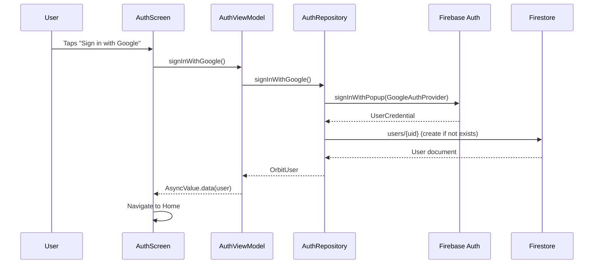
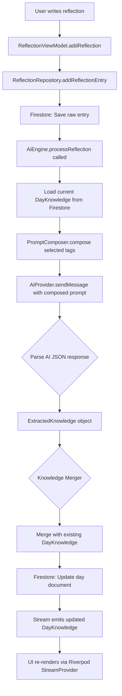
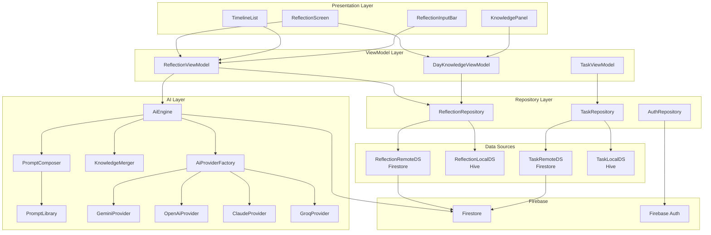
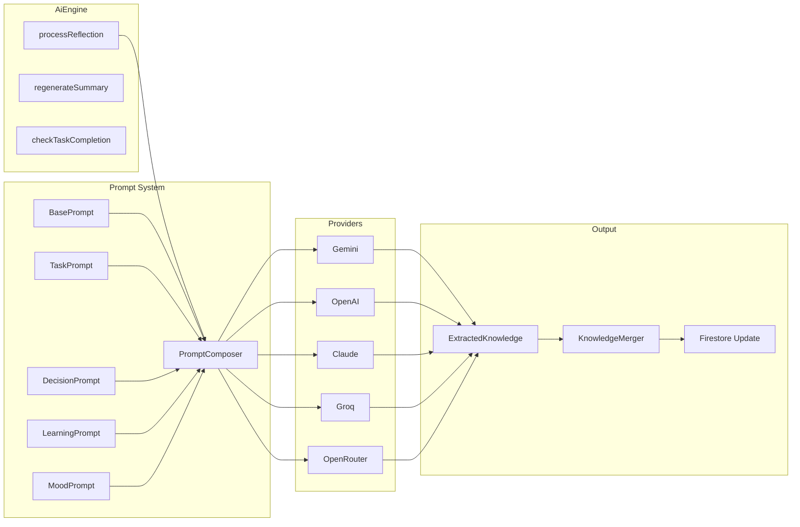
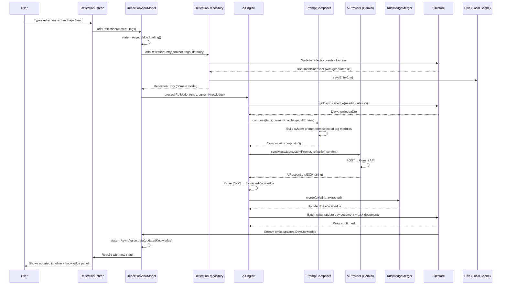
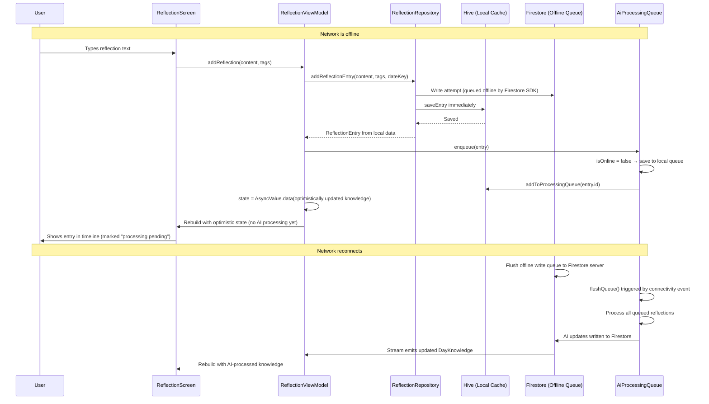
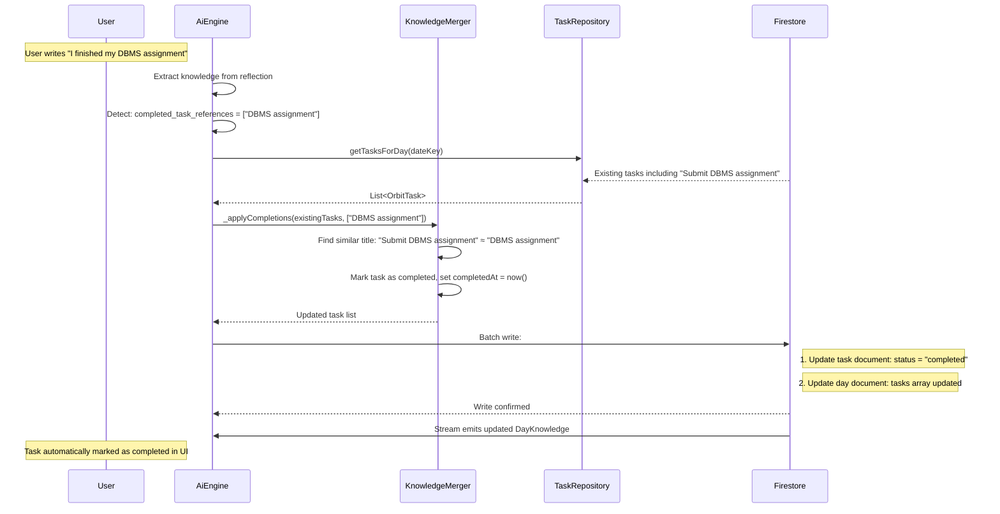
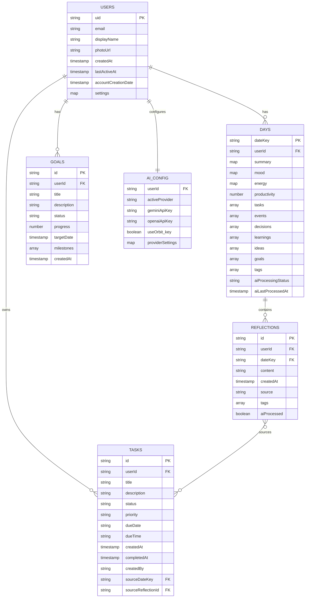
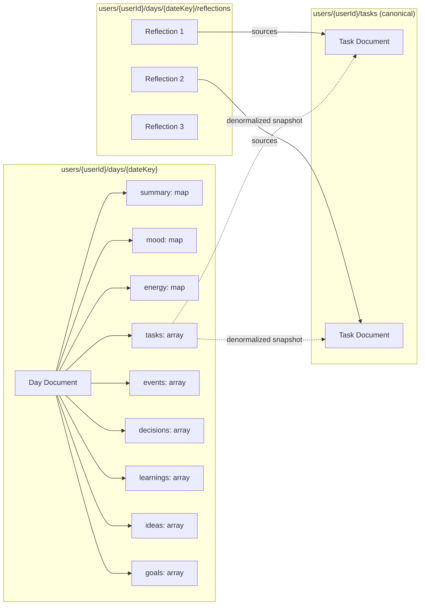

# 02 — Orbit Technical Architecture

> **Document Type:** Technical Architecture Reference  
> **Version:** 1.0.0  
> **Status:** Living Document  
> **Audience:** Core Contributors, Senior Engineers, AI Systems Architects  
> **Last Updated:** Phase 2 — Today's Reflection

---

## Table of Contents

1. [Architectural Philosophy](#1-architectural-philosophy)
2. [MVVM Architecture](#2-mvvm-architecture)
3. [Feature-First Folder Structure](#3-feature-first-folder-structure)
4. [Repository Pattern](#4-repository-pattern)
5. [Dependency Injection](#5-dependency-injection)
6. [Provider Architecture — Riverpod](#6-provider-architecture--riverpod)
7. [Firebase Architecture](#7-firebase-architecture)
8. [Firestore Database Design](#8-firestore-database-design)
9. [AI Engine Architecture](#9-ai-engine-architecture)
10. [Prompt Framework](#10-prompt-framework)
11. [API Layer](#11-api-layer)
12. [Caching Strategy](#12-caching-strategy)
13. [Offline-First Architecture](#13-offline-first-architecture)
14. [Security Architecture](#14-security-architecture)
15. [Scalability Design](#15-scalability-design)
16. [Component Diagrams](#16-component-diagrams)
17. [Sequence Diagrams](#17-sequence-diagrams)
18. [Database Diagrams](#18-database-diagrams)
19. [Error Handling Strategy](#19-error-handling-strategy)
20. [Testing Architecture](#20-testing-architecture)

---

## 1. Architectural Philosophy

### 1.1 Purpose

Before a single line of code is written, Orbit's architecture must answer one fundamental question: **how do we build a system that remains maintainable, testable, and extensible as the product grows from a single reflection screen to a full Personal Operating System?**

This section establishes the non-negotiable principles that govern every technical decision in the Orbit codebase.

### 1.2 Core Architectural Principles

**Separation of Concerns (SoC)**

Every layer of the application must have a single, well-defined responsibility. UI components must not know where data comes from. Business logic must not depend on UI frameworks. Data sources must not know what features consume them. Violating this principle is the primary source of spaghetti code in Flutter applications.

**Inversion of Control**

Higher-level modules must not depend on lower-level modules. Both should depend on abstractions. In Orbit's context, the `ReflectionViewModel` must not depend on `FirebaseFirestore` — it must depend on `ReflectionRepository`, an abstract interface. The concrete implementation can be swapped without changing any ViewModel.

**Single Responsibility Principle**

A class should have only one reason to change. A ViewModel changes when the presentation logic changes. A Repository changes when the data-fetching strategy changes. These must never be the same class.

**Open/Closed Principle**

The architecture must be open for extension but closed for modification. Adding a new AI provider must not require touching existing AI provider code. Adding a new knowledge extraction type must not break the existing extraction pipeline.

**Don't Repeat Yourself (DRY)**

Shared logic, such as authentication state checks, error handling patterns, or Firestore timestamp utilities, must be centralized. Feature implementations must never duplicate shared infrastructure.

**Convention Over Configuration**

The project must have clear, enforced conventions for file naming, folder organization, class naming, and state management patterns. New contributors should be able to infer the pattern from existing code without reading documentation.

### 1.3 Why This Stack?

The stack — Flutter, Firebase, Firestore, Riverpod, MVVM, Feature-first, Repository Pattern — was not chosen arbitrarily. Each element solves a specific problem:

| Technology | Problem Solved |
|---|---|
| Flutter | Cross-platform UI from a single codebase |
| Firebase Auth | Eliminates the complexity of building authentication infrastructure |
| Firestore | Real-time, offline-capable NoSQL database with scalable reads |
| Riverpod | Compile-safe, testable, scalable state management |
| MVVM | Decouples UI from business logic |
| Feature-first folders | Scales with the team; features are isolated |
| Repository Pattern | Decouples data sources from business logic |

---

## 2. MVVM Architecture

### 2.1 Purpose

MVVM (Model-View-ViewModel) is the foundational architectural pattern that governs how Orbit's UI layers are organized. The primary motivation is **testability** and **decoupling** — the ViewModel can be unit-tested in complete isolation from Flutter's widget tree.

### 2.2 Layer Definitions

```
┌─────────────────────────────────────────────────────────┐
│                         VIEW                            │
│  Flutter Widgets, Screens, UI Components                │
│  Responsibility: Render state, dispatch user events     │
│  Knows about: ViewModel                                 │
│  Does NOT know about: Repositories, Firestore, AI       │
└────────────────────────┬────────────────────────────────┘
                         │ observes state
                         │ dispatches events
┌────────────────────────▼────────────────────────────────┐
│                      VIEWMODEL                          │
│  Riverpod Notifiers, State Holders                      │
│  Responsibility: Business logic, UI state management    │
│  Knows about: Repositories (via interfaces)             │
│  Does NOT know about: Firestore, Firebase, AI SDKs      │
└────────────────────────┬────────────────────────────────┘
                         │ calls abstract methods
                         │ receives domain models
┌────────────────────────▼────────────────────────────────┐
│                     REPOSITORY                          │
│  Abstract interfaces + Concrete implementations        │
│  Responsibility: Data access, caching, offline sync     │
│  Knows about: Data sources (Firestore, local DB, AI)   │
│  Does NOT know about: ViewModels, UI state              │
└────────────────────────┬────────────────────────────────┘
                         │ fetches/writes data
┌────────────────────────▼────────────────────────────────┐
│                    DATA SOURCES                         │
│  Firestore, Hive, SharedPreferences, AI APIs            │
│  Responsibility: Raw data access only                   │
│  Knows about: External APIs, SDKs                       │
│  Does NOT know about: anything above                    │
└─────────────────────────────────────────────────────────┘
```

### 2.3 The Model Layer

In Orbit's MVVM, "Model" encompasses two distinct types:

**Domain Models** — Pure Dart classes that represent business entities. They carry no framework dependencies.

```dart
// lib/features/reflection/domain/models/reflection_entry.dart

class ReflectionEntry {
  final String id;
  final String userId;
  final String content;
  final DateTime createdAt;
  final String dateKey; // Format: 'YYYY-MM-DD'
  final ReflectionSource source; // typed, voice, imported
  final List<ReflectionTag> tags;

  const ReflectionEntry({
    required this.id,
    required this.userId,
    required this.content,
    required this.createdAt,
    required this.dateKey,
    required this.source,
    this.tags = const [],
  });
}
```

**Data Transfer Objects (DTOs)** — These are the serialization layer. They live in the `data` layer and know about Firestore's `Map<String, dynamic>` format.

```dart
// lib/features/reflection/data/dtos/reflection_entry_dto.dart

class ReflectionEntryDto {
  final String id;
  final String userId;
  final String content;
  final Timestamp createdAt;
  final String dateKey;
  final String source;
  final List<String> tags;

  factory ReflectionEntryDto.fromFirestore(DocumentSnapshot doc) {
    final data = doc.data() as Map<String, dynamic>;
    return ReflectionEntryDto(
      id: doc.id,
      userId: data['userId'] as String,
      content: data['content'] as String,
      createdAt: data['createdAt'] as Timestamp,
      dateKey: data['dateKey'] as String,
      source: data['source'] as String,
      tags: List<String>.from(data['tags'] ?? []),
    );
  }

  ReflectionEntry toDomain() {
    return ReflectionEntry(
      id: id,
      userId: userId,
      content: content,
      createdAt: createdAt.toDate(),
      dateKey: dateKey,
      source: ReflectionSource.fromString(source),
      tags: tags.map(ReflectionTag.fromString).toList(),
    );
  }

  Map<String, dynamic> toFirestore() {
    return {
      'userId': userId,
      'content': content,
      'createdAt': createdAt,
      'dateKey': dateKey,
      'source': source,
      'tags': tags,
    };
  }
}
```

**Design Decision — Why separate DTOs from Domain Models?**

Many Flutter projects use a single model class that both represents the domain entity and handles Firestore serialization. This creates tight coupling between the business layer and the data layer. When Firestore's structure changes (which happens in growing products), the domain model is polluted. In Orbit, the DTO absorbs all Firestore-specific changes, and the domain model remains clean.

### 2.4 The View Layer

Views are Flutter widgets. They must be as dumb as possible. A View's responsibilities:

- Read state from the ViewModel via Riverpod's `ref.watch`
- Dispatch events to the ViewModel via `ref.read(vmProvider.notifier).someMethod()`
- Never contain conditional business logic (this belongs in the ViewModel)
- Never directly call repositories

```dart
// lib/features/reflection/presentation/screens/reflection_screen.dart

class ReflectionScreen extends ConsumerWidget {
  const ReflectionScreen({super.key});

  @override
  Widget build(BuildContext context, WidgetRef ref) {
    final state = ref.watch(reflectionViewModelProvider);

    return state.when(
      loading: () => const ReflectionLoadingView(),
      error: (error, _) => ReflectionErrorView(error: error.toString()),
      data: (data) => ReflectionLoadedView(data: data),
    );
  }
}
```

**Design Decision — Why `ConsumerWidget` over `StatefulWidget`?**

`ConsumerWidget` gives access to the Riverpod `ref` object without requiring a `State` class. This keeps View classes stateless (or minimally stateful) and pushes all meaningful state into the ViewModel layer where it can be tested.

### 2.5 The ViewModel Layer

ViewModels in Orbit are Riverpod `AsyncNotifier` classes. They expose an `AsyncValue<T>` state, which encodes loading, error, and data states without requiring manual boolean flags.

```dart
// lib/features/reflection/presentation/viewmodels/reflection_view_model.dart

@riverpod
class ReflectionViewModel extends _$ReflectionViewModel {

  @override
  Future<DayKnowledge> build(String dateKey) async {
    final repository = ref.read(reflectionRepositoryProvider);
    return repository.getDayKnowledge(dateKey: dateKey);
  }

  Future<void> addReflection(String content, List<ReflectionTag> tags) async {
    state = const AsyncValue.loading();
    state = await AsyncValue.guard(() async {
      final repository = ref.read(reflectionRepositoryProvider);
      final aiEngine = ref.read(aiEngineProvider);

      // 1. Save the raw reflection
      final entry = await repository.addReflectionEntry(
        content: content,
        tags: tags,
        dateKey: currentDateKey(),
      );

      // 2. Trigger AI knowledge extraction
      await aiEngine.processReflection(entry: entry);

      // 3. Reload the day's knowledge state
      return repository.getDayKnowledge(dateKey: currentDateKey());
    });
  }
}
```

**Why `AsyncNotifier` over `StateNotifier`?**

`StateNotifier` was the previous Riverpod pattern. `AsyncNotifier` provides native async support via `AsyncValue`, eliminating the need for manual `isLoading` and `error` boolean fields. It also integrates cleanly with Riverpod's code generation system, reducing boilerplate.

---

## 3. Feature-First Folder Structure

### 3.1 Purpose

The folder structure is the architecture made visible. It determines how quickly a new contributor can locate code, how easy it is to delete a feature without touching unrelated code, and how well the codebase scales with a growing team.

Orbit uses a **feature-first** structure, meaning the primary organizational axis is the feature (reflection, tasks, calendar, academics), not the layer (models, services, screens).

### 3.2 Design Decision — Feature-First vs Layer-First

**Layer-first** organizes by technical role:

```
lib/
  models/
  services/
  screens/
  repositories/
  viewmodels/
```

**Feature-first** organizes by business domain:

```
lib/
  features/
    reflection/
    tasks/
    calendar/
    academics/
```

**Why feature-first wins for Orbit:**

In a layer-first structure, adding the Academics module requires touching five or more top-level directories. In a feature-first structure, adding Academics creates a single `features/academics/` directory. The feature boundary is also a potential module boundary — in the future, features can be extracted into separate Dart packages if needed.

Furthermore, when a contributor works on the reflection feature, every relevant file is co-located under `features/reflection/`. They never need to navigate across the project to find related code.

### 3.3 Full Folder Structure

```
orbit/
├── lib/
│   ├── core/
│   │   ├── constants/
│   │   │   ├── app_constants.dart
│   │   │   ├── firestore_constants.dart
│   │   │   └── ai_constants.dart
│   │   ├── di/
│   │   │   └── dependency_injection.dart
│   │   ├── errors/
│   │   │   ├── orbit_exception.dart
│   │   │   ├── network_exception.dart
│   │   │   └── ai_exception.dart
│   │   ├── extensions/
│   │   │   ├── datetime_extensions.dart
│   │   │   ├── string_extensions.dart
│   │   │   └── list_extensions.dart
│   │   ├── services/
│   │   │   ├── analytics_service.dart
│   │   │   └── crash_reporting_service.dart
│   │   ├── theme/
│   │   │   ├── app_theme.dart
│   │   │   ├── color_tokens.dart
│   │   │   ├── typography_tokens.dart
│   │   │   └── theme_notifier.dart
│   │   ├── routing/
│   │   │   ├── app_router.dart
│   │   │   └── route_guards.dart
│   │   ├── utils/
│   │   │   ├── date_utils.dart
│   │   │   ├── validators.dart
│   │   │   └── formatters.dart
│   │   └── widgets/
│   │       ├── orbit_app_bar.dart
│   │       ├── orbit_button.dart
│   │       ├── orbit_loading_indicator.dart
│   │       └── orbit_error_widget.dart
│   │
│   ├── features/
│   │   │
│   │   ├── auth/
│   │   │   ├── data/
│   │   │   │   ├── datasources/
│   │   │   │   │   └── firebase_auth_datasource.dart
│   │   │   │   ├── dtos/
│   │   │   │   │   └── user_dto.dart
│   │   │   │   └── repositories/
│   │   │   │       └── auth_repository_impl.dart
│   │   │   ├── domain/
│   │   │   │   ├── models/
│   │   │   │   │   └── orbit_user.dart
│   │   │   │   └── repositories/
│   │   │   │       └── auth_repository.dart
│   │   │   └── presentation/
│   │   │       ├── screens/
│   │   │       │   ├── login_screen.dart
│   │   │       │   └── register_screen.dart
│   │   │       ├── viewmodels/
│   │   │       │   └── auth_view_model.dart
│   │   │       └── widgets/
│   │   │           ├── auth_form.dart
│   │   │           └── google_sign_in_button.dart
│   │   │
│   │   ├── reflection/
│   │   │   ├── data/
│   │   │   │   ├── datasources/
│   │   │   │   │   ├── reflection_remote_datasource.dart
│   │   │   │   │   └── reflection_local_datasource.dart
│   │   │   │   ├── dtos/
│   │   │   │   │   ├── reflection_entry_dto.dart
│   │   │   │   │   └── day_knowledge_dto.dart
│   │   │   │   └── repositories/
│   │   │   │       └── reflection_repository_impl.dart
│   │   │   ├── domain/
│   │   │   │   ├── models/
│   │   │   │   │   ├── reflection_entry.dart
│   │   │   │   │   ├── day_knowledge.dart
│   │   │   │   │   ├── reflection_tag.dart
│   │   │   │   │   └── knowledge_item.dart
│   │   │   │   └── repositories/
│   │   │   │       └── reflection_repository.dart
│   │   │   └── presentation/
│   │   │       ├── screens/
│   │   │       │   ├── reflection_screen.dart
│   │   │       │   └── reflection_detail_screen.dart
│   │   │       ├── viewmodels/
│   │   │       │   ├── reflection_view_model.dart
│   │   │       │   └── day_knowledge_view_model.dart
│   │   │       └── widgets/
│   │   │           ├── reflection_input_bar.dart
│   │   │           ├── reflection_timeline.dart
│   │   │           ├── knowledge_panel.dart
│   │   │           ├── summary_card.dart
│   │   │           ├── task_chip.dart
│   │   │           └── voice_input_button.dart
│   │   │
│   │   ├── tasks/
│   │   │   ├── data/
│   │   │   │   ├── datasources/
│   │   │   │   │   ├── task_remote_datasource.dart
│   │   │   │   │   └── task_local_datasource.dart
│   │   │   │   ├── dtos/
│   │   │   │   │   └── task_dto.dart
│   │   │   │   └── repositories/
│   │   │   │       └── task_repository_impl.dart
│   │   │   ├── domain/
│   │   │   │   ├── models/
│   │   │   │   │   ├── orbit_task.dart
│   │   │   │   │   └── task_status.dart
│   │   │   │   └── repositories/
│   │   │   │       └── task_repository.dart
│   │   │   └── presentation/
│   │   │       ├── screens/
│   │   │       │   └── task_list_screen.dart
│   │   │       ├── viewmodels/
│   │   │       │   └── task_view_model.dart
│   │   │       └── widgets/
│   │   │           ├── task_card.dart
│   │   │           └── task_creation_sheet.dart
│   │   │
│   │   ├── calendar/
│   │   │   ├── data/
│   │   │   ├── domain/
│   │   │   └── presentation/
│   │   │       ├── screens/
│   │   │       │   └── calendar_screen.dart
│   │   │       ├── viewmodels/
│   │   │       │   └── calendar_view_model.dart
│   │   │       └── widgets/
│   │   │           ├── day_strip.dart
│   │   │           └── month_picker_dialog.dart
│   │   │
│   │   └── [future_modules]/
│   │       ├── academics/
│   │       ├── fitness/
│   │       ├── goals/
│   │       └── ai_coach/
│   │
│   ├── ai/
│   │   ├── engine/
│   │   │   ├── ai_engine.dart
│   │   │   └── ai_engine_impl.dart
│   │   ├── providers/
│   │   │   ├── ai_provider.dart              ← abstract interface
│   │   │   ├── gemini_provider.dart
│   │   │   ├── openai_provider.dart
│   │   │   ├── claude_provider.dart
│   │   │   ├── groq_provider.dart
│   │   │   └── openrouter_provider.dart
│   │   ├── prompts/
│   │   │   ├── prompt_library.dart
│   │   │   ├── base_prompt.dart
│   │   │   ├── task_prompt.dart
│   │   │   ├── completion_prompt.dart
│   │   │   ├── decision_prompt.dart
│   │   │   ├── learning_prompt.dart
│   │   │   ├── summary_prompt.dart
│   │   │   ├── event_prompt.dart
│   │   │   ├── goal_prompt.dart
│   │   │   └── prompt_composer.dart
│   │   └── models/
│   │       ├── ai_request.dart
│   │       ├── ai_response.dart
│   │       └── extracted_knowledge.dart
│   │
│   └── main.dart
│
├── test/
│   ├── unit/
│   │   ├── features/
│   │   │   ├── reflection/
│   │   │   └── tasks/
│   │   └── ai/
│   ├── widget/
│   └── integration/
│
├── docs/
│   ├── 01_ORBIT_VISION_AND_PRODUCT_BLUEPRINT.md
│   ├── 02_ORBIT_TECHNICAL_ARCHITECTURE.md
│   └── 03_ORBIT_DEVELOPMENT_ROADMAP.md
│
├── pubspec.yaml
├── analysis_options.yaml
└── README.md
```

### 3.4 Core Module Explained

The `core/` directory contains infrastructure that is shared across all features. It is explicitly **not a dumping ground**. Every item in `core/` must be used by at least two features; otherwise it belongs inside the feature itself.

**`core/constants/`** — Application-wide constants. `firestore_constants.dart` contains collection names (e.g., `static const String reflections = 'reflections'`) so that Firestore collection names are never hardcoded as strings in multiple places.

**`core/di/`** — The dependency injection registration layer. All providers that assemble the dependency graph live here.

**`core/errors/`** — The application-wide error hierarchy. All exceptions in Orbit extend `OrbitException`, which carries a `message`, `code`, and optional `originalException`. This ensures consistent error formatting throughout the app.

**`core/routing/`** — GoRouter configuration. All named routes are declared here. Route guards check authentication state before allowing navigation.

**`core/widgets/`** — Only truly universal widgets — the AppBar variant, standard buttons, and loading indicators — live here. Feature-specific widgets live in the feature's `presentation/widgets/` directory.

---

## 4. Repository Pattern

### 4.1 Purpose

The Repository Pattern creates a clean boundary between the application's business logic and its data sources. ViewModels depend on repository interfaces; they have no awareness of whether data comes from Firestore, a local Hive database, an AI API, or a mock in tests.

### 4.2 The Three Layers of the Repository Pattern

**Layer 1 — Abstract Repository Interface (Domain Layer)**

This is the contract. It defines what operations are available without saying how they are implemented.

```dart
// lib/features/reflection/domain/repositories/reflection_repository.dart

abstract class ReflectionRepository {
  /// Adds a new reflection entry for the current user.
  /// Triggers AI knowledge extraction asynchronously.
  Future<ReflectionEntry> addReflectionEntry({
    required String content,
    required List<ReflectionTag> tags,
    required String dateKey,
  });

  /// Returns the complete knowledge state for a given day.
  Future<DayKnowledge> getDayKnowledge({required String dateKey});

  /// Returns a stream of knowledge updates for a given day.
  /// Used for real-time UI updates as AI processes reflections.
  Stream<DayKnowledge> watchDayKnowledge({required String dateKey});

  /// Returns all reflection entries for a given day.
  Future<List<ReflectionEntry>> getEntriesForDay({required String dateKey});

  /// Updates the manual summary for a day.
  Future<void> updateSummary({
    required String dateKey,
    required String summary,
    required SummaryType type,
  });

  /// Deletes a single reflection entry.
  Future<void> deleteEntry({required String entryId, required String dateKey});
}
```

**Layer 2 — Data Sources**

Data sources are responsible for a single data access concern. Orbit uses two types:

- **Remote Data Source** — Firestore operations
- **Local Data Source** — Hive operations for caching

```dart
// lib/features/reflection/data/datasources/reflection_remote_datasource.dart

abstract class ReflectionRemoteDataSource {
  Future<ReflectionEntryDto> addEntry(ReflectionEntryDto dto);
  Future<DayKnowledgeDto> getDayKnowledge(String userId, String dateKey);
  Stream<DayKnowledgeDto> watchDayKnowledge(String userId, String dateKey);
  Future<List<ReflectionEntryDto>> getEntriesForDay(String userId, String dateKey);
  Future<void> updateDayKnowledge(String userId, String dateKey, Map<String, dynamic> updates);
}

class FirestoreReflectionDataSource implements ReflectionRemoteDataSource {
  final FirebaseFirestore _firestore;

  FirestoreReflectionDataSource(this._firestore);

  @override
  Future<ReflectionEntryDto> addEntry(ReflectionEntryDto dto) async {
    final ref = _firestore
        .collection(FirestoreConstants.users)
        .doc(dto.userId)
        .collection(FirestoreConstants.days)
        .doc(dto.dateKey)
        .collection(FirestoreConstants.reflections)
        .doc();

    final dtoWithId = dto.copyWith(id: ref.id);
    await ref.set(dtoWithId.toFirestore());
    return dtoWithId;
  }

  @override
  Stream<DayKnowledgeDto> watchDayKnowledge(String userId, String dateKey) {
    return _firestore
        .collection(FirestoreConstants.users)
        .doc(userId)
        .collection(FirestoreConstants.days)
        .doc(dateKey)
        .snapshots()
        .map(DayKnowledgeDto.fromFirestore);
  }
}
```

**Layer 3 — Repository Implementation**

The implementation orchestrates between the remote and local data sources, handles caching logic, maps DTOs to domain models, and translates data layer exceptions into domain-level `OrbitException` instances.

```dart
// lib/features/reflection/data/repositories/reflection_repository_impl.dart

class ReflectionRepositoryImpl implements ReflectionRepository {
  final ReflectionRemoteDataSource _remote;
  final ReflectionLocalDataSource _local;
  final AuthRepository _auth;

  ReflectionRepositoryImpl({
    required ReflectionRemoteDataSource remote,
    required ReflectionLocalDataSource local,
    required AuthRepository auth,
  })  : _remote = remote,
        _local = local,
        _auth = auth;

  @override
  Future<ReflectionEntry> addReflectionEntry({
    required String content,
    required List<ReflectionTag> tags,
    required String dateKey,
  }) async {
    try {
      final userId = _auth.requireCurrentUserId();
      final dto = ReflectionEntryDto(
        id: '',
        userId: userId,
        content: content,
        createdAt: Timestamp.now(),
        dateKey: dateKey,
        source: 'typed',
        tags: tags.map((t) => t.value).toList(),
      );
      final saved = await _remote.addEntry(dto);
      final domain = saved.toDomain();
      // Also persist to local cache
      await _local.saveEntry(saved);
      return domain;
    } on FirebaseException catch (e) {
      throw OrbitException.fromFirebase(e);
    }
  }

  @override
  Stream<DayKnowledge> watchDayKnowledge({required String dateKey}) {
    try {
      final userId = _auth.requireCurrentUserId();
      return _remote
          .watchDayKnowledge(userId, dateKey)
          .map((dto) => dto.toDomain());
    } on FirebaseException catch (e) {
      throw OrbitException.fromFirebase(e);
    }
  }
}
```

### 4.3 Why This Approach Was Chosen Over Alternatives

**Alternative 1 — Direct Firestore access in ViewModels**

This is the most common anti-pattern in Flutter apps. It makes ViewModels untestable (you would need the Firebase emulator for every ViewModel test) and creates tight coupling between UI logic and infrastructure.

**Alternative 2 — Service Layer Instead of Repository**

A "Service" layer is similar to Repository but tends to merge business logic with data access. The Repository pattern has a clearer contract: repositories only do data access and transformation. Business logic that crosses repositories belongs in use case classes or directly in the ViewModel.

**Decision — Repository Pattern**

Repository is the most appropriate pattern for Orbit because it creates a testable seam, enables offline-first caching at the repository boundary, allows data source swapping (e.g., replacing Firestore with a different backend), and follows established Clean Architecture conventions that contributors will recognize.

---

## 5. Dependency Injection

### 5.1 Purpose

Dependency Injection (DI) ensures that classes receive their dependencies from the outside rather than creating them internally. In Orbit, DI is implemented via Riverpod's provider system, which acts as the DI container.

### 5.2 Provider Hierarchy

Riverpod providers form a directed acyclic graph (DAG). Lower-level providers are declared first and consumed by higher-level providers.

```dart
// lib/core/di/dependency_injection.dart

// ─── Infrastructure ──────────────────────────────────────────────────────────

@Riverpod(keepAlive: true)
FirebaseFirestore firebaseFirestore(FirebaseFirestoreRef ref) {
  return FirebaseFirestore.instance;
}

@Riverpod(keepAlive: true)
FirebaseAuth firebaseAuth(FirebaseAuthRef ref) {
  return FirebaseAuth.instance;
}

// ─── Data Sources ─────────────────────────────────────────────────────────────

@Riverpod(keepAlive: true)
ReflectionRemoteDataSource reflectionRemoteDataSource(
  ReflectionRemoteDataSourceRef ref,
) {
  return FirestoreReflectionDataSource(ref.watch(firebaseFirestoreProvider));
}

@Riverpod(keepAlive: true)
ReflectionLocalDataSource reflectionLocalDataSource(
  ReflectionLocalDataSourceRef ref,
) {
  return HiveReflectionDataSource();
}

// ─── Repositories ─────────────────────────────────────────────────────────────

@Riverpod(keepAlive: true)
ReflectionRepository reflectionRepository(ReflectionRepositoryRef ref) {
  return ReflectionRepositoryImpl(
    remote: ref.watch(reflectionRemoteDataSourceProvider),
    local: ref.watch(reflectionLocalDataSourceProvider),
    auth: ref.watch(authRepositoryProvider),
  );
}

// ─── AI Layer ─────────────────────────────────────────────────────────────────

@Riverpod(keepAlive: true)
AiProvider activeAiProvider(ActiveAiProviderRef ref) {
  final config = ref.watch(aiConfigProvider);
  return AiProviderFactory.create(config.activeProvider);
}

@Riverpod(keepAlive: true)
AiEngine aiEngine(AiEngineRef ref) {
  return AiEngineImpl(
    provider: ref.watch(activeAiProviderProvider),
    promptLibrary: ref.watch(promptLibraryProvider),
    reflectionRepository: ref.watch(reflectionRepositoryProvider),
  );
}
```

### 5.3 Testing with Dependency Injection

Because Riverpod providers are declared independently, any provider can be overridden in tests:

```dart
// test/features/reflection/reflection_view_model_test.dart

void main() {
  late ProviderContainer container;

  setUp(() {
    container = ProviderContainer(
      overrides: [
        reflectionRepositoryProvider.overrideWithValue(
          MockReflectionRepository(), // Returns canned data; no Firebase needed
        ),
        aiEngineProvider.overrideWithValue(
          MockAiEngine(), // Returns canned extraction results
        ),
      ],
    );
  });

  test('addReflection updates state correctly', () async {
    final vm = container.read(reflectionViewModelProvider('2025-01-15').notifier);
    await vm.addReflection('I finished my DBMS assignment', [ReflectionTag.tasks]);
    
    final state = container.read(reflectionViewModelProvider('2025-01-15'));
    expect(state.value?.tasks, isNotEmpty);
  });
}
```

---

## 6. Provider Architecture — Riverpod

### 6.1 Purpose

Riverpod is Orbit's state management solution. The decision between Riverpod and alternatives (Provider, Bloc, GetX, MobX) was made deliberately after evaluating Orbit's specific needs.

### 6.2 Why Riverpod Over Alternatives

**Provider (the package)**

Provider is the predecessor to Riverpod, also made by Remi Rousseau. It has known limitations: providers must be declared within the widget tree (limiting testability), `BuildContext` is required to access providers (coupling providers to Flutter), and there are no compile-time safety checks for missing providers. Riverpod addresses all of these.

**Bloc**

Bloc is excellent for complex event-driven state machines. However, for Orbit's use case — primarily reading and writing data with async states — Bloc introduces significant boilerplate. Each user interaction requires an `Event`, a `State`, and a `Bloc` class. Riverpod's `AsyncNotifier` achieves the same with 40% less code. Bloc's primary advantage is in highly complex state machines, which is a future concern, not a current one.

**GetX**

GetX is not recommended for Orbit due to its tendency to encourage coupling layers together, its non-standard patterns that conflict with Flutter's own architecture guidance, and its less testable dependency injection approach.

**MobX**

MobX is reactive and elegant but requires code generation for every observable, action, and reaction. This significantly increases build times as the project grows and creates a high learning curve for contributors.

**Decision — Riverpod with Code Generation**

Riverpod with `@riverpod` annotations provides compile-time safety (missing providers cause compilation errors, not runtime crashes), excellent testability (providers can be overridden anywhere), no BuildContext dependency, and native async support via `AsyncValue`. It is the official recommendation from many Flutter architecture guides and has growing community momentum.

### 6.3 Provider Types Used in Orbit

```dart
// 1. Simple provider — for immutable values or singletons
@Riverpod(keepAlive: true)
FirebaseFirestore firebaseFirestore(FirebaseFirestoreRef ref) =>
    FirebaseFirestore.instance;

// 2. FutureProvider — for one-time async reads
@riverpod
Future<List<OrbitTask>> tasksForDay(TasksForDayRef ref, String dateKey) async {
  final repo = ref.watch(taskRepositoryProvider);
  return repo.getTasksForDay(dateKey: dateKey);
}

// 3. StreamProvider — for real-time Firestore data
@riverpod
Stream<DayKnowledge> dayKnowledgeStream(DayKnowledgeStreamRef ref, String dateKey) {
  final repo = ref.watch(reflectionRepositoryProvider);
  return repo.watchDayKnowledge(dateKey: dateKey);
}

// 4. AsyncNotifier — for ViewModels with user interactions
@riverpod
class ReflectionViewModel extends _$ReflectionViewModel {
  @override
  Future<DayKnowledge> build(String dateKey) async { ... }
  
  Future<void> addReflection(String content, List<ReflectionTag> tags) async { ... }
  Future<void> regenerateSummary() async { ... }
}

// 5. Notifier — for synchronous state with user interactions
@riverpod
class ThemeNotifier extends _$ThemeNotifier {
  @override
  ThemeMode build() => ThemeMode.system;
  
  void toggle() => state = state == ThemeMode.light ? ThemeMode.dark : ThemeMode.light;
}
```

### 6.4 State Invalidation and Caching

Riverpod's automatic disposal system means providers are garbage-collected when their listeners are removed. This is a feature, not a bug — a day's knowledge is loaded when the user navigates to that day and released when they navigate away, preventing unnecessary memory usage.

For cross-session data (user profile, AI configuration), providers are declared with `keepAlive: true`:

```dart
@Riverpod(keepAlive: true)
Future<OrbitUser> currentUser(CurrentUserRef ref) async { ... }
```

**Cache Invalidation Strategy**

When the AI engine finishes processing a reflection and updates Firestore, the `watchDayKnowledge` StreamProvider automatically emits the new state — no manual invalidation required. For non-streaming providers, Riverpod's `ref.invalidate(provider)` forces a re-fetch.

---

## 7. Firebase Architecture

### 7.1 Firebase Services Used in Orbit

| Service | Purpose | Phase |
|---|---|---|
| Firebase Authentication | User identity, session management | Phase 1 |
| Cloud Firestore | Primary persistent data store | Phase 1 |
| Firebase Storage | Profile photos, future: fitness photos | Phase 3+ |
| Firebase Functions | AI processing triggers, data aggregation | Phase 3+ |
| Firebase Analytics | Feature usage, retention | Phase 2+ |
| Firebase Crashlytics | Error tracking and crash reporting | Phase 2 |
| Firebase Remote Config | Feature flags, A/B testing | Phase 3+ |

### 7.2 Firebase Authentication Architecture

Orbit uses Firebase Auth as the single source of truth for user identity. The `AuthRepository` wraps all Firebase Auth operations behind a clean interface.

```dart
// lib/features/auth/domain/repositories/auth_repository.dart

abstract class AuthRepository {
  /// Returns the current user, or null if not authenticated.
  OrbitUser? get currentUser;

  /// Returns the current user's ID, throwing if not authenticated.
  /// Used by repositories that require authentication.
  String requireCurrentUserId();

  /// Stream of authentication state changes.
  Stream<OrbitUser?> get authStateChanges;

  /// Signs in with Google OAuth.
  Future<OrbitUser> signInWithGoogle();

  /// Signs in with email and password.
  Future<OrbitUser> signInWithEmailAndPassword(String email, String password);

  /// Creates a new user account.
  Future<OrbitUser> createUserWithEmailAndPassword(String email, String password);

  /// Signs out the current user.
  Future<void> signOut();
}
```

### 7.3 Authentication Flow



### 7.4 User Document Initialization

When a user first authenticates, Orbit creates their root document in Firestore if it does not exist. This uses `SetOptions(merge: true)` to avoid overwriting existing data on subsequent logins:

```dart
await _firestore.collection('users').doc(uid).set({
  'uid': uid,
  'email': email,
  'displayName': displayName,
  'createdAt': FieldValue.serverTimestamp(),
  'lastActiveAt': FieldValue.serverTimestamp(),
  'accountCreationDate': FieldValue.serverTimestamp(),
  'settings': {
    'theme': 'system',
    'aiProvider': 'gemini',
    'notificationsEnabled': true,
  },
}, SetOptions(merge: true));
```

**Design Decision — Why `merge: true`?**

Without `merge: true`, every sign-in would overwrite the user's settings with defaults. With `merge: true`, fields not present in the new data are preserved. This is the correct pattern for initialization documents that may be updated by the user later.

---

## 8. Firestore Database Design

### 8.1 Design Philosophy

Firestore is a document-oriented NoSQL database. Its data model is fundamentally different from relational databases, and treating it like SQL is the primary source of performance and cost problems in Firebase projects.

**Orbit's Firestore design principles:**

- **Denormalization is acceptable** — Duplicate data to avoid expensive joins (Firestore does not support server-side joins).
- **Design for read patterns** — Structure data the way the application reads it, not the way it conceptually relates.
- **Minimize collection-group queries** — While supported, they require composite indexes and are more expensive than document reads.
- **Use subcollections for one-to-many relationships** — This enables pagination and targeted security rules.
- **Prefer batch writes** — When multiple documents must be updated atomically, use Firestore batch writes or transactions.

### 8.2 Collection Architecture Overview

```
users/ (collection)
└── {userId}/ (document)
    ├── [User Profile Fields]
    ├── settings/ (subcollection)
    │   └── preferences (document)
    ├── days/ (subcollection)
    │   └── {dateKey}/ (document, format: YYYY-MM-DD)
    │       ├── [DayKnowledge Fields]
    │       └── reflections/ (subcollection)
    │           └── {reflectionId}/ (document)
    ├── tasks/ (subcollection)
    │   └── {taskId}/ (document)
    ├── goals/ (subcollection)
    │   └── {goalId}/ (document)
    └── ai_config/ (subcollection)
        └── settings (document)
```

### 8.3 Collection: `users`

**Purpose:** Root collection. Each document represents one Orbit user.

**Document ID:** Firebase Auth UID

**Schema:**

```
users/{userId}
├── uid: string
├── email: string
├── displayName: string
├── photoUrl: string | null
├── createdAt: timestamp
├── lastActiveAt: timestamp
├── accountCreationDate: timestamp  ← first login date; determines accessible calendar range
└── settings: map
    ├── theme: string ('light' | 'dark' | 'system')
    ├── aiProvider: string ('gemini' | 'openai' | 'claude' | 'groq')
    ├── defaultReflectionTags: array<string>
    └── notificationsEnabled: boolean
```

**Design Decision — Why Inline Settings?**

Settings could live in a separate `settings` subcollection document. However, because settings are always read alongside user identity on app startup, inlining them avoids an additional Firestore read. The tradeoff is that settings cannot have their own security rules separate from the user document — this is acceptable for the current architecture.

### 8.4 Subcollection: `users/{userId}/days`

**Purpose:** Each document represents one calendar day for a user. This is the central knowledge document for the day.

**Document ID:** Date string in `YYYY-MM-DD` format (e.g., `2025-01-15`). This format is lexicographically sortable, enabling efficient range queries.

**Why a string date key instead of a Timestamp?**

Firestore Timestamps are stored as UTC. A user creating a reflection at 11 PM in IST would result in a different UTC date than their local date. Using a string date key derived from the user's local device time ensures the day document always matches what the user considers "today."

**Schema:**

```
users/{userId}/days/{dateKey}
├── dateKey: string               ← 'YYYY-MM-DD'
├── userId: string
├── createdAt: timestamp
├── updatedAt: timestamp
├── summary: map
│   ├── content: string
│   ├── type: string ('ai' | 'manual' | 'none')
│   ├── generatedAt: timestamp | null
│   └── lastEditedAt: timestamp | null
├── mood: map | null
│   ├── value: number (1–10)
│   └── label: string ('great' | 'good' | 'neutral' | 'bad' | 'terrible')
├── energy: map | null
│   ├── value: number (1–10)
│   └── label: string
├── productivity: number | null     ← 1–10
├── tasks: array<map>              ← denormalized task summaries
│   └── [each entry]:
│       ├── id: string
│       ├── title: string
│       ├── status: string
│       └── priority: string
├── events: array<map>
│   └── [each entry]:
│       ├── id: string
│       ├── title: string
│       └── time: string
├── decisions: array<map>
│   └── [each entry]:
│       ├── id: string
│       └── content: string
├── learnings: array<map>
│   └── [each entry]:
│       ├── id: string
│       └── content: string
├── ideas: array<map>
├── goals: array<map>
├── habits: array<map>
├── tags: array<string>           ← all tags present in today's reflections
├── aiProcessingStatus: string    ← 'idle' | 'processing' | 'completed' | 'failed'
└── aiLastProcessedAt: timestamp | null
```

**Design Decision — Why Array Fields for Tasks, Events, Decisions?**

Orbit supports rendering a rich summary of a day's knowledge from a single document read. If tasks, events, and decisions were separate subcollections, a full-day view would require N+1 Firestore reads. By denormalizing summaries into the day document, a single read renders the complete knowledge panel.

**The canonical task store** remains the `users/{userId}/tasks` subcollection. The day document's `tasks` array contains only the fields needed for rendering in the context of that day. This is a deliberate denormalization pattern.

**Limitation — 1MB document size limit**

Firestore documents have a maximum size of 1 MB. For users who write many reflections per day or have very large extracted knowledge, this limit could theoretically be reached. In practice, the limit is well beyond what a student would generate daily. A future mitigation is to move large text fields (long summaries) to Firebase Storage and store only a reference in Firestore.

### 8.5 Subcollection: `users/{userId}/days/{dateKey}/reflections`

**Purpose:** Each document represents a single reflection entry written by the user.

**Document ID:** Auto-generated Firestore ID.

**Schema:**

```
users/{userId}/days/{dateKey}/reflections/{reflectionId}
├── id: string
├── userId: string
├── content: string
├── createdAt: timestamp
├── dateKey: string
├── source: string                ← 'typed' | 'voice' | 'imported'
├── tags: array<string>           ← user-selected tags for this entry
├── aiProcessed: boolean
├── aiProcessedAt: timestamp | null
└── extractedKnowledgeRef: string | null   ← future: reference to detailed extraction
```

**Why a subcollection rather than an array on the day document?**

Storing reflection entries as an array on the day document would:
1. Hit the 1MB document limit for prolific writers
2. Make individual entry updates require rewriting the entire array (Firestore array operations are limited)
3. Make security rules on individual entries impossible

A subcollection allows paginated reads, targeted security rules per reflection, and clean deletion of individual entries.

### 8.6 Subcollection: `users/{userId}/tasks`

**Purpose:** The canonical task store. This is Orbit's task database, separate from the day's knowledge snapshot.

**Document ID:** Auto-generated Firestore ID.

**Schema:**

```
users/{userId}/tasks/{taskId}
├── id: string
├── userId: string
├── title: string
├── description: string | null
├── status: string                ← 'pending' | 'in_progress' | 'completed' | 'cancelled'
├── priority: string              ← 'high' | 'medium' | 'low'
├── dueDate: string | null        ← 'YYYY-MM-DD'
├── dueTime: string | null        ← 'HH:mm'
├── createdAt: timestamp
├── completedAt: timestamp | null
├── createdBy: string             ← 'ai' | 'manual'
├── sourceDateKey: string | null  ← which day's reflection created this task
├── sourceReflectionId: string | null
└── tags: array<string>
```

**Design Decision — Tasks as a Top-Level Subcollection**

Tasks belong to the user, not to a single day. A task created on Monday can be completed on Wednesday. A task's due date may be different from its creation date. Storing tasks as a subcollection of `days` would make cross-day task views (a full task inbox) require expensive collection group queries. Storing them under `users/{userId}/tasks` enables efficient user-scoped queries.

**Relationship to Day Documents**

When a task is created or updated, the day document's `tasks` array is updated via a Firestore batch write to maintain consistency. The batch write ensures both the task document and the day's knowledge snapshot are updated atomically.

### 8.7 Firestore Indexing Strategy

Firestore automatically indexes every field in a document. However, compound queries (filtering on multiple fields, or filtering + ordering) require explicit composite indexes.

**Indexes Orbit Will Require:**

```
Collection: users/{userId}/tasks
Composite Index 1: status ASC, dueDate ASC      ← "all pending tasks, sorted by due date"
Composite Index 2: createdAt DESC, status ASC   ← "recent tasks"
Composite Index 3: sourceDateKey ASC, status ASC ← "tasks from a specific day"

Collection: users/{userId}/days
Composite Index 1: dateKey ASC                  ← simple, likely covered by auto-index
```

**Design Decision — Minimal Index Strategy**

Firestore charges per index write. Every document write also updates all applicable indexes. Starting with the minimum required indexes and adding as query patterns are confirmed reduces unnecessary write costs.

### 8.8 Firestore Security Rules

Security rules enforce that users can only access their own data:

```javascript
rules_version = '2';
service cloud.firestore {
  match /databases/{database}/documents {

    function isAuthenticated() {
      return request.auth != null;
    }

    function isOwner(userId) {
      return request.auth.uid == userId;
    }

    function isValidDateKey(dateKey) {
      return dateKey.matches('^[0-9]{4}-[0-9]{2}-[0-9]{2}$');
    }

    // User documents
    match /users/{userId} {
      allow read, write: if isAuthenticated() && isOwner(userId);

      // Day documents
      match /days/{dateKey} {
        allow read, write: if isAuthenticated()
            && isOwner(userId)
            && isValidDateKey(dateKey);

        // Reflection entries
        match /reflections/{reflectionId} {
          allow read, write: if isAuthenticated() && isOwner(userId);
        }
      }

      // Tasks
      match /tasks/{taskId} {
        allow read, write: if isAuthenticated() && isOwner(userId);
      }
    }
  }
}
```

---

## 9. AI Engine Architecture

### 9.1 Purpose

The AI Engine is the intelligence layer of Orbit. Its responsibility is to accept raw reflection text, select and compose the appropriate prompts, send requests to the configured AI provider, parse structured responses, and update the Firestore knowledge state.

The AI Engine is deliberately separated from all feature layers. Features interact with Orbit's knowledge state (Firestore) — they do not interact with the AI Engine directly. The AI Engine writes to Firestore; features read from Firestore. This decoupling is fundamental.

### 9.2 AI Engine Interface

```dart
// lib/ai/engine/ai_engine.dart

abstract class AiEngine {
  /// Processes a newly added reflection entry.
  /// Extracts knowledge and updates the day's knowledge state in Firestore.
  Future<ExtractedKnowledge> processReflection({
    required ReflectionEntry entry,
    required DayKnowledge currentDayKnowledge,
  });

  /// Regenerates the day's summary using all available reflection entries.
  Future<String> regenerateSummary({
    required String dateKey,
    required List<ReflectionEntry> entries,
    required DayKnowledge currentKnowledge,
  });

  /// Checks whether a reflection implies completion of an existing task.
  Future<TaskCompletionResult?> checkTaskCompletion({
    required ReflectionEntry entry,
    required List<OrbitTask> existingTasks,
  });
}
```

### 9.3 AI Provider Abstraction

Orbit supports multiple AI providers from Phase 2 onwards. The `AiProvider` interface defines the single method all providers must implement:

```dart
// lib/ai/providers/ai_provider.dart

abstract class AiProvider {
  /// The provider identifier (used in settings and analytics)
  String get id;

  /// The display name shown in the UI
  String get displayName;

  /// Whether this provider is currently configured and usable
  bool get isConfigured;

  /// Sends a message to the AI and returns the response.
  Future<AiResponse> sendMessage({
    required String systemPrompt,
    required String userMessage,
    AiResponseFormat responseFormat = AiResponseFormat.text,
    int maxTokens = 2000,
    double temperature = 0.3,
  });

  /// Sends a streaming message (for real-time UI responses).
  Stream<String> streamMessage({
    required String systemPrompt,
    required String userMessage,
  });
}
```

### 9.4 Provider Implementations

```dart
// lib/ai/providers/gemini_provider.dart

class GeminiProvider implements AiProvider {
  final GenerativeModel _model;

  GeminiProvider() : _model = GenerativeModel(
    model: 'gemini-1.5-flash',
    apiKey: const String.fromEnvironment('GEMINI_API_KEY'),
  );

  @override
  String get id => 'gemini';

  @override
  String get displayName => 'Google Gemini';

  @override
  bool get isConfigured => const String.fromEnvironment('GEMINI_API_KEY').isNotEmpty;

  @override
  Future<AiResponse> sendMessage({
    required String systemPrompt,
    required String userMessage,
    AiResponseFormat responseFormat = AiResponseFormat.text,
    int maxTokens = 2000,
    double temperature = 0.3,
  }) async {
    try {
      final prompt = '$systemPrompt\n\n$userMessage';
      final response = await _model.generateContent([Content.text(prompt)]);
      return AiResponse(
        content: response.text ?? '',
        provider: id,
        tokensUsed: null, // Gemini does not return token counts in all configurations
      );
    } on GenerativeAIException catch (e) {
      throw AiException(message: e.message, provider: id);
    }
  }
}
```

```dart
// lib/ai/providers/openai_provider.dart

class OpenAiProvider implements AiProvider {
  final OpenAI _client;

  OpenAiProvider() : _client = OpenAI.instance;

  @override
  Future<AiResponse> sendMessage({
    required String systemPrompt,
    required String userMessage,
    AiResponseFormat responseFormat = AiResponseFormat.text,
    int maxTokens = 2000,
    double temperature = 0.3,
  }) async {
    final response = await _client.chat.create(
      model: 'gpt-4o-mini',
      messages: [
        OpenAIChatCompletionChoiceMessageModel(
          role: OpenAIChatMessageRole.system,
          content: [OpenAIChatCompletionChoiceMessageContentItemModel.text(systemPrompt)],
        ),
        OpenAIChatCompletionChoiceMessageModel(
          role: OpenAIChatMessageRole.user,
          content: [OpenAIChatCompletionChoiceMessageContentItemModel.text(userMessage)],
        ),
      ],
      maxTokens: maxTokens,
      temperature: temperature,
      responseFormat: responseFormat == AiResponseFormat.json
          ? OpenAIResponseFormat.jsonObject
          : null,
    );
    return AiResponse(
      content: response.choices.first.message.content?.first.text ?? '',
      provider: id,
      tokensUsed: response.usage?.totalTokens,
    );
  }
}
```

### 9.5 AI Provider Factory

```dart
// lib/ai/providers/ai_provider_factory.dart

class AiProviderFactory {
  static AiProvider create(String providerId) {
    return switch (providerId) {
      'gemini' => GeminiProvider(),
      'openai' => OpenAiProvider(),
      'claude' => ClaudeProvider(),
      'groq' => GroqProvider(),
      'openrouter' => OpenRouterProvider(),
      _ => throw AiException(message: 'Unknown AI provider: $providerId'),
    };
  }
}
```

### 9.6 Knowledge Extraction Flow



### 9.7 Knowledge Extraction Response Format

The AI Engine always requests JSON responses. The JSON schema is designed to be partial — the AI only returns fields that were actually detected in the reflection:

```json
{
  "summary_addition": "Completed DBMS assignment and worked on Orbit authentication.",
  "tasks": [
    {
      "title": "Submit DBMS assignment",
      "status": "completed",
      "priority": "high",
      "dueDate": null,
      "confidence": 0.95
    }
  ],
  "completed_task_references": ["DBMS assignment"],
  "events": [],
  "decisions": [
    {
      "content": "Decided to implement MVVM architecture for Orbit",
      "confidence": 0.88
    }
  ],
  "learnings": [
    {
      "content": "Repository Pattern separates data access from business logic",
      "confidence": 0.92
    }
  ],
  "mood": {
    "value": 7,
    "label": "good"
  },
  "energy": null,
  "ideas": [],
  "goals": [],
  "tags": ["academics", "coding", "productivity"]
}
```

### 9.8 Knowledge Merger

The Knowledge Merger prevents duplication. When a new extraction is received, it is merged with the existing day knowledge using these rules:

```dart
// lib/ai/engine/knowledge_merger.dart

class KnowledgeMerger {
  DayKnowledge merge({
    required DayKnowledge existing,
    required ExtractedKnowledge newKnowledge,
  }) {
    return existing.copyWith(
      // Summary: append new additions; never replace existing user-edited summaries
      summary: _mergeSummary(existing.summary, newKnowledge.summaryAddition),

      // Tasks: add new tasks; update existing tasks if same title detected
      tasks: _mergeTasks(existing.tasks, newKnowledge.tasks),

      // Completed tasks: mark existing tasks as completed by reference
      tasks: _applyCompletions(existing.tasks, newKnowledge.completedTaskReferences),

      // Events, Decisions, Learnings: append unique entries only
      events: _mergeUnique(existing.events, newKnowledge.events),
      decisions: _mergeUnique(existing.decisions, newKnowledge.decisions),
      learnings: _mergeUnique(existing.learnings, newKnowledge.learnings),

      // Mood and Energy: take the latest value
      mood: newKnowledge.mood ?? existing.mood,
      energy: newKnowledge.energy ?? existing.energy,

      // Tags: union of existing and new
      tags: {...existing.tags, ...newKnowledge.tags}.toList(),
    );
  }

  List<OrbitTask> _mergeTasks(List<OrbitTask> existing, List<AiTask> newTasks) {
    final result = List<OrbitTask>.from(existing);
    for (final aiTask in newTasks) {
      final existingIndex = result.indexWhere(
        (t) => _isSimilarTitle(t.title, aiTask.title),
      );
      if (existingIndex == -1) {
        result.add(aiTask.toOrbitTask());
      } else {
        // Update status if AI detected completion
        if (aiTask.status == 'completed') {
          result[existingIndex] = result[existingIndex].copyWith(
            status: TaskStatus.completed,
            completedAt: DateTime.now(),
          );
        }
      }
    }
    return result;
  }

  bool _isSimilarTitle(String a, String b) {
    // Normalize and compare; threshold-based string similarity
    final normalizedA = a.toLowerCase().trim();
    final normalizedB = b.toLowerCase().trim();
    return normalizedA.contains(normalizedB) || normalizedB.contains(normalizedA);
  }
}
```

---

## 10. Prompt Framework

### 10.1 Purpose

The Prompt Framework is one of the most critical architectural decisions in Orbit. A naive approach would use a single enormous prompt that tries to extract everything at once. This approach fails for three reasons:

1. **Token waste** — When a user only wants task extraction, sending a prompt asking about fitness, mood, goals, and decisions wastes tokens and increases latency.
2. **Focus degradation** — Large prompts cause AI models to give less reliable results for each individual extraction type.
3. **Non-extensibility** — Adding a new extraction type requires editing a monolithic prompt, introducing regression risk.

Orbit uses a **Modular Prompt Composition** approach.

### 10.2 Prompt Library Structure

```dart
// lib/ai/prompts/prompt_library.dart

class PromptLibrary {
  static const Map<ReflectionTag, String> _taggedPrompts = {
    ReflectionTag.tasks: _taskPrompt,
    ReflectionTag.taskCompletion: _completionPrompt,
    ReflectionTag.decisions: _decisionPrompt,
    ReflectionTag.learnings: _learningPrompt,
    ReflectionTag.events: _eventPrompt,
    ReflectionTag.goals: _goalPrompt,
    ReflectionTag.mood: _moodPrompt,
    ReflectionTag.ideas: _ideaPrompt,
    ReflectionTag.academic: _academicPrompt,
    ReflectionTag.fitness: _fitnessPrompt,
  };

  String compose({
    required List<ReflectionTag> tags,
    required DayKnowledge currentKnowledge,
    required List<ReflectionEntry> allEntries,
  }) {
    final promptComposer = PromptComposer(
      base: _basePrompt,
      taggedSections: tags.map((t) => _taggedPrompts[t] ?? '').toList(),
      context: _buildContext(currentKnowledge, allEntries),
    );
    return promptComposer.build();
  }
}
```

### 10.3 Base Prompt

The base prompt establishes the AI's role, output format requirements, and behavioral constraints:

```dart
const _basePrompt = '''
You are Orbit's Knowledge Extraction Engine.

Your role is to analyze personal reflections written by students and extract structured information.

CRITICAL RULES:
1. Respond ONLY with valid JSON. Do not include any explanation, markdown, or preamble.
2. Only extract information that is explicitly or clearly implied in the reflection.
3. Do not invent, assume, or hallucinate information not present in the text.
4. If a field has no relevant data, return null or an empty array for that field.
5. Maintain a confidence score between 0.0 and 1.0 for each extracted item.
   - 0.9+: Explicitly stated
   - 0.7-0.9: Clearly implied
   - Below 0.7: Do not include; it is too uncertain.

CURRENT CONTEXT:
{context}

REFLECTION TO ANALYZE:
{reflection}

REQUIRED OUTPUT SCHEMA:
{schema}
''';
```

### 10.4 Individual Prompt Modules

```dart
const _taskPrompt = '''
TASK EXTRACTION RULES:
- Extract any action the user needs to take, has taken, or plans to take.
- Examples:
  "I need to submit my report" → task with status: pending
  "I finished my assignment" → task with status: completed
  "I should review my notes tonight" → task with status: pending, dueDate: today
- For due dates, use the format YYYY-MM-DD. If relative (e.g., "tomorrow"), resolve to an absolute date.
- Current date for resolution: {currentDate}

Add to the JSON output:
"tasks": [
  {
    "title": string,
    "status": "pending" | "in_progress" | "completed",
    "priority": "high" | "medium" | "low",
    "dueDate": "YYYY-MM-DD" | null,
    "dueTime": "HH:mm" | null,
    "confidence": number
  }
]
''';

const _completionPrompt = '''
TASK COMPLETION RULES:
- Identify when the user mentions completing or finishing something.
- Cross-reference with existing tasks in the CURRENT CONTEXT.
- If a completion matches an existing task (even with slightly different wording), return it as a completion reference.

Add to the JSON output:
"completed_task_references": [string]  ← list of task titles that appear to be completed
''';

const _decisionPrompt = '''
DECISION EXTRACTION RULES:
- Extract clear decisions the user has made.
- A decision involves choosing between options or committing to a course of action.
- Examples:
  "I decided to switch to MVVM" → decision
  "I'm going to start waking up at 6 AM" → decision
  "I chose Flutter over React Native" → decision

Add to the JSON output:
"decisions": [
  {
    "content": string,
    "confidence": number
  }
]
''';

const _learningPrompt = '''
LEARNING EXTRACTION RULES:
- Extract things the user explicitly learned, discovered, or understood.
- Examples:
  "I learned that Repository Pattern separates concerns" → learning
  "I discovered a bug in the authentication flow" → learning
  "I finally understood async/await" → learning

Add to the JSON output:
"learnings": [
  {
    "content": string,
    "topic": string | null,
    "confidence": number
  }
]
''';

const _moodPrompt = '''
MOOD AND ENERGY EXTRACTION RULES:
- Detect the user's emotional state and energy level from the reflection.
- Mood scale: 1 (terrible) to 10 (great)
- Energy scale: 1 (exhausted) to 10 (energized)
- Mood labels: "terrible" | "bad" | "neutral" | "good" | "great"
- Use contextual clues: tone, word choice, events described.

Add to the JSON output:
"mood": { "value": number, "label": string } | null,
"energy": { "value": number, "label": string } | null,
"productivity": number | null  (1-10 scale)
''';
```

### 10.5 Prompt Composer

```dart
// lib/ai/prompts/prompt_composer.dart

class PromptComposer {
  final String base;
  final List<String> taggedSections;
  final Map<String, String> context;

  PromptComposer({
    required this.base,
    required this.taggedSections,
    required this.context,
  });

  String build() {
    // Build the schema from selected tags
    final schema = _buildSchema();
    
    // Build the full system prompt
    String prompt = base
        .replaceAll('{context}', _buildContextString())
        .replaceAll('{schema}', schema);

    // Inject each tagged section before the schema
    final sections = taggedSections
        .where((s) => s.isNotEmpty)
        .join('\n\n');

    return '$sections\n\n$prompt';
  }

  String _buildContextString() {
    final existing = context['existingTasks'] ?? 'None';
    final date = context['currentDate'] ?? DateTime.now().toIso8601String();
    return '''
Today's date: $date
Existing tasks for today: $existing
Previous summary: ${context['summary'] ?? 'None yet'}
    ''';
  }

  String _buildSchema() {
    // Always include the base schema fields
    return '''
{
  "summary_addition": string | null,
  ${taggedSections.map(_schemaForTag).join(',\n  ')}
  "tags": [string]
}
    ''';
  }
}
```

### 10.6 Future Prompt Modules

The modular prompt framework is designed to accommodate future modules with zero changes to existing prompts:

| Future Module | Prompt File |
|---|---|
| Academic | `academic_prompt.dart` — extracts assignments, exams, study sessions |
| Fitness | `fitness_prompt.dart` — extracts workouts, PRs, weight updates |
| Goals | `goal_prompt.dart` — extracts goal progress, milestones |
| Weekly Review | `weekly_prompt.dart` — synthesizes the week's knowledge |
| Monthly Review | `monthly_prompt.dart` — synthesizes the month's patterns |

---

## 11. API Layer

### 11.1 Purpose

The API Layer defines how Orbit communicates with external services beyond Firebase. This includes AI provider APIs, future academic APIs, and any third-party integrations.

### 11.2 HTTP Client Architecture

Orbit uses the `http` or `dio` package for external HTTP calls. `dio` is preferred for its interceptor system, which enables request logging, authentication header injection, and retry logic.

```dart
// lib/core/network/orbit_http_client.dart

class OrbitHttpClient {
  final Dio _dio;

  OrbitHttpClient() : _dio = Dio() {
    _dio.interceptors.addAll([
      LogInterceptor(requestBody: true, responseBody: true),
      RetryInterceptor(dio: _dio, retries: 3),
      AiAuthInterceptor(),
    ]);
    _dio.options.connectTimeout = const Duration(seconds: 10);
    _dio.options.receiveTimeout = const Duration(seconds: 30);
  }

  Future<Response<T>> post<T>(String url, Map<String, dynamic> body, {
    Map<String, String>? headers,
  }) async {
    try {
      return await _dio.post(url, data: body, options: Options(headers: headers));
    } on DioException catch (e) {
      throw NetworkException.fromDio(e);
    }
  }
}
```

### 11.3 OpenRouter Integration

OpenRouter provides access to multiple AI providers through a single API endpoint, enabling Orbit to offer provider selection without maintaining separate API implementations for each:

```dart
// lib/ai/providers/openrouter_provider.dart

class OpenRouterProvider implements AiProvider {
  static const String _baseUrl = 'https://openrouter.ai/api/v1/chat/completions';
  final OrbitHttpClient _client;
  final String _apiKey;
  final String _selectedModel; // e.g., 'anthropic/claude-3-5-sonnet'

  @override
  Future<AiResponse> sendMessage({
    required String systemPrompt,
    required String userMessage,
    AiResponseFormat responseFormat = AiResponseFormat.text,
    int maxTokens = 2000,
    double temperature = 0.3,
  }) async {
    final response = await _client.post(_baseUrl, {
      'model': _selectedModel,
      'messages': [
        {'role': 'system', 'content': systemPrompt},
        {'role': 'user', 'content': userMessage},
      ],
      'max_tokens': maxTokens,
      'temperature': temperature,
      if (responseFormat == AiResponseFormat.json)
        'response_format': {'type': 'json_object'},
    }, headers: {
      'Authorization': 'Bearer $_apiKey',
      'HTTP-Referer': 'https://orbit-app.dev',
    });

    final content = response.data['choices'][0]['message']['content'] as String;
    return AiResponse(
      content: content,
      provider: 'openrouter/$_selectedModel',
      tokensUsed: response.data['usage']['total_tokens'] as int?,
    );
  }
}
```

---

## 12. Caching Strategy

### 12.1 Purpose

Caching serves two goals: performance (reducing Firestore read costs) and offline capability (allowing the app to function without a network connection).

### 12.2 Caching Layers

**Layer 1 — Firestore's Built-in Cache**

Firestore for Flutter has built-in offline persistence enabled by default. It caches documents locally and serves them while offline, syncing changes when connectivity is restored. This provides a baseline level of offline functionality for free.

```dart
// Enable Firestore persistence (done at app initialization)
FirebaseFirestore.instance.settings = const Settings(
  persistenceEnabled: true,
  cacheSizeBytes: Settings.CACHE_SIZE_UNLIMITED,
);
```

**Layer 2 — Hive Local Database**

Hive is a lightweight, fast key-value store for Flutter. It stores user-facing data that benefits from immediate access without a Firestore round-trip:

- The current day's knowledge (so the reflection screen loads instantly)
- Recent days' knowledge (for calendar navigation without network)
- The user's task list (for offline task marking)
- AI configuration and prompt library

```dart
// lib/features/reflection/data/datasources/reflection_local_datasource.dart

class HiveReflectionDataSource implements ReflectionLocalDataSource {
  static const String _boxName = 'day_knowledge';

  Future<Box<dynamic>> get _box async => Hive.openBox(_boxName);

  @override
  Future<DayKnowledgeDto?> getDayKnowledge(String userId, String dateKey) async {
    final box = await _box;
    final json = box.get('$userId:$dateKey');
    if (json == null) return null;
    return DayKnowledgeDto.fromJson(json as Map<String, dynamic>);
  }

  @override
  Future<void> saveDayKnowledge(DayKnowledgeDto dto) async {
    final box = await _box;
    await box.put('${dto.userId}:${dto.dateKey}', dto.toJson());
  }

  @override
  Future<void> evictOldEntries({int keepDays = 30}) async {
    final box = await _box;
    final cutoff = DateTime.now().subtract(Duration(days: keepDays));
    final keysToDelete = box.keys.where((k) {
      final parts = (k as String).split(':');
      if (parts.length < 2) return false;
      final date = DateTime.tryParse(parts[1]);
      return date != null && date.isBefore(cutoff);
    }).toList();
    await box.deleteAll(keysToDelete);
  }
}
```

**Layer 3 — In-Memory Riverpod Cache**

Riverpod providers cache their state in memory for the duration of the app session. A `StreamProvider` for the current day's knowledge stays active and up to date without any manual cache management.

### 12.3 Cache Invalidation Rules

| Data Type | Invalidation Trigger |
|---|---|
| Day Knowledge | AI finishes processing (Firestore stream update) |
| Task List | Task created, updated, or deleted |
| User Profile | Profile update action |
| AI Configuration | User changes AI provider in settings |
| Monthly Summary | Weekly/monthly review generated |

---

## 13. Offline-First Architecture

### 13.1 Design Philosophy

Orbit is used by students, who may be in areas with unreliable internet connections. A student should be able to write reflections during a commute with no signal and have those reflections synced when connectivity returns.

### 13.2 Offline Write Strategy

When a user adds a reflection while offline:

1. The reflection is saved to the Hive local cache immediately.
2. A Firestore write is attempted. If offline, Firestore queues the write internally.
3. Firestore's built-in offline persistence writes the document to its local cache.
4. When connectivity returns, Firestore automatically syncs the queued writes to the server.
5. The AI Engine's `processReflection` call fails because it requires network connectivity.
6. The failed AI processing is recorded in the local queue.
7. When connectivity returns, the AI processing queue is flushed.

### 13.3 Connectivity Detection

```dart
// lib/core/services/connectivity_service.dart

@Riverpod(keepAlive: true)
Stream<ConnectivityStatus> connectivityStatus(ConnectivityStatusRef ref) {
  return Connectivity().onConnectivityChanged.map((result) {
    return result == ConnectivityResult.none
        ? ConnectivityStatus.offline
        : ConnectivityStatus.online;
  });
}
```

### 13.4 AI Processing Queue

```dart
// lib/ai/engine/ai_processing_queue.dart

class AiProcessingQueue {
  final ReflectionLocalDataSource _local;
  final AiEngine _engine;
  final ConnectivityService _connectivity;

  /// Queues a reflection for AI processing.
  /// If online, processes immediately. If offline, stores to queue.
  Future<void> enqueue(ReflectionEntry entry) async {
    if (await _connectivity.isOnline) {
      await _processImmediately(entry);
    } else {
      await _local.addToProcessingQueue(entry.id);
    }
  }

  /// Flushes the processing queue when connectivity returns.
  Future<void> flushQueue() async {
    final pendingIds = await _local.getProcessingQueue();
    for (final id in pendingIds) {
      final entry = await _local.getEntryById(id);
      if (entry != null) {
        await _processImmediately(entry.toDomain());
        await _local.removeFromProcessingQueue(id);
      }
    }
  }
}
```

---

## 14. Security Architecture

### 14.1 API Key Management

**Problem:** AI API keys must not be hardcoded in the Flutter application. Decompiling a Flutter APK exposes hardcoded strings.

**Solution — Environment Variables with `--dart-define`:**

```bash
# Development
flutter run --dart-define=GEMINI_API_KEY=your_key_here

# Production build
flutter build apk --dart-define=GEMINI_API_KEY=${{ secrets.GEMINI_API_KEY }}
```

In code:
```dart
static const String geminiApiKey = String.fromEnvironment('GEMINI_API_KEY');
```

**Future Solution — Firebase Functions as Proxy:**

For production releases, AI API calls should be routed through Firebase Functions. The Flutter app sends reflection text to a Firebase Function; the Function holds the API key server-side and forwards the request to the AI provider. This completely prevents API key exposure.

```
Flutter App → Firebase Function (secure) → Gemini API
```

### 14.2 Data Validation

All data written to Firestore must pass validation before the Firestore write:

```dart
class ReflectionValidator {
  static void validate(String content) {
    if (content.trim().isEmpty) {
      throw OrbitException('Reflection content cannot be empty');
    }
    if (content.length > 10000) {
      throw OrbitException('Reflection content exceeds maximum length of 10,000 characters');
    }
  }
}
```

Firestore Security Rules provide the server-side validation layer. The client-side validation is for UX; the server-side rules are the security guarantee.

### 14.3 Sensitive Data Handling

Orbit processes personal reflection content that may include sensitive information. The following policies apply:

- Reflection content is never logged to Firebase Analytics or Crashlytics.
- AI providers receive only the reflection content necessary for extraction — not the user's full history.
- Error reports to Crashlytics strip reflection content before sending.

---

## 15. Scalability Design

### 15.1 Firestore Scalability

Firestore's pricing model charges per document read, write, and delete. Orbit's data model is designed to minimize unnecessary reads:

- **The day document** serves as a denormalized read-optimized view, reducing reads from N (one per knowledge type) to 1.
- **StreamProviders** maintain a single listener per document rather than re-fetching on every build.
- **Pagination** is applied to the task list and reflection timeline when querying historical data.

### 15.2 AI Cost Optimization

AI API calls are the most expensive operations in Orbit. The following strategies minimize cost:

- **Selective processing** — Only tags selected by the user are included in the prompt. A user who selects only "Tasks" receives a short, focused prompt rather than the full extraction prompt.
- **Debouncing** — If the user writes multiple reflections in rapid succession, AI processing is debounced by 3 seconds to batch the last entry only.
- **Caching AI responses** — For the weekly and monthly summary features, results are cached in Firestore and only regenerated on explicit user request.

### 15.3 Flutter Performance

- All AI processing happens asynchronously and does not block the UI thread.
- The reflection timeline uses `ListView.builder` for virtualized rendering.
- Images in future modules are lazily loaded using `cached_network_image`.
- The knowledge panel uses `AnimatedSwitcher` for smooth state transitions.

---

## 16. Component Diagrams

### 16.1 Overall Component Architecture



### 16.2 AI Engine Component Detail



---

## 17. Sequence Diagrams

### 17.1 Adding a Reflection — Full Flow



### 17.2 Offline Reflection Flow



### 17.3 Task Auto-Completion Flow



---

## 18. Database Diagrams

### 18.1 Firestore Collection Hierarchy



### 18.2 Day Document Relationship Diagram



---

## 19. Error Handling Strategy

### 19.1 Error Hierarchy

Orbit uses a typed exception hierarchy to enable structured error handling at every layer:

```dart
// lib/core/errors/orbit_exception.dart

sealed class OrbitException implements Exception {
  final String message;
  final String? code;
  final Exception? originalException;

  const OrbitException({
    required this.message,
    this.code,
    this.originalException,
  });
}

class NetworkException extends OrbitException {
  const NetworkException({required super.message, super.code});

  factory NetworkException.fromDio(DioException e) {
    return NetworkException(
      message: e.message ?? 'Network error occurred',
      code: e.response?.statusCode?.toString(),
    );
  }
}

class FirestoreException extends OrbitException {
  const FirestoreException({required super.message, super.code});

  factory FirestoreException.fromFirebase(FirebaseException e) {
    return FirestoreException(
      message: e.message ?? 'Database error occurred',
      code: e.code,
    );
  }
}

class AiException extends OrbitException {
  final String provider;
  const AiException({required super.message, required this.provider});
}

class AuthException extends OrbitException {
  const AuthException({required super.message, super.code});
}

class ValidationException extends OrbitException {
  final String field;
  const ValidationException({required super.message, required this.field});
}
```

### 19.2 Error Handling at Each Layer

**Repository Layer** — Catches infrastructure exceptions (Firebase, Dio) and translates them into `OrbitException` subclasses. This is the only place that catches `FirebaseException`.

**ViewModel Layer** — Catches `OrbitException` and updates state to `AsyncValue.error(exception, stackTrace)`. Never swallows exceptions silently.

**View Layer** — Reads `AsyncValue.error` and renders the appropriate UI. The `OrbitErrorWidget` receives the exception and displays a user-friendly message.

```dart
// lib/core/widgets/orbit_error_widget.dart

class OrbitErrorWidget extends StatelessWidget {
  final Object error;
  final VoidCallback? onRetry;

  String _messageFor(Object error) {
    return switch (error) {
      NetworkException() => 'No internet connection. Please check your network.',
      FirestoreException(code: 'permission-denied') => 'You do not have permission to access this data.',
      AiException() => 'AI processing is temporarily unavailable. Your reflection was saved.',
      AuthException() => 'Your session has expired. Please sign in again.',
      _ => 'Something went wrong. Please try again.',
    };
  }

  @override
  Widget build(BuildContext context) {
    return Column(
      children: [
        Text(_messageFor(error)),
        if (onRetry != null)
          TextButton(onPressed: onRetry, child: const Text('Retry')),
      ],
    );
  }
}
```

---

## 20. Testing Architecture

### 20.1 Testing Strategy Overview

Orbit follows the Flutter testing pyramid:

```
         /\
        /  \
       / E2E \       ← Minimal: 2-5 critical user journeys
      /────────\
     /  Widget  \    ← Medium: Key screens and components
    /────────────\
   /  Unit Tests  \  ← Heavy: All ViewModels, Repositories, AI Engine
  /────────────────\
```

### 20.2 Unit Testing ViewModels

```dart
// test/unit/features/reflection/reflection_view_model_test.dart

@GenerateMocks([ReflectionRepository, AiEngine])
void main() {
  group('ReflectionViewModel', () {
    late MockReflectionRepository mockRepository;
    late MockAiEngine mockAiEngine;
    late ProviderContainer container;

    setUp(() {
      mockRepository = MockReflectionRepository();
      mockAiEngine = MockAiEngine();

      container = ProviderContainer(
        overrides: [
          reflectionRepositoryProvider.overrideWithValue(mockRepository),
          aiEngineProvider.overrideWithValue(mockAiEngine),
        ],
      );
    });

    tearDown(() => container.dispose());

    test('initial state loads day knowledge', () async {
      when(mockRepository.getDayKnowledge(dateKey: '2025-01-15'))
          .thenAnswer((_) async => DayKnowledge.empty('2025-01-15'));

      final state = await container.read(
        reflectionViewModelProvider('2025-01-15').future,
      );

      expect(state, isA<DayKnowledge>());
      verify(mockRepository.getDayKnowledge(dateKey: '2025-01-15')).called(1);
    });

    test('addReflection saves entry and triggers AI processing', () async {
      final mockEntry = ReflectionEntry.mock();
      final mockKnowledge = DayKnowledge.mock();

      when(mockRepository.addReflectionEntry(
        content: anyNamed('content'),
        tags: anyNamed('tags'),
        dateKey: anyNamed('dateKey'),
      )).thenAnswer((_) async => mockEntry);

      when(mockAiEngine.processReflection(
        entry: anyNamed('entry'),
        currentDayKnowledge: anyNamed('currentDayKnowledge'),
      )).thenAnswer((_) async => ExtractedKnowledge.empty());

      when(mockRepository.getDayKnowledge(dateKey: anyNamed('dateKey')))
          .thenAnswer((_) async => mockKnowledge);

      final notifier = container.read(
        reflectionViewModelProvider('2025-01-15').notifier,
      );

      await notifier.addReflection('Test reflection', [ReflectionTag.tasks]);

      verify(mockRepository.addReflectionEntry(
        content: 'Test reflection',
        tags: [ReflectionTag.tasks],
        dateKey: '2025-01-15',
      )).called(1);

      verify(mockAiEngine.processReflection(
        entry: mockEntry,
        currentDayKnowledge: any,
      )).called(1);
    });
  });
}
```

### 20.3 Unit Testing Repositories

```dart
// test/unit/features/reflection/reflection_repository_test.dart

@GenerateMocks([ReflectionRemoteDataSource, ReflectionLocalDataSource, AuthRepository])
void main() {
  group('ReflectionRepositoryImpl', () {
    late MockReflectionRemoteDataSource mockRemote;
    late MockReflectionLocalDataSource mockLocal;
    late MockAuthRepository mockAuth;
    late ReflectionRepository repository;

    setUp(() {
      mockRemote = MockReflectionRemoteDataSource();
      mockLocal = MockReflectionLocalDataSource();
      mockAuth = MockAuthRepository();

      when(mockAuth.requireCurrentUserId()).thenReturn('test-user-id');

      repository = ReflectionRepositoryImpl(
        remote: mockRemote,
        local: mockLocal,
        auth: mockAuth,
      );
    });

    test('addReflectionEntry writes to remote and local', () async {
      final dto = ReflectionEntryDto.mock();
      when(mockRemote.addEntry(any)).thenAnswer((_) async => dto);
      when(mockLocal.saveEntry(any)).thenAnswer((_) async {});

      final result = await repository.addReflectionEntry(
        content: 'Test',
        tags: [],
        dateKey: '2025-01-15',
      );

      expect(result, isA<ReflectionEntry>());
      verify(mockRemote.addEntry(any)).called(1);
      verify(mockLocal.saveEntry(any)).called(1);
    });
  });
}
```

### 20.4 Testing the AI Engine

```dart
// test/unit/ai/ai_engine_test.dart

@GenerateMocks([AiProvider, ReflectionRepository, PromptLibrary])
void main() {
  group('AiEngineImpl', () {
    late MockAiProvider mockProvider;
    late AiEngine engine;

    setUp(() {
      mockProvider = MockAiProvider();
      engine = AiEngineImpl(
        provider: mockProvider,
        promptLibrary: PromptLibrary(),
        reflectionRepository: MockReflectionRepository(),
      );
    });

    test('processReflection extracts tasks correctly', () async {
      when(mockProvider.sendMessage(
        systemPrompt: anyNamed('systemPrompt'),
        userMessage: anyNamed('userMessage'),
      )).thenAnswer((_) async => AiResponse(
        content: '''
        {
          "tasks": [{"title": "Submit report", "status": "pending", "priority": "high", "confidence": 0.95}],
          "completed_task_references": [],
          "decisions": [],
          "learnings": [],
          "summary_addition": "User needs to submit a report.",
          "tags": ["tasks"]
        }
        ''',
        provider: 'mock',
      ));

      final entry = ReflectionEntry(
        id: 'test',
        userId: 'user',
        content: 'I need to submit my report tomorrow.',
        createdAt: DateTime.now(),
        dateKey: '2025-01-15',
        source: ReflectionSource.typed,
        tags: [ReflectionTag.tasks],
      );

      final result = await engine.processReflection(
        entry: entry,
        currentDayKnowledge: DayKnowledge.empty('2025-01-15'),
      );

      expect(result.tasks, hasLength(1));
      expect(result.tasks.first.title, equals('Submit report'));
      expect(result.tasks.first.status, equals('pending'));
    });
  });
}
```

### 20.5 Widget Testing

```dart
// test/widget/features/reflection/reflection_screen_test.dart

void main() {
  testWidgets('ReflectionScreen shows loading state', (tester) async {
    final container = ProviderContainer(
      overrides: [
        reflectionViewModelProvider('2025-01-15')
            .overrideWith((ref) => Future.delayed(const Duration(seconds: 1))),
      ],
    );

    await tester.pumpWidget(
      UncontrolledProviderScope(
        container: container,
        child: const MaterialApp(home: ReflectionScreen()),
      ),
    );

    expect(find.byType(ReflectionLoadingView), findsOneWidget);
  });

  testWidgets('ReflectionScreen shows error state', (tester) async {
    final container = ProviderContainer(
      overrides: [
        reflectionViewModelProvider('2025-01-15').overrideWith(
          (ref) => Future.error(NetworkException(message: 'No network')),
        ),
      ],
    );

    await tester.pumpWidget(
      UncontrolledProviderScope(
        container: container,
        child: const MaterialApp(home: ReflectionScreen()),
      ),
    );
    await tester.pump();

    expect(find.byType(OrbitErrorWidget), findsOneWidget);
  });
}
```

---

## Appendix A — Key Architectural Decisions Summary

| Decision | Chosen | Rejected | Rationale |
|---|---|---|---|
| State Management | Riverpod | Bloc, Provider, GetX | Compile safety, testability, native async support |
| Architecture Pattern | MVVM + Repository | MVC, Clean Architecture (strict) | Balance between structure and Flutter pragmatism |
| Folder Structure | Feature-first | Layer-first | Scales with team; feature isolation |
| Local Cache | Hive | SQLite, Drift, SharedPreferences | Speed, type safety, minimal setup |
| AI Prompt Design | Modular composition | Single monolithic prompt | Extensibility, token efficiency, focus |
| Firestore Data Model | Denormalized day document | Normalized subcollections for everything | Single-read day view; Firestore read efficiency |
| Error Handling | Sealed class hierarchy | String-based errors, generic Exception | Type-safe matching, structured handling |
| Date Keys | String 'YYYY-MM-DD' | Firestore Timestamp | Timezone correctness, lexicographic sortability |
| API Key Storage | `--dart-define` + Firebase Functions (future) | Hardcoded, `.env` file | Security; prevents key exposure in APK |

---

## Appendix B — Dependency Reference

```yaml
# pubspec.yaml (key dependencies)

dependencies:
  flutter:
    sdk: flutter

  # Firebase
  firebase_core: ^3.0.0
  firebase_auth: ^5.0.0
  cloud_firestore: ^5.0.0
  firebase_storage: ^12.0.0
  firebase_analytics: ^11.0.0
  firebase_crashlytics: ^4.0.0

  # State Management
  flutter_riverpod: ^2.5.0
  riverpod_annotation: ^2.3.0

  # Routing
  go_router: ^14.0.0

  # Local Storage
  hive_flutter: ^1.1.0

  # HTTP
  dio: ^5.4.0

  # AI Providers
  google_generative_ai: ^0.4.0

  # Utilities
  connectivity_plus: ^6.0.0
  cached_network_image: ^3.3.0
  intl: ^0.19.0
  uuid: ^4.3.0

dev_dependencies:
  # Code Generation
  build_runner: ^2.4.0
  riverpod_generator: ^2.4.0
  json_serializable: ^6.7.0
  hive_generator: ^2.0.0

  # Testing
  flutter_test:
    sdk: flutter
  mockito: ^5.4.0
  build_runner: ^2.4.0
```

---

## Appendix C — Coding Standards Quick Reference

**Naming Conventions**

- Classes: `PascalCase` — `ReflectionViewModel`, `DayKnowledge`
- Files: `snake_case` — `reflection_view_model.dart`, `day_knowledge.dart`
- Variables and methods: `camelCase` — `addReflection`, `currentDateKey`
- Constants: `camelCase` (Dart convention) — `defaultMaxTokens`
- Riverpod providers: `camelCase` with `Provider` suffix — `reflectionRepositoryProvider`

**File Length**

- Target: under 200 lines per file
- Maximum: 300 lines; if exceeded, extract into smaller files

**Comment Standards**

- Public APIs must have `///` doc comments
- Complex logic must have inline `//` comments explaining "why", not "what"
- TODOs must include a reference: `// TODO(username): Description`

**Import Ordering**

```dart
// 1. Dart SDK
import 'dart:async';

// 2. Flutter
import 'package:flutter/material.dart';

// 3. Third-party packages
import 'package:riverpod_annotation/riverpod_annotation.dart';

// 4. Internal: core
import 'package:orbit/core/errors/orbit_exception.dart';

// 5. Internal: features
import 'package:orbit/features/reflection/domain/models/reflection_entry.dart';
```

---

*End of Document — 02_ORBIT_TECHNICAL_ARCHITECTURE.md*

*This document is part of the Orbit open-source project documentation. For related documents, see 01_ORBIT_VISION_AND_PRODUCT_BLUEPRINT.md and 03_ORBIT_DEVELOPMENT_ROADMAP.md.*
