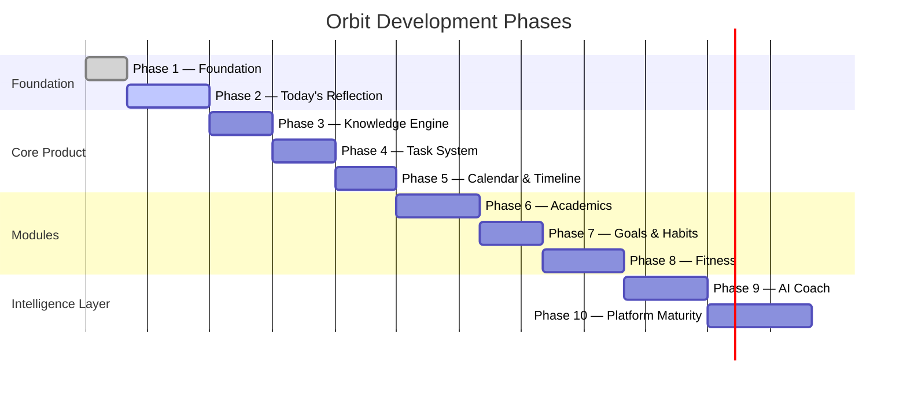
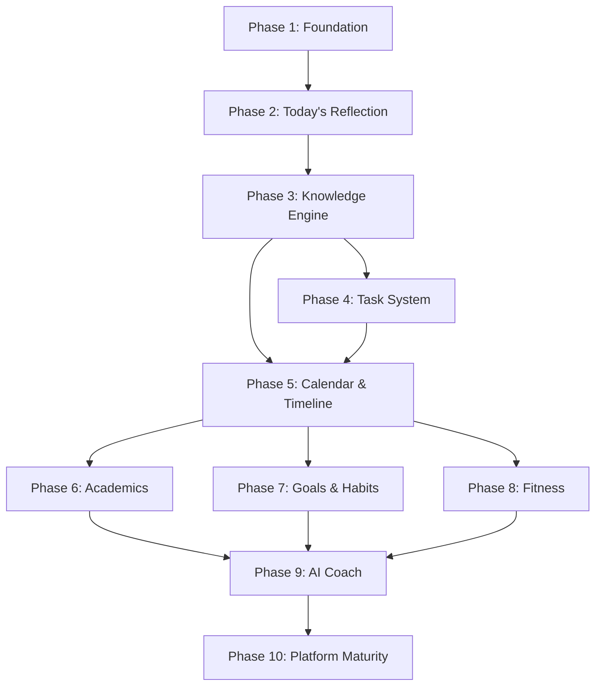
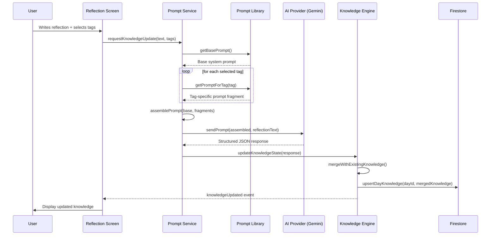
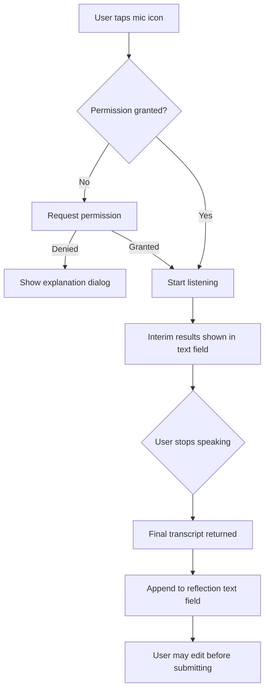
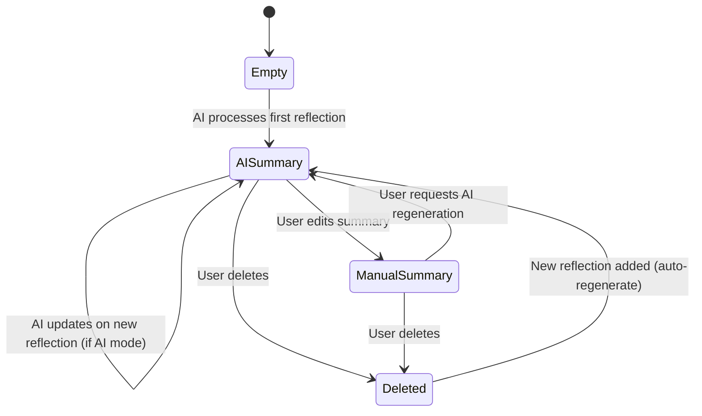
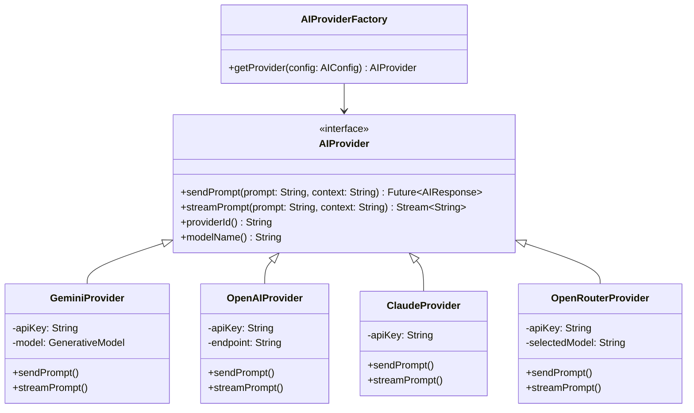
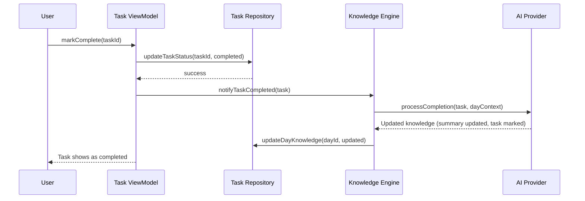
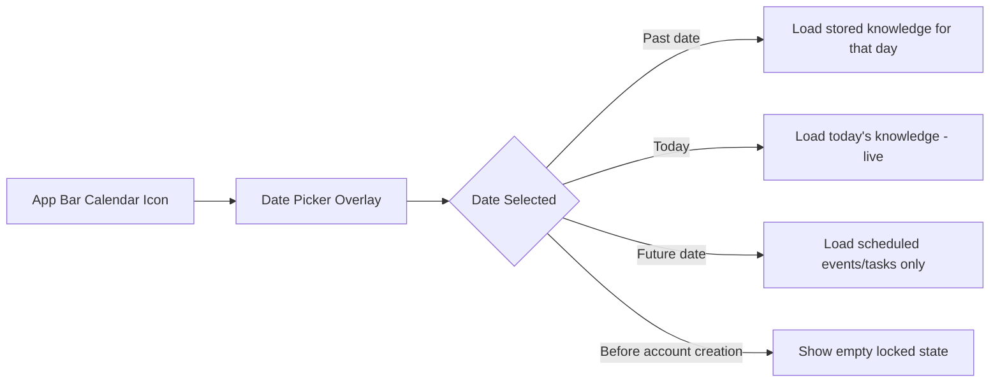
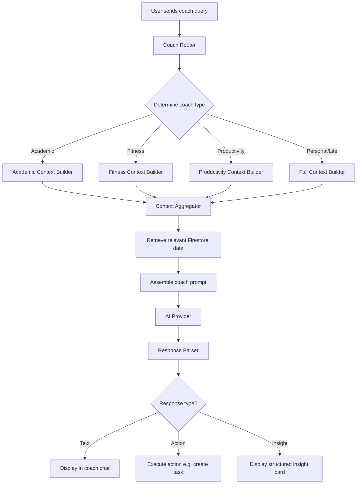
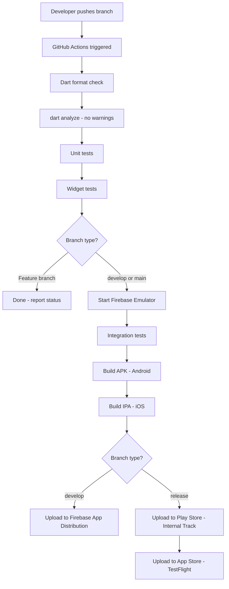

# 03 — ORBIT DEVELOPMENT ROADMAP

> **Document Type:** Development Roadmap  
> **Version:** 1.0.0  
> **Status:** Living Document  
> **Maintainers:** Orbit Core Team  
> **Last Updated:** Phase 2 — Today's Reflection


---

## Table of Contents

1. [Document Purpose](#1-document-purpose)
2. [Development Philosophy](#2-development-philosophy)
3. [Phase Overview](#3-phase-overview)
4. [Phase 1 — Foundation](#4-phase-1--foundation)
5. [Phase 2 — Today's Reflection (Current)](#5-phase-2--todays-reflection-current)
6. [Phase 3 — Knowledge Engine](#6-phase-3--knowledge-engine)
7. [Phase 4 — Task System](#7-phase-4--task-system)
8. [Phase 5 — Calendar & Timeline](#8-phase-5--calendar--timeline)
9. [Phase 6 — Academics Module](#9-phase-6--academics-module)
10. [Phase 7 — Goals & Habits](#10-phase-7--goals--habits)
11. [Phase 8 — Fitness Module](#11-phase-8--fitness-module)
12. [Phase 9 — AI Coach](#12-phase-9--ai-coach)
13. [Phase 10 — Platform Maturity](#13-phase-10--platform-maturity)
14. [Feature Priority Matrix](#14-feature-priority-matrix)
15. [Milestone Definitions](#15-milestone-definitions)
16. [Coding Standards](#16-coding-standards)
17. [Branch Strategy](#17-branch-strategy)
18. [Testing Strategy](#18-testing-strategy)
19. [CI/CD Pipeline](#19-cicd-pipeline)
20. [Open-Source Contribution Strategy](#20-open-source-contribution-strategy)
21. [Version Roadmap](#21-version-roadmap)
22. [Technical Debt Management](#22-technical-debt-management)
23. [Risk Analysis](#23-risk-analysis)
24. [Success Criteria](#24-success-criteria)
25. [Appendix: Complexity Estimation Guide](#25-appendix-complexity-estimation-guide)

---

## 1. Document Purpose

### 1.1 What This Document Is

This document is the authoritative development roadmap for Orbit — an AI-powered Personal Operating System for students. It provides a structured, milestone-driven plan for taking Orbit from its current Phase 2 state through to a mature, open-source, multi-module platform.

This is not a project management board. This is an architectural roadmap — it captures *what* to build, *why* in that order, *how complex* each decision is, and *what risks* exist at each stage.

### 1.2 Who Should Read This

| Audience | Purpose |
|---|---|
| Core Developer(s) | Primary reference for development sequence and decision-making |
| Contributors | Understand what work is planned and how to contribute |
| Maintainers | Understand release gates and standards |
| Architects | Validate technical decisions at each phase boundary |

### 1.3 How to Use This Document

- Each phase has a clear **entry condition** (prerequisites) and **exit condition** (definition of done).
- Complexity ratings use a standard scale defined in the appendix.
- Dependencies between phases are explicitly stated so no phase begins prematurely.
- This document should be updated at the end of every phase to reflect lessons learned.

---

## 2. Development Philosophy

### 2.1 Core Principle: Ship Working Software at Every Phase

Every development phase must conclude with a working, usable state of the application. No phase should end with a partially broken product. This is non-negotiable.

**Rationale:** Orbit is being built by a small team (or solo developer) without dedicated QA infrastructure. The safest path to a stable product is to treat every phase boundary as a release gate. Each phase either ships or does not end.

**Implication:** Features within a phase may be descoped before the phase concludes if they threaten overall stability. Descoped features move to the next appropriate phase.

### 2.2 Prioritization Framework: RICE Scoring

Every feature is evaluated using RICE scoring before it is scheduled into a phase:

```
RICE Score = (Reach × Impact × Confidence) / Effort
```

| Factor | Definition |
|---|---|
| **Reach** | How many users will this affect per week? |
| **Impact** | How much does this improve the core experience? (0.25 / 0.5 / 1 / 2 / 3) |
| **Confidence** | How certain are we about our estimates? (100% / 80% / 50%) |
| **Effort** | Total engineering weeks required |

Features with higher RICE scores are scheduled earlier. Features below a minimum threshold are moved to the backlog without a committed phase.

### 2.3 Architecture-First Development

Before any feature is coded, the following must exist:

1. Screen specification in the product blueprint
2. Data model in the technical architecture
3. Repository contract (abstract interface)
4. AI prompt specification (if AI-involved)
5. Test plan outline

This is the difference between a well-engineered product and an ad-hoc codebase.

### 2.4 The "No God Classes" Rule

No single class, widget, or service in Orbit may be responsible for more than one logical domain. If a class exceeds ~300 lines, it is a strong signal of a missing abstraction. Refactor before adding features.

### 2.5 Technical Debt Budget

Every sprint (or equivalent development cycle) allocates a minimum of 20% of capacity to:
- Refactoring
- Documentation
- Test coverage improvement
- Dependency upgrades

Technical debt is a first-class citizen. It is not shameful. It is managed.

---

## 3. Phase Overview

The following Mermaid diagram represents the high-level development arc of Orbit:



### 3.1 Phase Dependency Graph



### 3.2 Phase Summary Table

| Phase | Focus | Complexity | Estimated Duration | Status |
|---|---|---|---|---|
| 1 | Foundation | Medium | 1 weeks | ✅ Complete |
| 2 | Today's Reflection | High | 8 weeks | 🚧 Active |
| 3 | Knowledge Engine | Very High | 8 weeks | 📋 Planned |
| 4 | Task System | High | 8 weeks | 📋 Planned |
| 5 | Calendar & Timeline | High | 10–12 weeks | 📋 Planned |
| 6 | Academics Module | Very High | 16–20 weeks | 📋 Planned |
| 7 | Goals & Habits | High | 12–14 weeks | 📋 Planned |
| 8 | Fitness Module | High | 12–14 weeks | 📋 Planned |
| 9 | AI Coach | Extreme | 16–20 weeks | 📋 Planned |
| 10 | Platform Maturity | High | 20–24 weeks | 📋 Planned |

---

## 4. Phase 1 — Foundation

### 4.1 Status: Complete

Phase 1 established the structural and infrastructure foundation upon which all future phases depend. Without a solid foundation, every subsequent feature carries accumulated risk.

### 4.2 Goals

- Establish the Flutter project with feature-first, MVVM architecture
- Integrate Firebase Authentication (email/password, Google Sign-In)
- Configure Firestore with correct security rules
- Implement base theme system (light/dark mode, design tokens)
- Establish navigation skeleton
- Implement dependency injection with `get_it` or equivalent
- Define folder structure conventions

### 4.3 Deliverables

| Deliverable | Description | Status |
|---|---|---|
| Flutter project scaffold | Feature-first folder structure | ✅ |
| Firebase Auth integration | Email + Google Sign-In | ✅ |
| Theme system | Light/dark mode, design tokens | ✅ |
| MVVM base classes | BaseViewModel, BaseView | ✅ |
| Firestore user document | Created on first login | ✅ |
| Navigation system | Named routes or GoRouter | ✅ |
| Dependency injection | `get_it` setup | ❌ |
| CI skeleton | Basic build pipeline | ❌ |

### 4.4 Architecture Decisions Made in Phase 1

#### Decision: Feature-First Over Layer-First

**Alternatives Considered:**
- Layer-first (all models in `/models`, all services in `/services`)
- Feature-first (everything for a feature in `/features/feature_name`)

**Chosen:** Feature-first

**Rationale:** Orbit is expected to grow into 10+ distinct modules. Layer-first architecture causes features to be scattered across directories, making it difficult to reason about a single module's complete implementation. Feature-first allows a contributor to look at a single directory and understand the full vertical slice of a feature without navigating across the project.

**Tradeoff:** Shared code requires a `/core` or `/shared` directory that must be carefully managed to avoid bloat.

#### Decision: Provider/Riverpod

**Alternatives Considered:**
- `Provider` — Simpler, widely understood, official Flutter package
- `Riverpod` — Compile-time safety, no `BuildContext` dependency, better testing
- `Bloc` — Strict event-driven, more boilerplate, better for large teams
- `GetX` — All-in-one, opinionated, tight coupling, not recommended for long-term

**Chosen:** Riverpod

**Rationale:** Riverpod's compile-time safety eliminates an entire category of runtime errors that plague `Provider`. Its providers can be accessed without `BuildContext`, making ViewModels testable without widget trees. For a solo developer or small team building a complex system, Riverpod's ability to catch errors at compile time is worth the learning curve.

**Tradeoff:** Riverpod has a steeper initial learning curve than Provider. Documentation must compensate.

#### Decision: GoRouter for Navigation

**Alternatives Considered:**
- Flutter's native `Navigator 2.0` — Very verbose, low-level
- `AutoRoute` — Code generation overhead
- `GoRouter` — URL-based, deep-link ready, well-maintained by Flutter team

**Chosen:** GoRouter

**Rationale:** Orbit will eventually support deep links (e.g., opening a specific day's reflection from a notification). GoRouter's URL-based routing makes this trivial to implement. It also handles nested navigation (e.g., within the Academics module) cleanly.

### 4.5 Exit Criteria (Phase 1)

- ✅ User can sign in with Google
- ✅ User can sign out
- ✅ User document exists in Firestore after registration
- ✅ Light and dark mode work correctly across all scaffold screens
- ✅ Navigation between home and profile screens works
- ✅ No critical Firebase security rule gaps

---

## 5. Phase 2 — Today's Reflection (Current)

### 5.1 Status: Active

Phase 2 is the first user-facing feature of Orbit. It is the proof of the core thesis: that unstructured reflections can be converted into structured knowledge by AI.

This phase is the most important phase in the roadmap. Every future feature is built on top of what Phase 2 establishes.

### 5.2 Goals

- Allow users to type reflections
- Allow users to use voice-to-text input
- Allow multiple reflections per day
- Display reflections in a chronological feed (today's view)
- Send reflections to the AI Knowledge Engine
- Display AI-extracted knowledge (summary, tasks, etc.) in a structured panel
- Persist reflection data in Firestore

### 5.3 Feature Breakdown

#### 5.3.1 Reflection Input

| Feature | Complexity | Notes |
|---|---|---|
| Text input field | Low | Standard TextField with formatting |
| Character count / word count | Low | Cosmetic, encourages users |
| Voice input (device microphone) | Medium | `speech_to_text` package |
| Voice input error handling | Medium | Permissions, no speech detected, timeout |
| Multi-reflection per day | Medium | Append to Firestore array or subcollection |
| Reflection submission UX | Medium | Loading state, optimistic UI |
| Reflection tags selector | High | Pre-submission tag selection, drives prompt |
| Reflection editing (post-submit) | High | Requires re-triggering AI if edited |

#### 5.3.2 AI Processing Pipeline

| Feature | Complexity | Notes |
|---|---|---|
| Gemini API integration | Medium | REST or Dart SDK |
| Modular prompt assembly | High | Combine base + tag-specific prompts |
| AI response parsing | High | Structured JSON extraction from LLM response |
| Error handling & retry | Medium | Exponential backoff on API failure |
| AI provider abstraction | High | Interface so Gemini/OpenAI/Claude are swappable |
| Streaming response support | Medium | For better UX, show AI output progressively |

#### 5.3.3 Knowledge Display

| Feature | Complexity | Notes |
|---|---|---|
| Summary panel | Medium | Editable, AI or manual |
| Task chips/cards | Medium | Extracted tasks displayed visually |
| Mood indicator | Low | Simple emoji or color ring |
| Energy indicator | Low | Similar to mood |
| Learning cards | Medium | Learnings extracted |
| Decision cards | Medium | Decisions extracted |
| Knowledge state refresh | High | Re-running AI on new reflection |

#### 5.3.4 Data Persistence

| Feature | Complexity | Notes |
|---|---|---|
| Reflection document write | Low | Save to Firestore |
| Daily knowledge document upsert | High | Merge, not replace |
| Offline queue | High | Local cache via `hive` or `isar` |
| Conflict resolution | High | Server vs local divergence handling |

### 5.4 AI Knowledge Engine — Phase 2 Design

The AI Knowledge Engine in Phase 2 is the first version of what will become Orbit's most powerful capability.

#### Prompt Assembly Flow



#### Knowledge Merge Strategy

**Problem:** The user may write three reflections in a day. Each new reflection must update the knowledge state without erasing information from previous reflections.

**Solution:** The Knowledge Engine maintains a merge strategy for each knowledge field:

| Field | Merge Strategy |
|---|---|
| `summary` | AI regenerates from all reflections combined |
| `tasks` | Append new tasks; match by title for deduplication; update status if matched |
| `events` | Append; deduplicate by time + title |
| `decisions` | Append always (decisions are distinct by nature) |
| `learnings` | Append; fuzzy deduplicate by content similarity |
| `mood` | Replace with latest value |
| `energy` | Replace with latest value |
| `tags` | Union of all tags across all reflections |

**Design Decision: Server-Side vs Client-Side Merge**

**Chosen:** Client-side merge with Firestore transactions

**Rationale:** Performing the merge on the client eliminates a need for a backend server at this stage, keeping infrastructure minimal. Firestore transactions guarantee atomicity. If the merge logic ever becomes too complex, it can migrate to Firebase Cloud Functions without changing the public interface.

### 5.5 Voice Input Architecture



**Package:** `speech_to_text`

**Error cases handled:**
- Microphone permission permanently denied → deep link to app settings
- No speech detected after 5 seconds → auto-stop with message
- Network-dependent recognition failure → fallback error state

### 5.6 Summary System Design

The summary is the user-facing output of the AI's understanding of their day.

**Key Design Decisions:**

1. **The summary is ephemeral, not permanent.** The user may delete it, rewrite it manually, or ask AI to regenerate it.
2. **Two modes exist:** `AI Mode` and `Manual Mode`. These are distinct states stored in Firestore.
3. **Regeneration always uses all reflection entries for the day,** not just the latest one.
4. **The user can edit the AI summary** and it will switch to `Manual Mode` automatically.
5. **Manual summaries are never overwritten by AI** unless the user explicitly requests regeneration.



### 5.7 Phase 2 Exit Criteria

- [ ] User can write a reflection and submit it
- [ ] Voice-to-text works on Android and iOS
- [ ] Multiple reflections can be added in one day
- [ ] AI extracts summary, tasks, mood, learnings, decisions from reflection
- [ ] Knowledge panel displays extracted information
- [ ] New reflection merges with existing day knowledge (does not replace)
- [ ] Summary can be edited, deleted, and regenerated
- [ ] All data persists in Firestore with correct structure
- [ ] Offline: reflection drafts survive app kill
- [ ] AI provider can be swapped by changing configuration

---

## 6. Phase 3 — Knowledge Engine

### 6.1 Entry Condition

Phase 2 exit criteria are fully satisfied.

### 6.2 Purpose

Phase 3 deepens and solidifies the AI Knowledge Engine. Phase 2 introduced it; Phase 3 makes it robust, reliable, and extensible.

**Why Phase 3 before Task System?** The Task System (Phase 4) depends entirely on high-quality knowledge extraction. Investing in the Knowledge Engine first ensures that tasks created by AI are accurate and trustworthy.

### 6.3 Goals

- Introduce multi-provider AI support (OpenRouter, Claude, OpenAI, Groq)
- Build the complete Prompt Library with all planned prompt fragments
- Improve knowledge merge quality with conflict detection
- Add knowledge confidence scoring
- Introduce knowledge versioning (history of how a day's knowledge changed)
- Add user feedback loop (user can correct AI extraction)
- Improve structured JSON parsing robustness

### 6.4 Multi-Provider AI Architecture



**Design Decision: Abstract Interface Over Direct SDK Usage**

**Rationale:** Gemini is the default provider today. It will not be the only option forever. API keys change, models deprecate, pricing shifts. By programming against an abstract `AIProvider` interface, the rest of the system is insulated from provider changes. Swapping from Gemini to Claude requires only implementing a new class, not touching any business logic.

### 6.5 Prompt Library Architecture

The Prompt Library is a critical architectural component. Its design impacts every AI-driven feature in the application.

#### Prompt Fragment Types

| Type | Description | Example |
|---|---|---|
| `SystemPrompt` | Defines AI role and output format | Base identity + JSON schema |
| `ExtractionPrompt` | Instructs extraction of specific knowledge | Task extraction rules |
| `MergePrompt` | Instructs AI to merge with existing knowledge | Used on 2nd+ reflection |
| `RegenerationPrompt` | Full regeneration from all entries | Used for summary regeneration |
| `QueryPrompt` | Used for user questions about their knowledge | Used in AI Coach |

#### Prompt Assembly Rules

```dart
// Pseudo-code for prompt assembly
String assemblePrompt({
  required List<String> selectedTags,
  required bool hasExistingKnowledge,
}) {
  final buffer = StringBuffer();

  // 1. Always start with base system prompt
  buffer.write(PromptLibrary.base());

  // 2. Add JSON schema definition
  buffer.write(PromptLibrary.outputSchema());

  // 3. If existing knowledge, add merge instructions
  if (hasExistingKnowledge) {
    buffer.write(PromptLibrary.mergeInstructions());
  }

  // 4. Add tag-specific extraction prompts
  for (final tag in selectedTags) {
    final fragment = PromptLibrary.forTag(tag);
    if (fragment != null) buffer.write(fragment);
  }

  // 5. Add formatting and safety guards
  buffer.write(PromptLibrary.outputGuards());

  return buffer.toString();
}
```

#### Complete Prompt Library (Phase 3)

| Prompt Key | Purpose | Phase Introduced |
|---|---|---|
| `base` | System identity, role, output format | Phase 2 |
| `output_schema` | JSON schema definition for structured output | Phase 2 |
| `merge_instructions` | How to merge new with existing knowledge | Phase 2 |
| `task_extraction` | Extract tasks, detect completion signals | Phase 2 |
| `event_extraction` | Extract calendar events | Phase 2 |
| `decision_extraction` | Extract decisions made | Phase 2 |
| `learning_extraction` | Extract learnings | Phase 2 |
| `mood_energy` | Extract mood and energy levels | Phase 2 |
| `summary_generation` | Generate day summary | Phase 2 |
| `summary_regeneration` | Full regeneration from all entries | Phase 3 |
| `goal_extraction` | Extract goal-related mentions | Phase 3 |
| `habit_extraction` | Extract habit tracking mentions | Phase 3 |
| `idea_extraction` | Extract ideas and insights | Phase 3 |
| `academic_extraction` | Extract academic mentions | Phase 6 |
| `fitness_extraction` | Extract fitness mentions | Phase 8 |
| `weekly_synthesis` | Weekly knowledge summary | Phase 5 |
| `monthly_synthesis` | Monthly knowledge summary | Phase 5 |
| `coach_query` | Answer user questions about their data | Phase 9 |

### 6.6 Knowledge Confidence Scoring

Every piece of AI-extracted knowledge receives a confidence score between 0.0 and 1.0.

**Purpose:** Low-confidence extractions are flagged for user review rather than silently committed.

**Scoring Criteria:**
- Explicit language → High confidence (e.g., "I completed X" → task completion)
- Implicit language → Medium confidence (e.g., "X is done" → task completion)
- Ambiguous language → Low confidence (e.g., "X seems finished" → task completion?)

**User Experience:** Items below a confidence threshold of 0.7 show a "Review?" indicator. The user can confirm or dismiss.

### 6.7 Knowledge Versioning

Each time the day's knowledge state is updated, a snapshot is written to a subcollection:

```
users/{uid}/days/{dayId}/knowledge_history/{timestamp}
```

This enables:
- Undo/redo of AI changes
- Debugging poor AI extractions
- Analytics on how knowledge evolves through the day
- Future: showing the user how their day's understanding evolved

### 6.8 Phase 3 Exit Criteria

- [ ] At least 3 AI providers can be selected from settings
- [ ] All planned prompt fragments are implemented in the Prompt Library
- [ ] Confidence scores are displayed for AI-extracted items
- [ ] Low-confidence items require user confirmation
- [ ] Knowledge history is captured on every update
- [ ] User can correct an AI extraction and the correction is persisted
- [ ] Prompt assembly unit tests cover all tag combinations
- [ ] JSON parsing is robust to malformed AI responses (graceful degradation)

---

## 7. Phase 4 — Task System

### 7.1 Entry Condition

Phase 3 exit criteria are fully satisfied.

### 7.2 Purpose

The Task System is Orbit's first productivity layer. It bridges the gap between reflection (capturing what happened) and action (tracking what needs to happen).

Phase 4 transforms Orbit from a reflection journal into a life management tool.

### 7.3 Goals

- Full task CRUD (Create, Read, Update, Delete)
- AI-generated tasks from reflections (already partially done in Phase 2–3)
- Manual task creation
- Task prioritization (None, Low, Medium, High, Critical)
- Task status (Open, In Progress, Completed, Cancelled)
- Due date and time assignment
- Source tracking (from which reflection was this task created?)
- Task completion flow (mark complete → AI updates knowledge)

### 7.4 Task Data Model

```
users/{uid}/tasks/{taskId}
  ├── id: String
  ├── title: String
  ├── description: String?
  ├── status: TaskStatus (open | in_progress | completed | cancelled)
  ├── priority: Priority (none | low | medium | high | critical)
  ├── dueDate: Timestamp?
  ├── dueTime: String? ("HH:MM")
  ├── createdAt: Timestamp
  ├── updatedAt: Timestamp
  ├── completedAt: Timestamp?
  ├── createdBy: CreatedBy (ai | manual | import)
  ├── sourceReflectionId: String? (link to reflection)
  ├── sourceDayId: String?
  ├── tags: List<String>
  └── isDeleted: bool (soft delete)
```

**Design Decision: Top-Level Collection vs Subcollection**

**Alternatives:**
- `users/{uid}/tasks/{taskId}` — top-level per user
- `users/{uid}/days/{dayId}/tasks/{taskId}` — nested under day

**Chosen:** Top-level collection `users/{uid}/tasks`

**Rationale:** Tasks are cross-day entities. A task created on Monday may be completed on Friday. Nesting tasks under a day would make it impossible to query "all overdue tasks" without knowing which day documents to read. Top-level tasks allow flexible querying across any time range.

**Relationship to Days:** A `sourceReflectionId` and `sourceDayId` are stored on the task for traceability. The day document stores only task IDs in its `extractedTaskIds` array for display purposes.

### 7.5 Task Views

| View | Description | Complexity |
|---|---|---|
| Today's Tasks | Tasks due today or overdue | Low |
| All Tasks | Full list with filters | Medium |
| By Priority | Grouped by priority level | Low |
| By Status | Grouped by status | Low |
| By Due Date | Calendar-adjacent view | Medium |
| AI-Suggested | Tasks extracted but not confirmed | Medium |

### 7.6 Task Completion Loop



### 7.7 Phase 4 Exit Criteria

- [ ] User can manually create, edit, and delete tasks
- [ ] AI creates tasks from reflection text
- [ ] User can confirm or dismiss AI-suggested tasks
- [ ] Tasks have priority, status, due date/time
- [ ] Task completion updates day knowledge
- [ ] Today's tasks view works correctly
- [ ] Overdue tasks are highlighted
- [ ] Soft delete works (tasks are never hard-deleted)
- [ ] Offline task creation queues correctly

---

## 8. Phase 5 — Calendar & Timeline

### 8.1 Entry Condition

Phases 3 and 4 exit criteria are fully satisfied.

### 8.2 Purpose

The Calendar is Orbit's navigation backbone. The Timeline is the chronological view of a user's day. Together, they transform Orbit from a form-based data entry tool into a temporal, visual operating system.

### 8.3 Calendar Architecture



**Design Decision: Swipe Navigation vs Bottom Calendar**

**Chosen:** Horizontal swipe (Yesterday ← Today → Tomorrow) with calendar icon for date jumping

**Rationale:** Day-to-day navigation should be frictionless — a single swipe. Jumping to arbitrary dates (e.g., two weeks ago) is less frequent and warrants a deliberate tap. This matches the mental model of "daily flow" while still providing random access.

**Technical Implementation:** `PageView.builder` with a virtual infinite scroll anchored at account creation date (lower bound) and today (upper bound for past data).

### 8.4 Future Date Behavior

Future dates are not empty — they show:
- Tasks due on that date
- Events scheduled for that date
- Habits scheduled for that date (Phase 7)
- Exam dates (Phase 6)

Future dates do NOT show:
- Reflection input (cannot reflect on the future)
- AI summary (nothing to summarize)
- Mood/energy (not yet experienced)

### 8.5 Timeline Architecture

The Timeline converts the day's reflection entries into a chronological visual story.

```
Day Timeline
│
├── 07:30  Went to gym                    [🏃 Fitness tag]
│
├── 10:00  Worked on DBMS assignment      [📚 Academic tag]
│
├── 12:10  Completed authentication       [✅ Task completed]
│
├── 15:00  Decided to use Riverpod        [💡 Decision]
│
└── 22:00  Reflected on productivity      [📝 Reflection]
```

**Each timeline entry contains:**
- Timestamp (from reflection submission time)
- Brief extracted summary of that reflection
- Icon/color indicating primary knowledge type extracted
- Tap to expand → full reflection text

**Performance Consideration:** Timeline entries are loaded lazily. Only 20 entries load at a time. Older entries load on scroll.

### 8.6 Weekly and Monthly Synthesis

Phase 5 introduces periodic AI synthesis — AI generating knowledge at a higher level.

**Weekly Synthesis:** Every Sunday (or triggered manually), AI combines all 7 days of knowledge into a weekly summary.

**Monthly Synthesis:** On the last day of the month (or triggered manually), AI synthesizes the month.

**Design Decision: Where is weekly/monthly data stored?**

```
users/{uid}/periods/
  ├── week_2024_W30/
  │     ├── summary: String
  │     ├── totalTasks: int
  │     ├── completedTasks: int
  │     ├── mood_avg: double
  │     ├── topLearnings: List
  │     └── aiInsights: String
  └── month_2024_08/
        └── (similar structure)
```

### 8.7 Phase 5 Exit Criteria

- [ ] Swipe navigation works between days
- [ ] Calendar icon opens date picker
- [ ] Dates before account creation are locked
- [ ] Future dates show tasks/events only
- [ ] Timeline view is rendered for days with reflections
- [ ] Weekly synthesis generates on demand
- [ ] Monthly synthesis generates on demand
- [ ] Page loading performance is acceptable (< 500ms on cold load)

---

## 9. Phase 6 — Academics Module

### 9.1 Entry Condition

Phase 5 exit criteria are fully satisfied. This module can proceed in parallel with Phase 7.

### 9.2 Purpose

Academics is Orbit's first major domain module. For a student, academics is the primary domain of life. This module transforms Orbit from a general reflection tool into a specialized student operating system.

**Why Academics first among modules?** Orbit's core target audience is students. Academics has the highest RICE score of any module.

### 9.3 Sub-Feature Breakdown

#### 9.3.1 Routine Scanner

| Feature | Complexity | Description |
|---|---|---|
| Camera integration | Medium | Capture timetable image |
| Image OCR | Very High | ML Kit or Google Vision API |
| Timetable parsing | Very High | Convert OCR output to structured schedule |
| Manual timetable entry | Medium | Fallback for poor OCR results |
| Timetable display | Medium | Visual weekly grid |

**Design Decision: On-device vs Cloud OCR**

**Chosen:** Cloud OCR (Google Cloud Vision API) with on-device ML Kit as fallback

**Rationale:** Timetable images often contain complex layouts (grids, colors, small text). Cloud Vision API produces significantly better results than on-device ML Kit for this use case. On-device ML Kit serves as a fallback when network is unavailable. Cost is acceptable at student scale.

#### 9.3.2 Timetable

| Feature | Complexity | Description |
|---|---|---|
| Weekly timetable view | Medium | 7-column grid |
| Class session model | Low | Subject, time, room, teacher |
| Today's schedule | Low | Filtered view of current day |
| Next class indicator | Low | Countdown to next class |
| Integration with Calendar | Medium | Classes appear in Calendar view |

#### 9.3.3 Assignments

| Feature | Complexity | Description |
|---|---|---|
| Assignment CRUD | Low | Standard form |
| Due date tracking | Low | Date/time picker |
| Subject association | Low | Linked to timetable subject |
| Status tracking | Low | Not started / In progress / Submitted |
| AI extraction from reflection | Medium | "I need to submit X by Friday" |
| Overdue detection | Low | Computed field |

#### 9.3.4 Exams

| Feature | Complexity | Description |
|---|---|---|
| Exam schedule | Low | Similar to assignments |
| Study planner | Very High | AI generates study schedule |
| Exam countdown | Low | Days remaining |
| Subject-wise exam history | Medium | Past performance tracking |

#### 9.3.5 AI Study Planner

This is the most complex feature in the Academics module.

**How it works:**
1. User inputs exam date and subjects
2. AI analyzes available days (using Calendar data)
3. AI considers existing tasks, events, and habits
4. AI generates a study schedule
5. Schedule is written to the Task system as individual study tasks

**Complexity: Very High** because it requires multi-entity reasoning: exams + tasks + habits + calendar events must all be considered simultaneously.

#### 9.3.6 Study Analytics

| Feature | Complexity | Description |
|---|---|---|
| Study hours tracking | Medium | Reflections tagged "academic" → tracked hours |
| Subject-wise distribution | Medium | Which subjects are getting attention? |
| Study streak | Low | Consecutive days of academic reflection |
| Attendance tracking | High | Manual input + reminder integration |
| Performance correlation | Very High | Study hours vs self-reported exam performance |

### 9.4 Phase 6 Exit Criteria

- [ ] User can scan a timetable image and have it parsed
- [ ] Manual timetable entry works as fallback
- [ ] Timetable appears in weekly grid view
- [ ] Assignments can be created, tracked, and completed
- [ ] Exams can be scheduled
- [ ] AI Study Planner generates a study schedule for a given exam
- [ ] Study hours are tracked from academic-tagged reflections
- [ ] Analytics dashboard shows study distribution

---

## 10. Phase 7 — Goals & Habits

### 10.1 Entry Condition

Phase 5 exit criteria are fully satisfied. Can proceed in parallel with Phase 6.

### 10.2 Purpose

Goals and Habits are the long-term layer of Orbit. Reflections happen daily. Goals happen over months. This module makes Orbit a growth tracking system, not just a daily journal.

### 10.3 Goals Sub-Feature Breakdown

| Feature | Complexity | Description |
|---|---|---|
| Goal creation | Low | Title, description, target date, category |
| Goal categories | Low | Academic, Fitness, Personal, Career, Financial |
| Milestone system | Medium | Break goals into milestones |
| Progress tracking | Medium | % complete, based on milestones |
| AI goal suggestions | High | Based on reflection patterns |
| AI progress insights | High | "You've mentioned X 5 times this week" |
| Goal-to-task linkage | Medium | Tasks can be linked to goals |
| Goal timeline | Medium | Visual progress over time |
| Goal archiving | Low | Completed/abandoned goals |

### 10.4 Habits Sub-Feature Breakdown

| Feature | Complexity | Description |
|---|---|---|
| Habit creation | Low | Name, frequency, reminder time |
| Habit frequencies | Low | Daily / Weekly / Custom |
| Habit completion | Low | Tap to mark done |
| Habit streak tracking | Medium | Current streak, longest streak |
| AI habit extraction | Medium | Extract habit mentions from reflections |
| Habit analytics | Medium | Completion rate, trend graphs |
| Habit-Goal linkage | Medium | Habits that support goals |
| Habit calendar view | Medium | Monthly habit calendar (GitHub-style grid) |
| Habit reminder system | High | Local notifications |

### 10.5 Phase 7 Exit Criteria

- [ ] Goals can be created with milestones and target dates
- [ ] Goals link to tasks
- [ ] AI suggests relevant goals based on reflection patterns
- [ ] Habits can be created with daily/weekly frequencies
- [ ] Habit streaks are tracked correctly
- [ ] Habit completion view shows monthly calendar grid
- [ ] Local notifications fire for habit reminders
- [ ] Goals analytics show progress over time

---

## 11. Phase 8 — Fitness Module

### 11.1 Entry Condition

Phase 5 exit criteria are fully satisfied. Can proceed in parallel with Phases 6 and 7.

### 11.2 Purpose

Fitness is a critical dimension of student wellbeing. Orbit should help students track physical progress with the same depth it applies to academic and personal growth.

### 11.3 Feature Breakdown

| Feature | Complexity | Description |
|---|---|---|
| Workout logging | Medium | Exercise, sets, reps, weight |
| Exercise library | Medium | Pre-seeded exercise database |
| Custom exercises | Low | User-defined exercises |
| Weight tracking | Low | Daily weight entry with trend graph |
| Progress photos | High | Photo storage with date comparison |
| PR detection | Medium | Automatic personal record detection |
| Strength tracking | Medium | Per-exercise strength progression |
| Scatter plots | High | Weight vs time, strength vs time |
| Line graphs | Medium | Trend visualization |
| AI fitness insights | High | Extracted from reflections |
| Fitness goal integration | Medium | Link to Goals module |

**Design Decision: Progress Photo Storage**

**Chosen:** Firebase Storage with server-side thumbnails via Cloud Functions

**Rationale:** Progress photos are large binary files. Storing them in Firestore is not possible (10MB limit per document). Firebase Storage integrates natively with Firebase Auth for security rules. Thumbnails are generated server-side to keep bandwidth usage manageable in list views.

**Privacy Consideration:** Progress photos are private by default. Security rules must ensure `userId` in the storage path matches the authenticated user.

### 11.4 Phase 8 Exit Criteria

- [ ] Workouts can be logged with exercises, sets, reps, weight
- [ ] Exercise library is pre-seeded
- [ ] Weight tracking shows trend graph
- [ ] Personal records are automatically detected
- [ ] Progress charts are rendered correctly
- [ ] Progress photos can be captured and compared
- [ ] Fitness mentions in reflections are extracted by AI

---

## 12. Phase 9 — AI Coach

### 12.1 Entry Condition

Phases 6, 7, and 8 exit criteria are fully satisfied.

### 12.2 Purpose

The AI Coach is the convergence layer. It synthesizes data from every module — academics, fitness, goals, habits, reflections — and provides personalized coaching, insights, and recommendations.

This is Orbit's most complex feature and its most transformative one.

### 12.3 Coach Types

| Coach Type | Data Used | Example Interaction |
|---|---|---|
| Personal Coach | All modules | "How am I doing overall this week?" |
| Academic Coach | Academics + Goals + Tasks | "I have an exam in 5 days. Help me prepare." |
| Fitness Coach | Fitness + Goals + Habits | "Review my workout progress this month." |
| Productivity Coach | Tasks + Habits + Reflections | "Why have I been procrastinating?" |
| Life Coach | All modules | "What should I focus on for the next 30 days?" |

### 12.4 AI Coach Architecture



### 12.5 Context Management

The AI Coach's intelligence depends entirely on the quality of context it receives. A coach with incomplete context gives generic advice. A coach with rich context gives genuinely useful advice.

**Context Sources by Module:**

| Module | Context Provided |
|---|---|
| Reflections | Last 7 days' knowledge states |
| Tasks | Overdue tasks, completion rate, pending high-priority |
| Academics | Current assignments, upcoming exams, study hours this week |
| Fitness | Last 5 workouts, current weight trend, active fitness goals |
| Goals | Active goals, milestone progress, stale goals |
| Habits | Current streaks, missed habits this week |

**Context Budget:** LLM context windows are finite. The Context Aggregator must intelligently prioritize and truncate data to fit within the model's context window while retaining the most relevant information.

**Implementation:** A `ContextBudgetManager` class tracks token estimates for each context chunk and trims lower-priority chunks first.

### 12.6 Coach Conversation History

The AI Coach maintains conversation history within a session. Between sessions, a summary of the conversation is persisted.

```
users/{uid}/coach_sessions/{sessionId}
  ├── startedAt: Timestamp
  ├── lastMessageAt: Timestamp
  ├── coachType: String
  ├── summary: String (AI-generated session summary)
  └── messages: Subcollection
        └── {messageId}
              ├── role: "user" | "assistant"
              ├── content: String
              └── timestamp: Timestamp
```

### 12.7 Phase 9 Exit Criteria

- [ ] All 5 coach types are functional
- [ ] AI Coach uses real data from all connected modules
- [ ] Context budget management prevents token overflow
- [ ] Coach can create tasks on behalf of the user (with confirmation)
- [ ] Conversation history is persisted between sessions
- [ ] Session summaries are generated on session end

---

## 13. Phase 10 — Platform Maturity

### 13.1 Entry Condition

Phase 9 exit criteria are satisfied. At least 100 real users have used the product.

### 13.2 Purpose

Phase 10 is not about new features. It is about making Orbit production-ready at scale: performance, reliability, observability, and community.

### 13.3 Maturity Goals

| Area | Initiative |
|---|---|
| Performance | Lazy loading everywhere, profile-guided optimization |
| Observability | Crashlytics, performance monitoring, custom analytics |
| Localization | i18n framework, English + Hindi (initial) |
| Accessibility | Screen reader support, contrast ratios, font scaling |
| Security | Penetration test checklist, Firestore rule audit |
| Open Source | Public GitHub, contribution guide, issue templates |
| Web Support | Flutter Web port (limited feature set) |
| Notifications | Full local + push notification system |
| Backup & Export | User data export (JSON), account deletion |
| Rate Limiting | AI API call rate limiting per user tier |

### 13.4 Phase 10 Exit Criteria

- [ ] Crash-free rate > 99.5%
- [ ] App startup time < 2 seconds on mid-range device
- [ ] Accessibility audit passed
- [ ] All user data can be exported as JSON
- [ ] Public GitHub repository is live with contribution guide
- [ ] At least 10 external contributors have submitted PRs

---

## 14. Feature Priority Matrix

The following matrix categorizes all features by their importance to the core vision and their implementation effort:

```
HIGH VALUE / LOW EFFORT     │     HIGH VALUE / HIGH EFFORT
────────────────────────────┼─────────────────────────────
• Reflection text input     │ • AI Knowledge Engine
• Voice input               │ • Multi-provider AI
• Task CRUD                 │ • AI Study Planner
• Theme system              │ • Routine Scanner / OCR
• Mood tracking             │ • AI Coach
• Calendar navigation       │ • Context Budget Manager
────────────────────────────┼─────────────────────────────
LOW VALUE / LOW EFFORT      │     LOW VALUE / HIGH EFFORT
────────────────────────────┼─────────────────────────────
• Word count display        │ • Advanced scatter plots
• Dark mode toggle          │ • Progress photo comparison
• Sort task list            │ • Strength analytics
• Coach type selector       │ • Performance correlation
────────────────────────────┼─────────────────────────────
```

**Prioritization Rule:** High Value / Low Effort features are always built first within a phase. High Value / High Effort features justify dedicated phases. Low Value / High Effort features require justification before scheduling.

---

## 15. Milestone Definitions

Milestones are formal checkpoints in the roadmap. A milestone is only declared complete when all associated exit criteria are verified by review (self-review for solo developers, peer review for teams).

### Milestone 1: Orbit Alpha (End of Phase 2)

**Definition:** A working app that allows users to write reflections and receive AI-extracted knowledge.

**Success Gate:**
- At least 1 real user (outside the developer) has used it for 7 consecutive days
- No critical (P0) bugs exist
- Core data pipeline (Reflection → AI → Firestore) is stable

### Milestone 2: Orbit Beta (End of Phase 5)

**Definition:** A complete personal knowledge management system with tasks, calendar, and timeline.

**Success Gate:**
- At least 10 users have used it for 30 consecutive days
- Task system is actively used (not just reflections)
- Weekly synthesis generates correctly
- No P0 or P1 bugs in core flow

### Milestone 3: Orbit 1.0 (End of Phase 7)

**Definition:** First production release. Goals, habits, and academics are functional.

**Success Gate:**
- At least 50 users with an average session length > 5 minutes
- Crash-free rate > 99%
- Listed on Google Play Store and Apple App Store

### Milestone 4: Orbit 2.0 (End of Phase 9)

**Definition:** AI Coach is live. All modules are integrated.

**Success Gate:**
- At least 200 users
- AI Coach is used by > 30% of active users
- Public GitHub repository has > 10 stars

### Milestone 5: Orbit Platform (End of Phase 10)

**Definition:** Open source, production-grade, accessible, and extensible.

**Success Gate:**
- GitHub repository has > 5 external contributors
- Localization in at least 2 languages
- App store rating > 4.2

---

## 16. Coding Standards

### 16.1 Dart / Flutter Standards

Orbit follows the official [Effective Dart](https://dart.dev/guides/language/effective-dart) style guide as the baseline, with the following additions:

#### Naming Conventions

| Entity | Convention | Example |
|---|---|---|
| Classes | `UpperCamelCase` | `ReflectionRepository` |
| Functions/Methods | `lowerCamelCase` | `fetchDayKnowledge()` |
| Variables | `lowerCamelCase` | `isLoading` |
| Constants | `lowerCamelCase` | `kMaxReflectionLength` |
| Enum values | `lowerCamelCase` | `TaskStatus.inProgress` |
| Files | `snake_case` | `reflection_repository.dart` |
| Folders | `snake_case` | `features/reflection/` |

#### File Length Limits

| File Type | Soft Limit | Hard Limit |
|---|---|---|
| Widget | 200 lines | 400 lines |
| ViewModel | 200 lines | 300 lines |
| Repository | 150 lines | 250 lines |
| Service | 200 lines | 350 lines |
| Model | 100 lines | 200 lines |

If a file exceeds its hard limit, it must be split before the PR is merged.

#### Import Ordering

```dart
// 1. Dart SDK imports
import 'dart:async';
import 'dart:convert';

// 2. Flutter imports
import 'package:flutter/material.dart';

// 3. Third-party package imports (alphabetical)
import 'package:cloud_firestore/cloud_firestore.dart';
import 'package:riverpod/riverpod.dart';

// 4. Internal imports (relative, alphabetical)
import '../models/reflection_model.dart';
import '../repositories/reflection_repository.dart';
```

#### Comment Standards

```dart
/// Public API documentation uses triple-slash.
/// Include: purpose, parameters, return value, exceptions.
///
/// Example:
/// ```dart
/// final knowledge = await fetchDayKnowledge(dayId: '2024-08-01');
/// ```
Future<DayKnowledge> fetchDayKnowledge({required String dayId}) async { ... }

// Private implementation comments use double-slash.
// Explain WHY, not WHAT.
// Bad: // increment counter
// Good: // Debounce prevents multiple AI calls on rapid keystrokes
```

### 16.2 MVVM Layer Responsibilities

#### Model Layer
- Pure Dart data classes
- `copyWith()`, `toJson()`, `fromJson()` methods
- No Flutter imports
- No business logic
- `freezed` package recommended for immutable models

#### Repository Layer
- Abstract interface defines the contract
- Implementation class uses Firestore/API
- Returns domain models (not raw Firestore docs)
- Handles errors and converts to typed exceptions
- No UI logic

#### ViewModel Layer
- Manages screen state
- Calls repositories and services
- Exposes state via Riverpod providers
- Never imports Flutter widgets
- Unit testable without widget tree

#### View Layer
- Purely visual
- Reads from ViewModel providers
- Calls ViewModel methods on user interaction
- No business logic
- No direct Firestore or API calls

### 16.3 Error Handling Standards

Orbit uses a typed error hierarchy:

```dart
sealed class OrbitException implements Exception {
  final String message;
  final String? code;
  const OrbitException(this.message, {this.code});
}

class NetworkException extends OrbitException { ... }
class AuthException extends OrbitException { ... }
class AIProviderException extends OrbitException { ... }
class PermissionException extends OrbitException { ... }
class ParseException extends OrbitException { ... }
```

**Rule:** No raw `catch (e)` blocks. Always catch typed exceptions and convert to `OrbitException` subtypes before propagating to the ViewModel.

### 16.4 Async Standards

- All async operations use `Future` or `Stream` — no `async` without `await`
- Loading states are always represented in ViewModel
- Errors are always represented in ViewModel (never silently swallowed)
- Use `AsyncValue` from Riverpod for unified loading/error/data states

```dart
// Standard pattern
final AsyncValue<DayKnowledge> knowledgeState = watch(dayKnowledgeProvider(dayId));

return knowledgeState.when(
  data: (knowledge) => KnowledgeDisplay(knowledge: knowledge),
  loading: () => const ShimmerSkeleton(),
  error: (error, stack) => ErrorView(message: error.toString()),
);
```

---

## 17. Branch Strategy

### 17.1 Branch Model: GitHub Flow (Modified)

Orbit uses a modified GitHub Flow that adds a `develop` integration branch for stability:

```
main
├── develop (integration branch)
│   ├── feature/phase-2-voice-input
│   ├── feature/phase-2-ai-knowledge-engine
│   ├── fix/reflection-duplicate-submission
│   └── chore/update-firebase-sdk
└── release/v0.2.0 (created at milestone)
```

### 17.2 Branch Naming Convention

| Prefix | Purpose | Example |
|---|---|---|
| `feature/` | New feature development | `feature/phase-3-prompt-library` |
| `fix/` | Bug fix | `fix/task-completion-not-updating` |
| `chore/` | Maintenance, deps, config | `chore/upgrade-flutter-3-22` |
| `refactor/` | Code quality, no behavior change | `refactor/extract-knowledge-engine` |
| `docs/` | Documentation only | `docs/update-readme` |
| `release/` | Release preparation | `release/v1.0.0` |
| `hotfix/` | Emergency production fix | `hotfix/auth-crash-on-login` |

### 17.3 Branch Rules

| Branch | Protection Rule |
|---|---|
| `main` | Requires PR, requires review (1 approver), no direct push, requires passing CI |
| `develop` | Requires PR, requires passing CI, no direct push |
| All others | No restrictions, developer discretion |

### 17.4 Commit Message Format (Conventional Commits)

```
<type>(<scope>): <description>

[optional body]

[optional footer]
```

**Types:** `feat`, `fix`, `chore`, `refactor`, `docs`, `test`, `perf`, `ci`

**Examples:**
```
feat(reflection): add voice input with speech_to_text
fix(knowledge): prevent duplicate task creation on retry
refactor(ai): extract AIProvider interface
docs(roadmap): update phase 3 exit criteria
test(repository): add unit tests for ReflectionRepository
```

### 17.5 Pull Request Standards

Every PR must include:
1. **Description:** What changed and why
2. **Screenshots/Video:** For UI changes
3. **Checklist:**
   - [ ] Tests added/updated
   - [ ] Documentation updated
   - [ ] No debug code left in
   - [ ] Localization keys added (Phase 10+)
   - [ ] Firestore security rules updated (if schema changed)

---

## 18. Testing Strategy

### 18.1 Testing Pyramid

```
              ┌──────┐
              │  E2E  │   (5% of tests — high value user flows)
             ├────────┤
            │ Widget  │   (20% of tests — component rendering)
           ├──────────┤
          │    Unit    │   (75% of tests — models, repos, VMs)
         └────────────┘
```

**Rationale:** Unit tests are fast, reliable, and cheap to write. Widget tests catch visual regressions. E2E tests validate critical user journeys. The 75/20/5 split maximizes coverage while keeping the test suite fast.

### 18.2 Unit Tests

**What is unit-tested:**
- All model `fromJson`/`toJson` methods
- All repository methods (using Firestore emulator or mocks)
- All ViewModel state transitions
- Prompt assembly logic (critical: test every tag combination)
- AI response parsing (test malformed responses too)
- Knowledge merge logic (test every merge strategy)

**Target coverage:** 80% line coverage minimum on the following paths:
- `features/*/models/`
- `features/*/repositories/`
- `features/*/viewmodels/`
- `core/ai/`
- `core/prompt_library/`

**Testing Tool:** `flutter_test` + `mocktail` for mocking

```dart
// Example: Testing knowledge merge
test('merges new task without duplicating existing task', () {
  final existing = DayKnowledge(tasks: [Task(title: 'Submit DBMS')]);
  final incoming = KnowledgeUpdate(newTasks: [Task(title: 'Submit DBMS')]);

  final result = KnowledgeMerger.merge(existing, incoming);

  expect(result.tasks.length, equals(1)); // Not 2
});
```

### 18.3 Widget Tests

**What is widget-tested:**
- Reflection input form rendering states
- Task card rendering (all status + priority combinations)
- Knowledge panel rendering (empty, loading, populated)
- Error state rendering
- Shimmer/loading skeleton rendering

**Testing Tool:** `flutter_test` widget testing API

**Key principle:** Widget tests test *rendering*, not business logic. If the widget renders correctly given the ViewModel state, the widget test passes. Business logic belongs in unit tests.

### 18.4 Integration Tests

**What is integration-tested:**
- Reflection → AI → Knowledge update full pipeline (against Firestore emulator)
- Task creation → completion → knowledge update
- Auth flow (signup → auto-login)

**Testing Tool:** `integration_test` package + Firebase Emulator Suite

**Firestore Emulator:** All integration tests run against the local Firestore emulator, never against production. CI pipeline starts the emulator automatically.

### 18.5 E2E Tests

**Critical flows covered by E2E tests:**
1. New user signup and onboarding
2. Write reflection → see AI knowledge
3. Mark task complete
4. Navigate between dates in calendar

**Testing Tool:** `patrol` or `flutter_driver`

**E2E tests run on:** CI on every release branch creation. Not on every commit (too slow).

### 18.6 AI-Specific Testing

AI prompts and parsers require a special testing approach because LLM outputs are non-deterministic.

**Strategy:**
1. **Snapshot tests for prompts:** The assembled prompt string for a given tag combination must not change unless intentionally modified. Snapshot tests catch accidental prompt drift.
2. **Parser fuzzing:** The JSON parser must be tested against valid, malformed, partial, and empty responses.
3. **Regression fixtures:** A library of sample reflection texts paired with expected extraction outputs. When the prompt changes, these fixtures verify no regression.

```dart
// Example: Snapshot test for prompt assembly
test('task + event tags produce expected prompt', () {
  final prompt = PromptAssembler.assemble(
    tags: [ReflectionTag.tasks, ReflectionTag.events],
    hasExistingKnowledge: false,
  );

  expect(prompt, matchesGoldenFile('prompts/task_event.txt'));
});
```

### 18.7 Performance Tests

- Reflection screen must render within 16ms per frame (60fps)
- Timeline must handle 100 entries without jank
- Knowledge update must complete within 3 seconds (AI latency excluded)
- App cold start must be < 2 seconds on a mid-range device (Pixel 4 equivalent)

---

## 19. CI/CD Pipeline

### 19.1 Pipeline Overview



### 19.2 GitHub Actions Workflow Structure

```yaml
# .github/workflows/ci.yml
name: Orbit CI

on:
  push:
    branches: [ main, develop, 'feature/**', 'fix/**' ]
  pull_request:
    branches: [ main, develop ]

jobs:
  analyze:
    name: Analyze & Format
    runs-on: ubuntu-latest
    steps:
      - uses: actions/checkout@v4
      - uses: subosito/flutter-action@v2
      - run: flutter pub get
      - run: dart format --output=none --set-exit-if-changed .
      - run: flutter analyze --fatal-infos

  test:
    name: Unit & Widget Tests
    needs: analyze
    runs-on: ubuntu-latest
    steps:
      - run: flutter test --coverage
      - uses: codecov/codecov-action@v3

  integration_test:
    name: Integration Tests
    needs: test
    if: github.ref == 'refs/heads/develop' || github.ref == 'refs/heads/main'
    runs-on: ubuntu-latest
    steps:
      - run: firebase emulators:start --only firestore &
      - run: flutter test integration_test/

  build_android:
    name: Build Android
    needs: test
    runs-on: ubuntu-latest
    steps:
      - run: flutter build apk --release
```

### 19.3 Quality Gates

A PR cannot be merged into `develop` or `main` unless:

| Check | Threshold |
|---|---|
| `dart format` | Zero formatting violations |
| `flutter analyze` | Zero warnings, zero errors |
| Unit test coverage | ≥ 80% on critical paths |
| All unit tests | 100% pass rate |
| All widget tests | 100% pass rate |
| Build (Android) | Successful |
| Build (iOS) | Successful |

### 19.4 Release Process

**Release Checklist:**
1. Create `release/vX.Y.Z` from `develop`
2. Update `pubspec.yaml` version number
3. Update `CHANGELOG.md`
4. Run full E2E test suite manually
5. Submit to App Store / Play Store internal track
6. 48-hour soak period on internal track
7. Merge `release/vX.Y.Z` into `main`
8. Tag `main` with `vX.Y.Z`
9. Push `main` back to `develop`
10. Publish release notes on GitHub

---

## 20. Open-Source Contribution Strategy

### 20.1 Why Open Source?

Orbit is designed to become an open-source project by Milestone 4. The reasons are:

1. **Trust:** Students will share personal data with Orbit. Open source allows them to audit what happens to that data.
2. **Community:** The best student OS will be built by students, for students.
3. **Sustainability:** Community contributions extend what a small core team can build.
4. **Credibility:** An open-source project is a portfolio piece and a community-building tool.

### 20.2 Repository Structure

```
orbit/
├── .github/
│   ├── workflows/          # CI/CD pipelines
│   ├── ISSUE_TEMPLATE/     # Bug report, feature request templates
│   └── PULL_REQUEST_TEMPLATE.md
├── docs/
│   ├── 01_ORBIT_VISION_AND_PRODUCT_BLUEPRINT.md
│   ├── 02_ORBIT_TECHNICAL_ARCHITECTURE.md
│   └── 03_ORBIT_DEVELOPMENT_ROADMAP.md (this document)
├── lib/
│   └── (Flutter source)
├── test/
├── integration_test/
├── CHANGELOG.md
├── CONTRIBUTING.md
├── CODE_OF_CONDUCT.md
├── LICENSE               # MIT License
└── README.md
```

### 20.3 Contribution Tiers

| Tier | Description | Examples |
|---|---|---|
| **Beginner** | No Flutter knowledge required | Fix typos in docs, translate strings, report bugs |
| **Intermediate** | Flutter basics required | Fix UI bugs, add minor features, write tests |
| **Advanced** | Flutter + Firebase + AI required | New module features, AI prompt improvements |
| **Architect** | Deep system knowledge required | Core engine changes, new AI providers |

**Good First Issue Label:** All beginner-level issues must be labeled `good first issue` and include a "How to contribute" section in the issue description.

### 20.4 Contributor Guidelines

**CONTRIBUTING.md must include:**
- Development environment setup (step-by-step)
- How to run the app locally
- How to run tests
- Branch naming conventions
- PR standards
- Code review expectations
- How to add a new AI provider
- How to add a new prompt fragment
- How to add a new module (skeleton guide)

### 20.5 Community Communication

| Channel | Purpose |
|---|---|
| GitHub Issues | Bug reports, feature requests |
| GitHub Discussions | Architecture discussions, RFCs |
| README | First impression, quick start |
| Discord (Phase 10) | Real-time community |

### 20.6 RFC Process (Request for Comments)

Significant architectural changes require an RFC:

1. Open a GitHub Discussion with `[RFC]` prefix
2. Describe the proposed change, rationale, and alternatives considered
3. 7-day comment period
4. Core team makes decision, documents it in the discussion
5. Approved RFCs result in issues with `architecture` label

---

## 21. Version Roadmap

Orbit uses [Semantic Versioning](https://semver.org/): `MAJOR.MINOR.PATCH`

| Version | Milestone | Key Features | Target |
|---|---|---|---|
| `0.1.0` | Phase 1 complete | Auth, theme, scaffold | Q1 2024 |
| `0.2.0` | Phase 2 complete | Reflection, AI knowledge | Q3 2024 |
| `0.3.0` | Phase 3 complete | Multi-provider AI, Prompt Library | Q4 2024 |
| `0.4.0` | Phase 4 complete | Full task system | Q1 2025 |
| `0.5.0` | Phase 5 complete | Calendar, timeline | Q2 2025 |
| `0.6.0` | Phase 6 partial | Academics (timetable + assignments) | Q3 2025 |
| `0.7.0` | Phase 7 complete | Goals + Habits | Q4 2025 |
| `0.8.0` | Phase 6 complete | Academics (all features) | Q1 2026 |
| `0.9.0` | Phase 8 complete | Fitness module | Q2 2026 |
| `1.0.0` | Milestone 3 | Production release | Q3 2026 |
| `1.1.0` | Phase 9 partial | AI Coach (personal + academic) | Q4 2026 |
| `2.0.0` | Milestone 4 | Full AI Coach | Q2 2027 |

**Version Policy:**
- `PATCH` releases: Bug fixes only, no new features
- `MINOR` releases: New features, backward-compatible
- `MAJOR` releases: Breaking changes (e.g., major Firestore schema migration)
- Pre-1.0 versions: Minor versions may include breaking changes (documented in CHANGELOG)

---

## 22. Technical Debt Management

### 22.1 Definition of Technical Debt in Orbit

Technical debt in Orbit is any code, structure, or decision that:
- Makes future changes harder than they need to be
- Is undocumented
- Lacks test coverage
- Violates the coding standards defined in Section 16
- Creates implicit coupling between modules

### 22.2 Debt Tracking

Technical debt is tracked as GitHub Issues with:
- Label: `technical-debt`
- Severity: `severity:high`, `severity:medium`, `severity:low`
- Linked to the phase that created it

Example debt issues:
- "Prompt assembly uses string concatenation instead of template system" → severity:high
- "ReflectionViewModel exceeds 300-line limit" → severity:medium
- "No unit tests for KnowledgeMerger" → severity:high

### 22.3 Debt Budget per Phase

| Phase | Max Allowed New Debt Items | Required Debt Paydown |
|---|---|---|
| Phase 2 | 10 | 0 (bootstrapping) |
| Phase 3 | 8 | 5 from Phase 2 |
| Phase 4 | 6 | 5 from previous |
| Phase 5+ | 5 | 5 from previous |

**Rule:** No new phase begins if there are more than 5 high-severity debt items unresolved.

### 22.4 Refactoring Triggers

The following conditions trigger a mandatory refactoring task before new feature work:

| Trigger | Action |
|---|---|
| File exceeds hard line limit | Extract class or split file |
| Test coverage drops below 75% on critical path | Write missing tests |
| Three or more `// TODO` comments in one file | Resolve or file formal debt issues |
| A class has more than 3 constructor parameters not in a model | Introduce parameter object |
| A repository returns `dynamic` | Add proper types |

### 22.5 Dependency Management

**Policy:**
- Dependencies are reviewed every 3 months for updates
- Security patches are applied within 1 week of release
- No package is added without evaluating: maintenance status, pub score, test coverage, license
- `dart pub outdated` is run monthly

**Dependency Audit Checklist:**
- [ ] Is the package actively maintained (commits in last 6 months)?
- [ ] Does it have a pub score > 80?
- [ ] Is the license compatible (MIT, Apache, BSD)?
- [ ] Does it have integration tests in Orbit's test suite?

---

## 23. Risk Analysis

### 23.1 Risk Register

| ID | Risk | Probability | Impact | Severity | Mitigation |
|---|---|---|---|---|---|
| R01 | AI API cost exceeds budget | High | High | Critical | Rate limiting per user; caching; consider on-device models |
| R02 | Gemini API breaking change | Medium | High | High | Abstract `AIProvider` interface allows swap in < 1 day |
| R03 | Firestore pricing spike at scale | Medium | High | High | Efficient document reads; pagination; caching layer |
| R04 | Flutter major version breaking change | Low | High | Medium | Pin Flutter version in CI; test on upgrade before applying |
| R05 | Poor OCR quality for routine scanner | High | Medium | High | Cloud Vision API + manual entry fallback always available |
| R06 | AI extractions are inaccurate | Medium | High | High | Confidence scoring; user review flow; feedback loop |
| R07 | User data breach | Low | Critical | High | Firestore security rules audit; pen test; no PII in AI prompts |
| R08 | Solo developer burnout | High | Critical | Critical | Phased approach; avoid overcommitting; open source early |
| R09 | App store rejection | Low | High | Medium | Follow guidelines; test on real devices; review policy changes |
| R10 | Low user retention | Medium | High | High | Focus on core loop quality before module expansion |

### 23.2 Risk Deep Dives

#### R01: AI API Cost

**Scenario:** 100 users each writing 3 reflections/day = 300 API calls/day. If average prompt is 2,000 tokens and response is 500 tokens, that's 750,000 tokens/day. At Gemini Pro pricing, this is manageable. At 10,000 users, it becomes significant.

**Mitigation Tiers:**
1. **Now:** Set a per-user daily API call limit (e.g., 20 calls/day)
2. **Phase 3:** Implement response caching (same reflection text should not re-trigger AI)
3. **Phase 9:** Evaluate on-device models (Gemini Nano, llama.cpp) for simple extractions
4. **Future:** Freemium model where heavy AI usage requires a paid tier

#### R06: AI Extraction Inaccuracy

**Scenario:** User writes "I might try yoga tomorrow" → AI creates a task "Do yoga" due tomorrow. This is incorrect (it was speculative).

**Mitigation:**
- Confidence scoring (Phase 3): speculative language → low confidence
- User review flow: all AI-created tasks start as "Suggested" not "Confirmed"
- Feedback loop: user corrections improve future extractions (fine-tuning signal)
- Prompt engineering: explicit instructions about speculative vs definitive language

#### R08: Developer Burnout

**Scenario:** Orbit is an ambitious solo project. Phase 6 alone involves OCR, timetable parsing, study planning, and analytics. This is months of work.

**Mitigation:**
- The phased roadmap ensures the app is always usable, never a work-in-progress
- Open sourcing early allows the community to share the load
- The 20% technical debt budget prevents the codebase from becoming a burden
- If a feature proves too complex, it is descoped to the next phase — not forced

### 23.3 Contingency Plans

| Trigger | Contingency |
|---|---|
| Gemini API becomes unavailable | Switch to OpenAI via OpenRouter (1 day) |
| Firestore costs spike | Implement aggressive caching; reduce read frequency |
| OCR quality unacceptable | Ship Academics module without Routine Scanner initially |
| A phase is running 50% over estimate | Descope lowest-RICE feature from that phase |

---

## 24. Success Criteria

### 24.1 Product Success Metrics

These are the metrics that determine whether Orbit is succeeding as a product. They are measured continuously from the first real users.

| Metric | Definition | Target (6 months post-launch) |
|---|---|---|
| **Daily Active Users (DAU)** | Users who open the app and interact | > 60% of registered users |
| **Reflection Frequency** | Average reflections per user per day | > 1.5 |
| **Retention (Day 7)** | % of users still active 7 days after signup | > 40% |
| **Retention (Day 30)** | % of users still active 30 days after signup | > 20% |
| **AI Acceptance Rate** | % of AI-suggested tasks accepted by users | > 70% |
| **Session Length** | Average time in app per session | > 4 minutes |
| **Task Completion Rate** | % of created tasks marked complete | > 50% |
| **Knowledge Coverage** | Avg. knowledge fields populated per day | > 4 |

### 24.2 Technical Success Metrics

| Metric | Target |
|---|---|
| Crash-free session rate | > 99.5% |
| App startup time (cold) | < 2 seconds |
| AI knowledge update latency | < 4 seconds (incl. API) |
| Firestore read latency (cached) | < 100ms |
| Test coverage (critical paths) | > 80% |
| `flutter analyze` warning count | 0 |

### 24.3 Open Source Success Metrics

| Metric | Target (12 months post-open-source) |
|---|---|
| GitHub Stars | > 100 |
| External Contributors | > 10 |
| Issues Resolved by Community | > 30% |
| Documentation Coverage | 100% of public APIs |

### 24.4 Defining "Orbit Works"

Orbit is considered to be working — to have proven its core thesis — when a user can:

1. Write a reflection about their day in natural language
2. See AI-extracted tasks, learnings, mood, and decisions without any manual tagging
3. Come back the next day and see their tasks correctly reflecting what they wrote
4. Review a weekly summary that accurately represents how their week went
5. Do all of this without worrying about data loss, app crashes, or confusion

This is the north star. Every development decision should be evaluated against it.

---

## 25. Appendix: Complexity Estimation Guide

All phase features are rated on the following complexity scale. Ratings represent end-to-end engineering effort for a single developer familiar with the codebase, including design, implementation, testing, and documentation.

| Rating | Label | Estimated Effort | Description |
|---|---|---|---|
| 1 | Trivial | < 2 hours | Cosmetic change, copy edit, simple config |
| 2 | Low | 2–8 hours | Well-understood, single-component change |
| 3 | Medium | 1–3 days | Spans multiple components, some design needed |
| 4 | High | 3–7 days | New subsystem, cross-cutting concerns, careful design |
| 5 | Very High | 1–3 weeks | Major feature, multiple integrations, significant risk |
| 6 | Extreme | 3–8 weeks | New domain, novel technology, uncertain requirements |

**Example Calibration:**

| Feature | Rating | Reasoning |
|---|---|---|
| Add word count to reflection input | 1 — Trivial | Single widget change, no business logic |
| Voice input with error handling | 3 — Medium | Package integration + permission handling + error states |
| Multi-provider AI abstraction | 4 — High | New architecture, multiple implementations |
| AI Study Planner | 5 — Very High | Multi-entity reasoning, new domain, complex outputs |
| AI Coach with context management | 6 — Extreme | Novel system, uncertain LLM behavior, many integrations |

---

> **Document End**
>
> This roadmap is a living document. Every phase completion should trigger a review of subsequent phase plans. Estimates will shift. Priorities will evolve. What must not shift is the commitment to working software, clean architecture, and a product that genuinely serves students.
>
> *"Plans are useless, but planning is indispensable."* — Dwight D. Eisenhower

---

*Orbit is an open-source project. Contributions, feedback, and discussion are welcome. See `CONTRIBUTING.md` for details.*
