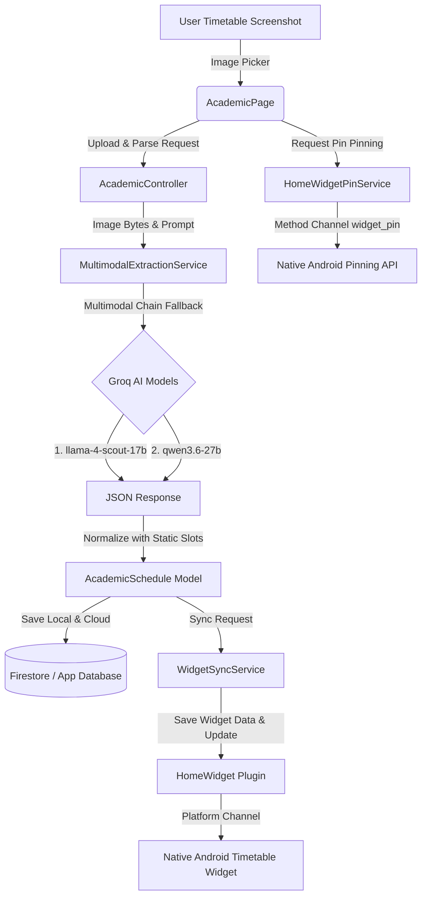

# Orbit Release Notes - Version 1.0.1 🚀

We are excited to announce the release of **Orbit v1.0.1**, featuring the brand new **Academic Timetable Planner**! This release is designed to help students streamline their class schedules (customised to VIT timetable format), keep track of daily courses, and access their agendas directly from their device's home screen.

---

## 📅 Feature Highlights

### 1. AI-Powered Academic Timetable Planner
The new **Academic** feature allows you to manage your weekly university schedule with ease. 

*   **Intelligent Timetable Parser:** Skip manual entry entirely! Upload screenshots or images of your university timetable, and Orbit's AI parsing engine will extract, clean, and structure the information automatically.
*   **Daily Swiper & weekday navigation:** Swipe through weekdays using a fluid swiper view or tap on weekday navigation chips to see what classes you have on any given day.
*   **Dynamic Class Slots:** Converts raw slot representations into exact daily timings chronologically using predefined static configurations.
*   **Course Directory & Editor:** View a unified directory of all courses, update course credits, rooms, slot names, and faculty details, or add new classes manually.

### 2. Live Home Screen Timetable Widget
Access your schedule at a glance without even opening the app.

*   **Real-time Synchronization:** Whenever you edit a course, upload a new timetable, or clear your schedule, Orbit automatically pushes updates to your home screen widget.
*   **Pre-formatted Schedules:** High-performance serialization pre-formats timings (24-hour to 12-hour AM/PM formats) before delivering to Android to ensure smooth widget loading.
*   **Direct Widget Pinning:** Request home-screen widget placement with one tap. Orbit leverages native Android API features to prompt widget pinning inside compatible launchers.

---

## Media

<table align="center">
  <tr>
    <td align="center" width="50%">
      <h3>Academic Schedule Page</h3>
      
    </td>
    <td align="center" width="50%">
      <h3>Widget Preview</h3>
      
    </td>
  </tr>
</table>

---

## 🛠️ Architectural Flow

Here is how the Academic Timetable Planner extracts information and synchronizes data with the native home screen:

---

## ⚙️ Technical and Platform Highlights

### 🤖 LLM Multimodal Extraction Chain
The extraction service uses a robust, fallback-based multi-model approach on the **Groq API** to process structured timetable screenshots:
1.  **Primary Model:** `meta-llama/llama-4-scout-17b-16e-instruct` (Fast and optimized for structural mapping).
2.  **Secondary Fallback:** `qwen/qwen3.6-27b` (Deep contextual understanding of non-standard formats).
3.  **JSON Normalization:** Post-extraction, the data is normalized using the predefined course slot mapping to generate chronological daily schedules.

### 📱 Android Home Widget Pinning
*   Uses a custom platform Channel `com.example.orbit/widget_pin` to communicate between Flutter and Android code.
*   Supports native launcher pinning requests via standard Android API level 26+ features (`ShortcutManager` / `AppWidgetManager`).

---

> [!IMPORTANT]
> **Configuration Setup**
> *   To use the AI Timetable Parser, verify that you have configured a valid `GROQ_API_KEY` in your settings or `.env` file.
> *   **Widget Compatibility:** Home screen widget pinning depends on your launcher supporting pinning protocols. (Compatible with Android 8.0/API 26 and above).

---

## 📝 Detailed Commit / Change History

| Component | Modality | Description |
| :--- | :--- | :--- |
| `lib/features/academic` | **[NEW]** | Added core feature directories, data structures, and Riverpod controllers. |
| `lib/features/academic/services` | **[NEW]** | Implemented `WidgetSyncService` (data transfer) and `HomeWidgetPinService` (Android pinning method channels). |
| `lib/features/academic/views` | **[NEW]** | Created `AcademicPage`, `CoursesPage`, and `EditCoursePage` views. |
| `lib/core/ai` | **[MODIFY]** | Integrated `MultimodalExtractionService` to utilize Groq models for structuring images into structured schedule JSONs. |
| `CHANGELOG.md` | **[MODIFY]** | Recorded v1.0.1 update list. |
