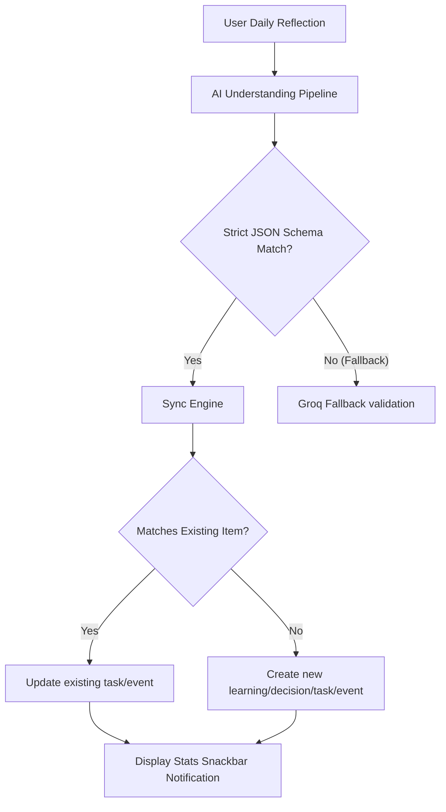

# Orbit Release Notes — Version 2.0.0 (v2.0.0+3)

We are proud to present **Orbit v2.0.0**, a major release designed to shift the application into a highly reliable, daily usable assistant. This release focuses on the core utility users care about: AI extraction that works consistently, smart updates that keep schedules correct without duplication, and a soothing, distraction-free space-themed interface that feels calming to work in.

---

## 🧠 Reliable AI Reflection Pipeline & Updates

At the heart of Orbit v2.0.0 is a rewritten reflection analysis system, designed to turn raw speech or text into highly accurate, structured actionable items.

### 1. Robust Prompt Restructuring (`understanding_prompt.dart`)
- **Strict Schema Enforcement**: Implemented strict JSON schema validations (`requiredProperties` constraints) forcing the LLM to output predictable formats.
- **Null Safety**: Added `nullable: true` parameter attributes on secondary fields (like description, due date/time, and reasons), preventing JSON parser crashes when fields are unspecified.
- **Correct Data Modeling**: Aligned learnings, decisions, tasks, and events with structured models, ensuring AI-generated items correspond cleanly to database fields without dropping context.

### 2. Smart Rescheduling & Update Support
- Instead of creating duplicate events or tasks, the AI sync services (`task_sync_service.dart`, `event_sync_service.dart`) now scan upcoming entries.
- If the user says *"Move gym session to 7 PM"* or *"Change due date of code task to tomorrow"*, the pipeline matches the existing entry using duplicate matching logic and updates details in-place.

### 3. Asynchronous User Notifications
- The updated pipeline tracks exactly what is modified and displays a clear snackbar notification (e.g., *"Insights extracted: 1 task created, 1 event updated"*), giving users instant feedback on their data changes.



---

## 🌌 Soothing Space-Themed UI Refresh

To make using the app a visually calm and soothing experience, we have introduced a comprehensive "space-themed" visual language.

- **Subtle Cosmic Backgrounds**: Integrated `SubtleSpaceBackground`, an animated painting background of a deep starry night, cosmic gradients, and solar systems that orbit slowly over 180 seconds to prevent visual fatigue.
- **Translucent Containers (`OrbitCard`)**: Replaced opaque white card containers with translucent frosted cards (`Color(0xF2FFFFFF)` in light theme and `Color(0xF21E2030)` in dark theme). Cards float over the animated backgrounds.
- **Low-Contrast Gradients**: Transitioned dark theme surface properties to a deep cosmic void color (`Color(0xFF07070F)`), significantly reducing bright light glare.

---

## 🗺️ Improved Action & Navigation Layouts

- **Curved Bottom Navigation Bar**: Swapped the floating vertical FAB for a horizontal, notched bottom bar (`BottomActionBar`).
- **Bezel Safe Area Spacing**: Uses the screen's bottom padding automatically to keep action elements above system navigation pills, preventing accidental touches on notch-less screens.
- **Dynamic Onboarding Overlay**: When starting the app, the first-run guide points down using dynamic arrow assets:
  - **Light Theme**: Renders a black hand-drawn loop arrow (`assets/arrow_black.png`).
  - **Dark Theme**: Renders a light hand-drawn loop arrow (`assets/arrow_light.png`).
  - **Gap Clearance**: Re-positioned the arrow with a 30px gap to avoid colliding with the bottom navigation bar.

---

## 🛠️ Verification & Build Health

- **Compilation Status**: Workspace code analyzed and confirmed to build cleanly:
  ```bash
  Analyzing orbit...
  No issues found! (ran in 10.5s)
  ```
- **Android ProGuard & R8 Optimization**: Configured ProGuard rules in `proguard-rules.pro` to support shrink-wrapped production release packages.
