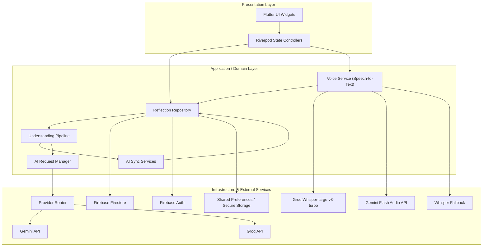
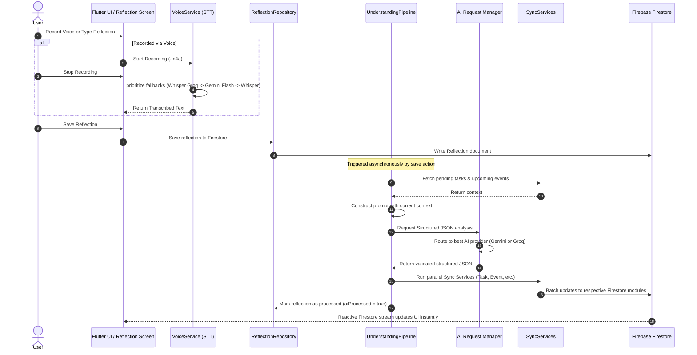

# Technical Architecture

Orbit is an AI-powered personal reflection and productivity application. It acts as an intelligent sounding board that processes natural language daily reflections (text or voice) to extract, organize, and sync tasks, decisions, learnings, events, and moods.

Below is a detailed guide to Orbit's architecture, layers, speech-to-text pipeline, AI understanding orchestration, and state synchronization flow.

---

## 1. System Architecture Overview

---

## 2. Codebase Organization (Feature-First Architecture)

Orbit uses a **Feature-First** layout combined with clean separation of concerns. Inside the [lib](../lib) folder, files are grouped into four primary directories:

*   **[app](../lib/app)**: Application-wide configurations, including routing ([router.dart](../lib/app/router.dart)) and global app bootstrap logic.
*   **[core](../lib/core)**: Core infrastructure, global utilities, application constants, base model schemas, low-level configurations, and central services (e.g., [voice](../lib/core/voice) processing services).
*   **[shared](../lib/shared)**: Shared UI elements, general-purpose widgets, cross-cutting configurations, and shared providers.
*   **[features](../lib/features)**: Self-contained feature modules (e.g., `auth`, `reflection`, `tasks`, `mood`, `ai`).

Each module in `lib/features/` is split into clean architectural layers:
1.  **`views/`**: Pure representation files (UI layouts, forms, lists).
2.  **`controllers/` or `providers/`**: State management (notifiers) that mutates state and coordinates UI actions, consuming repositories.
3.  **`models/`**: Strongly-typed data schemas (backed by `freezed` and `json_serializable` for type-safety and JSON parsing).
4.  **`data/`**: Repositories communicating with external services (such as Firestore or local databases).
5.  **`widgets/`**: Internal reusable widgets private to that feature module.

---

## 3. The Full End-to-End Workflow

When a user interacts with Orbit to record and analyze a reflection, the data flows through several subsystems:

### Detailed Workflow Step-by-Step

#### Step 1: Input & Voice Transcription
*   The user can type their daily reflection or record it via speech in the [Reflection Screen](../lib/features/reflection/views/reflection_board_view.dart).
*   If recorded via voice, the [VoiceService](../lib/core/voice/voice_service.dart) records audio locally in `.m4a` (AAC) format and then runs an automated fallback chain for fast and accurate speech-to-text (STT):
    1.  **Groq Whisper Turbo (`whisper-large-v3-turbo`)**: Fast, low-latency, and highly accurate.
    2.  **Gemini Flash (`gemini-2.5-flash`)**: Used if Groq fails or rate limits are hit.
    3.  **Groq standard Whisper (`whisper-large-v3`)**: Final fallback.

#### Step 2: Saving the Reflection
*   The text is saved to Firestore. Saving the reflection triggers [onReflectionSaved](../lib/features/ai/engine/understanding_pipeline.dart) in the `UnderstandingPipeline`.

#### Step 3: Prompt Building & Context Retrieval
*   To perform a contextual analysis, the pipeline fetches:
    *   Any existing summary for the current day to append or refine details.
    *   All current **pending tasks** to see if any are mentioned as completed or updated.
    *   All **upcoming events** to match schedule changes or plans.
*   The [UnderstandingPromptBuilder](../lib/features/ai/prompts/understanding_prompt.dart) bundles these context elements into a single prompt along with a strict JSON schema definition.

#### Step 4: AI Model Routing & Analysis
*   The request goes to the [AiRequestManager](../lib/features/ai/engine/ai_request_manager.dart).
*   The request manager handles:
    *   **Provider Routing**: Determines whether to use the Workspace default API keys or User-defined custom API keys.
    *   **Provider Selection**: Chooses between Gemini (e.g. `gemini-3.1-flash-lite`, `gemini-2.5-flash`) and Groq (e.g. `llama-3.3-70b-versatile`, `qwen3.6-27b`).
    *   **Health and Rate-Limiting**: Uses [RateLimitManager](../lib/features/ai/engine/rate_limit_manager.dart) and [AiHealthMonitor](../lib/features/ai/engine/ai_health_monitor.dart) to check which endpoints are operational and within rate limits.
    *   **Caching & Queueing**: Skips redundant calls via [ResponseCache](../lib/features/ai/engine/response_cache.dart) and schedules retries via [RequestQueue](../lib/features/ai/engine/request_queue.dart).

#### Step 5: Structured Data Parsing
*   The raw JSON string returned by the model is validated and parsed into structured Data Transfer Objects (DTOs):
    *   `SummaryDto` (Daily summary details and confidence metrics)
    *   `TaskDto` (New tasks, changes, or completions)
    *   `LearningDto` (Lessons, insights, and concepts learned)
    *   `DecisionDto` (Core decisions, reasons, and self-confidence ratings)
    *   `EventDto` (Planned events or schedule adjustments)
    *   `MoodDto` (Mood scores, triggers, and sentiments)

#### Step 6: Database Synchronization
*   The [UnderstandingPipeline](../lib/features/ai/engine/understanding_pipeline.dart) triggers the respective [SyncServices](../lib/features/ai/sync_services) concurrently:
    *   **[DaySyncService](../lib/features/ai/sync_services/day_sync_service.dart)**: Updates the day summary and increments the reflection count.
    *   **[TaskSyncService](../lib/features/ai/sync_services/task_sync_service.dart)**: Resolves context and maps new/modified tasks to the user's task list.
    *   **[LearningSyncService](../lib/features/ai/sync_services/learning_sync_service.dart)**: Adds lessons to the user's learning log, keeping track of duplicates.
    *   **[DecisionSyncService](../lib/features/ai/sync_services/decision_sync_service.dart)**: Inserts decisions, noting the exact logic.
    *   **[EventSyncService](../lib/features/ai/sync_services/event_sync_service.dart)**: Creates or revises calendar appointments.
    *   **[MoodSyncService](../lib/features/ai/sync_services/mood_sync_service.dart)**: Logs mood updates.
*   Once finished, the reflection's `aiProcessed` flag is updated in Firestore.

#### Step 7: UI Update (Reactivity)
*   The Flutter views subscribe to Firestore changes through Riverpod stream/future providers. As soon as the `SyncServices` update documents in Firebase, Riverpod automatically refreshes the state and forces the UI components (e.g. task boards, learning lists, mood graphs) to rebuild with the new data.

---

## 4. Key Architectural Subsystems

### AI Orchestrator (`AiRequestManager`)
The [AiRequestManager](../lib/features/ai/engine/ai_request_manager.dart) coordinates model calls to ensure high availability, compliance, and speed:
*   **Failover Policies**: If a Gemini model fails or returns a rate limit exception, the request is automatically routed to a Groq Llama model or fallback.
*   **Structured JSON Output**: Models are instructed using JSON schemas to guarantee parsing consistency.
*   **Usage Logging & Analytics**: Tracks prompt and completion token counts and tracks cost estimation.

### State Decoupling via Riverpod
*   **Decoupled View-Models**: Notifiers and Providers handle API/Database connectivity, formatting, and pagination, exposing read-only UI States.
*   **Testability**: By declaring providers as global static bindings, we can easily mock dependencies (e.g., swapping a production Firestore repository for an in-memory test database) without altering layout files.
