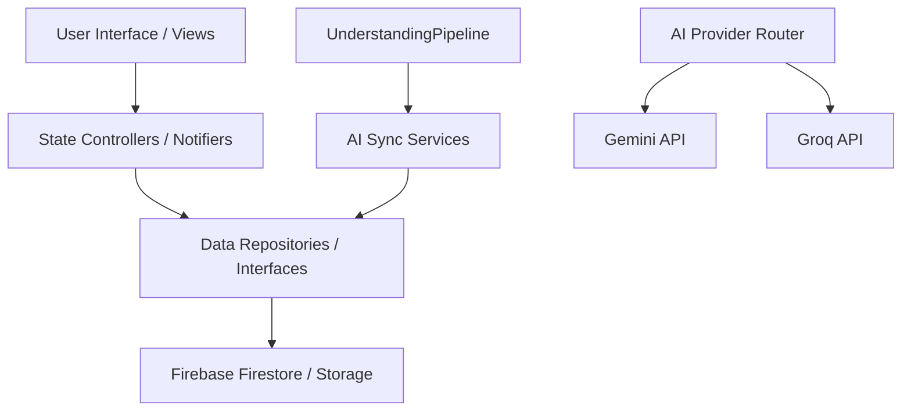

# Technical Architecture

Orbit uses a **Feature-First Architecture** combined with the **Riverpod** state management framework for maximum scalability, testability, and decoupling of features.

---

## Architecture Overview

### 1. Feature-First Layering
Each feature module in `lib/features/` is isolated into logical layers:
- **`views/`**: Pure visual presentation layout files (widgets, forms, and pages).
- **`controllers/` / `providers/`**: State notifier classes that consume repositories to manage view states.
- **`models/`**: Strongly typed data representations and mapping interfaces.
- **`data/`**: Data repositories that interface with network datasources (e.g., Firebase, Secure Storage, or local storage).

### 2. State Management (Riverpod)
- We use Flutter Riverpod providers to inject dependency dependencies, handle reactive state notifications, and keep business logic completely decoupled from widget lifecycles.
- Providers are declared as global instances to allow compilation-safe lookup.

### 3. AI Understanding Pipeline
- The core of Orbit is the **`UnderstandingPipeline`**. When a daily reflection is saved:
  1. The pipeline fetches context (e.g. pending tasks, upcoming events).
  2. It generates a detailed prompt and dispatches it to the AI Providers using the `AiRequestManager`.
  3. The response is strictly validated against a JSON schema.
  4. Specialized **`SyncServices`** (e.g., `TaskSyncService`, `MoodSyncService`, `DecisionSyncService`) parse and translate the JSON payload, updating the respective Firestore models.
